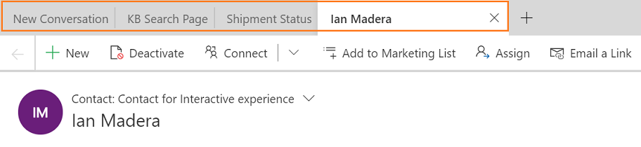

# Manage application tab templates

## Overview

Application tab templates in the Dynamics 365 Channel Integration Framework app provide the type of applications you want to open when a session is started. Each application type has a predefined set of parameters associated with it.

The horizontal bar below the model-driven app navigation bar is called the application tab panel. Every customer session has at least one application tab that is not closable; it is called **Anchor Tab**. That is, when a session is started, by default the system opens an application in the application tab panel. In addition, the system might open a few other applications that system opens by default based on the configuration. 

  

With the application tab templates, you can define the applications that are available for a session and then associate the applications with a session. 

For example, you can create the **Dashboard** application type and associate it with chat and SMS sessions. Now, when an agent accepts a notification from  the chat or SMS channels, a session starts and by default the **Customer summary** page loads.

As an administrator, you can create multiple application tab templates.

## Create an application tab template

1. Sign in to the Dynamics 365 Channel Integration Framework app.

2. Select **Application Tabs** under **Templates** in the sitemap.

3. Select **+ New** in the **Active Application Tabs** page.

4. Specify the following in the **New Application Tabs** page.

    | Tab | Name | Value description | Example |
    |-----------|-------------------|-----------------------------------|-------------------------------------|
    | General | Name | Specify a name for the application tab. This name won't be visible to agents at the runtime. | Knowledge article search |
    | General | Application title | Provide a title for the application that you want agents to see at runtime. | Knowledge article search |
    | General | Application type | Select an application type from the list. Choose one of the following:    <ul><li>Custom control</li> <li>Dashboard</li> <li>Entity view</li> <li>Entity record</li> <li>Entity search</li> <li>Web resource</li> <li>Website URL</li> </ul>   To learn more, see [Application types](#application-types).|  Web resource |
    | General | Description | Provide a description for your reference. | The application type is used to display the Knowledge Article Search Page. |

5. Select **Save** to save the application tab template. After you save, the parameters for the application type you selected appear in the **Parameters** section. 

   Whenever you make changes to the application type, you need to save the changes to reflect the appropriate custom parameters for that application type.

6. Select the **Value** field of a parameter to edit and provide the value. See [application types in the application templates](#application-types) for the parameters.

7. Select **Save** to save the changes.

## Application types

The types of applications available are as follows:

- [Custom control](#custom-control)
- [Dashboard](#dashboard)
- [Entity view](#entity-view)
- [Entity record](#entity-record)
- [Entity search](#entity-search)
- [Web resource](#web-resource)
- [Website URL](#website-url)

### Custom control

The parameters available for the custom control application type are as follows:

| parameter | Example value | Description |
|----------------------------|---------------------------------|-----------------------------------------------------------------------------|
| controlName | `MscrmControls.OCSearchRuntime.OCSearchRuntimeControl` | Name of the control.   Type = String |
| data | `{key1:value1}` | Defines the attributes and values for the control.   Type = JSON Object |

### Dashboard

The application type is used to display the dashboard as an application. The parameters available for the dashboard application type are as follows:

| parameter | Example value | Description |
|----------------------------|---------------------------------|-----------------------------------------------------------------------------|
| dashboardId | `d201a642-6283-4f1d-81b7-da4b1685e698` | GUID of the dashboard.   Type = String |
| entityType  | incident | Entity type of the record.   Type = String |
| type | system | The value is either `system` or `user`.   Type = String |

### Entity view

The application type is used to display an entity view that defines how a list of records for a specific entity is displayed in the model-driven app. The parameters available for the entity view application type are as follows: 

| parameter | Example value | Description |
|----------------------------|---------------------------------|-----------------------------------------------------------------------------|
| entityName | Account | Logical name of the entity.   Type = String |
| viewId | `00000000-0000-0000-00AA-000010001003` | GUID of the view.   Type = String|
| viewType  | savedquery |  Defines the view type. Possible values are as follows:   - **1039**      Use for a system view. The `viewid` represents the ID of a `savedquery` record. - **4230**      Use for a personal view. The `viewid` represents the ID of a `userquery` record.     Type = String |

### Entity record

The parameters available for the entity record application type are as follows:

| parameter | Example value | Description |
|----------------------------|---------------------------------|-----------------------------------------------------------------------------|
| createFromEntity | account | Designates a record that provides default values based on mapped attribute values. The lookup object has the following String properties: `entityType`, `id`, and `name` (optional).   Type = JSON Object | 
| data | `{"firstname":"Rigsby", "lastname":"cho" , "jobtitle":"Sales Manager"}` | Defines the attributes and values for the new entity record.   Type = JSON Object |
| entityId  | `d72e3735-5dca-e911-a826-000d3a1f0599` | GUID of the entity record.   Type = String  |
| entityName | account | Logical name of the entity.   Type = String |
| formId | `8448B78F-8F42-454E-8E2A-F8196B0419AF` | GUID of the form instance.   Type = String |
| processId |  | GUID of the business process.   Type = String |
| relationship |  | Relationship object of the record.   Type = JSON Object |
| selectStageId | | GUID of the selected stage in business process instance.    Type = String |

### Entity search

The parameters available for the entity search application type are as follows:

| parameter | Example value | Description |
|----------------------------|---------------------------------|-----------------------------------------------------------------------------|
| searchText  | Printer Noise | Define the string you want to search.   Type = String |
| searchType | 0 | Define to use Relevance search or Categorized search. The possible values are:   - **0** for RelevanceSearch   - **1** for CategorizedSearch    Type = Number|

### Web resource

The application type is used to display web resources that represent files, which are used to extend the web application such as HTML files, JavaScript, CSS, and several image formats. The parameters available for the web resources application type are as follows:

| parameter | Example value | Description |
|----------------------------|---------------------------------|-----------------------------------------------------------------------------|
| data | Printer Noise | Provide string or key value pair, according to the requirement of the web resource.    Type = String|
| webresourceName | `msdyn_kbsearchpagehost.html` |Name of the web resource to open.   Type = String|

### Website URL

The application type is used to display first-party and third-party websites as an application. The parameters available for the website URL application type are as follows:

| parameter | Example value | Description |
|----------------------------|---------------------------------|-----------------------------------------------------------------------------|
| data | `stackoverflow` |Query parameters that you want to search.   Type = String|
| url | https://www.bing.com/search? |   Type = String|

## See also

[Manage session templates](session-templates-cif.md)

[Manage notification templates](notification-templates-cif.md)

[Use automation dictionary to pass data parameter keys](automation-dictionary-keys-cif.md)

[Associate templates with workstreams](associate-templates-cif.md)

[!INCLUDE[footer-include](../../../includes/footer-banner.md)]