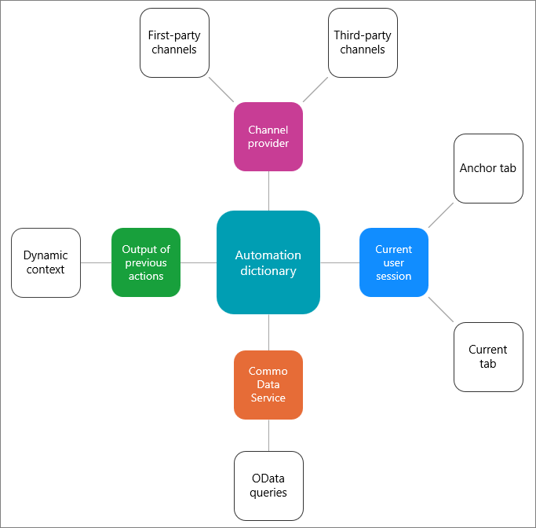

# Use automation dictionary to pass data parameter keys

[!INCLUDE[cc-data-platform-banner](../../../includes/cc-data-platform-banner.md)]

## Overview

Automation dictionary maintains the contextual data for the sessions. You can use the keys from the automation dictionary to pass the parameter keys in the templates.

While creating templates in the Dynamics 365 Channel Integration Framework app, you can pass parameter keys such as title of a session, title of notification, title of an application tab template, and custom parameter values for application tab types. These keys are replaced based on the contextual information available at the time of execution.

## Pass data parameters in templates

Let's consider a scenario for templates with the notifications.

The notification shows certain fields and values, which are called **Field header** and **Value** respectively.

Kenny Smith, a customer, initiated a conversation. When the agent sees the notification, it displays **Customer Name** as **Kenny Smith**.

Here, **Field header** is **Customer Name** and the **Value** is **Kenny Smith**.

For templates to identify the name of the customer as **Kenny Smith**, you as an administrator must set the configuration to pass the parameter as values.

Similarly, for session and notification titles, you can pass the data parameters. To learn more, see [Automation dictionary formats to data parameter keys](#automation-dictionary-formats-to-data-parameter-keys).

Dynamics 365 Channel Integration Framework replaces these parameter values with the actual value based on the context of the session, channel provider, Microsoft Dataverse, and user actions.

To learn more, see [Types of context data parameters](#types-of-context-data-parameters).

## Types of context data parameters

The automation dictionary uses the context data parameters that are available from the following sources:

- [Context data from the channel provider](#context-data-from-the-channel-provider)
- [Context data from the user actions](#context-data-from-the-user-actions)
- [Context data from Dataverse](#context-data-from-dataverse)

> [!div class=mx-imgBorder] 
> 

### Context data from the channel provider 

This context data is from a first-party channel provider such as Omnichannel for Customer Service or third-party channel provider that uses the widget exposed by Dynamics 365 Channel Integration Framework. You can pass context data from your Channel Integration Framework widget into the automation dictionary by using the [updateContext API](../reference/microsoft-ciframework/updateContext.md) from within your widget. You can pass any data through, but common examples include customer name, customer phone number, and data points collected from a phone IVR. You can then reference this data in the automation dictionary as slugs in templates and productivity tools like macros and agent scripts.

### Context data from the user actions 

This data is populated when agents perform activities in the session. An example is opening a new customer record or case.

### Context data from Dataverse 

The organizational data is stored in Dataverse, and you can fetch the data with the use of OData queries. To learn more, see [OData queries](#odata-queries).

## Automation dictionary formats to data parameter keys

Automation dictionary maintains the contextual data for the sessions. The keys in the automation dictionary can be passed as parameters to the action in macros. The system replaces these parameter keys with the actual value based on the context of the session, channel provider, Dataverse, and user actions.

The supported formats are:

- [Slugs](#slugs)
- [OData queries](#odata-queries)
- [Static values](#static-values)

### Slugs

Slug is a replacement parameter that Dynamics 365 Channel Integration Framework populates at runtime based on the context. Some examples are:

| Slug | Description |
|------------|-----------------------------------|
| `{customerName}` | Name of the customer who initiated the conversation. |
| `{caseId}` | Unique ID of a case. The system displays the case ID only if a case is linked to the conversation. |
| `{caseTitle}` | Title of the case. The system displays the title of the case only if a case is linked to the conversation. |

#### Format

The `{Slug}` parameter format that retrieves the context from the channel provider, current user session, and/or Dataverse. 

**For example:**

   `{caseId}`

### OData queries

You can use the OData queries to get the context that is available from Dataverse.

The OData query format:

`{$Odata.<entityName>.<entityAttributeName>.<?options>}`

**For example:**

- `{$Odata.account.name.?$filter=id eq '{accountid}'}`

- `{$odata.incident.prioritycode.?$filter=incidentid eq '{caseId}'&$select=prioritycode}`

- `{$odata.incident.title.?$filter=incidentid eq '{caseId}'&$select=title}`

### Static values

These are hard-coded values that you update as per your business requirement. For every hard-coded attribute you choose, follow the format type for the particular attribute.

**For example:**

For an incoming chat request, you want to provide the static title to the session and notification template that agents see at runtime.

Notification title = `New chat request`

Session title = `Chat conversation`

## See also

[Manage session templates](session-templates-cif.md)

[Manage application tab templates](application-tab-templates-cif.md)

[Manage notification templates](notification-templates-cif.md)

[Associate templates with workstreams](associate-templates-cif.md)
