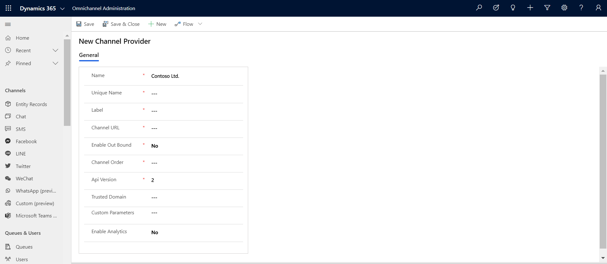

# Configure channel provider using App profile manager

[!include[cc-beta-prerelease-disclaimer](../../../includes/cc-beta-prerelease-disclaimer.md)]

> [!IMPORTANT]
>
> - This feature is a preview, which means that it is made available to you before general availability so you can test and evaluate the preview and provide feedback to Microsoft.
> - This preview may employ reduced or different privacy, security, or compliance commitments than a commercial version. As such, this preview is not meant to be used with any "live" or production Customer Data, Personal Data, or other data that is subject to heightened compliance requirements. Any use of "live" data is at your sole risk and it is your sole responsibility to notify your end users that they should not include sensitive information with their use of the Preview.
> - This preview, and any support Microsoft may elect to provide, is provided "as-is," "with all faults," "as available," and without warranty. This preview is subject to the [Preview Terms](../legal/supp-dynamics365-preview.md).

The App profile manager is an out-of-the-box solution that lets you create targeted app experiences for agents and supervisors. More information: [App profile manager](../../../../app-profile-manager/overview.md).

Channel Integration Framework version 2.0 is solution-aware and for multi-session applications. Given below are the steps to configure a new channel provider using the App profile manager.

1. Select **App profiles** from the site map and then, select your app profile.

2. Select the **Channels** tab.

3. Select **Add channel providers** and then, select **Create a new channel provider in Unified Interface**.

4. The **New Channel Provider** page opens in a new tab.

5. Fill in all the required details to configure a new channel provider.

## See also

[Enable outbound communication (ClickToAct)](enable-outbound-communication-clicktoact.md)

[Microsoft.CIFramework.getEnvironment](../v2/reference/microsoft-ciframework/getEnvironment.md)