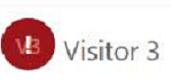

# notifyKpiBreach

This method is used to indicate a KPI breach. When this API is invoked, an exclamation sign appears on the icon of the session whose unique identifier is passed, indicating that a KPI breach has occurred.

To reset the KPI breach indication, invoke this API with the value of `shouldReset` parameter set as `false`.


<br>

## Syntax

`Microsoft.CIFramework.notifyKpiBreach(sessionId, shouldReset, details).then(successCallback, errorCallback);`

## Parameters

| **Name**        | **Type** | **Required** | **Description**                                                                                                  |
|-----------------|----------|--------------|------------------------------------------------------------------------------------------------------------------|
| sessionId           | String   | Yes    | Unique identifier of the session.                            |
| shouldReset | Boolean | No     |  A flag to reset the KPI breach indication. The default value is `false`. |
| details   | String | No           | Details about the KPI breach.             |
| successCallback| Function | No | A function to call when the request is successful. |
| errorCallback | Function | No | A function to call when the request fails. |

## Return value

None

## Example

```javascript
Microsoft.CIFramework.notifyKpiBreach(sessionId, shouldReset, details).then(
	function success(result) {
		console.log(result);
		// Perform operations
	},
	function (error) {
		console.log(error.message);
		// Handle error conditions
	}
);
```
### See also

[notifyNewActivity API](notifyNewActivity.md)
