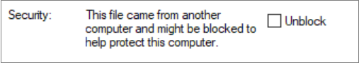
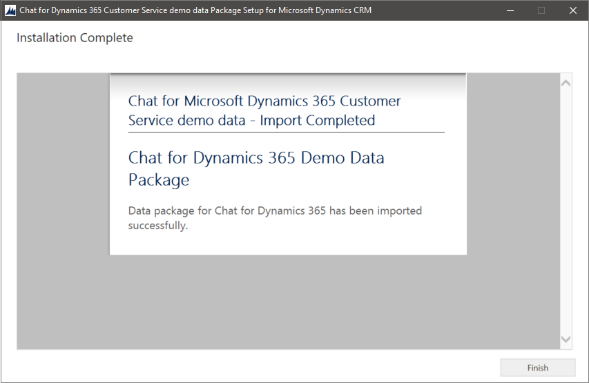

# Demo data installation for Chat for Dynamics 365 Customer Service

[!INCLUDE[cc-data-platform-banner](../includes/cc-data-platform-banner.md)]

This topic offers instructions on how to install sample or demo data for Chat for Dynamics 365 Customer Service capabilities to help you build your own demo environments.

The sample data is available as a downloadable demo package, which you can install in your Omnichannel for Dynamics 365 Customer Service demo environment that has the Chat for Dynamics 365 Customer Service add-on.

> [!IMPORTANT]
> - Once installed, you can't uninstall the demo data. 
> - The Chat for Dynamics 365 Customer Service demo data is available only in English. 
> - Install the demo data on a demonstration, evaluation, training, or test environment. We do not recommend installing the demo data in production environments.

## Prerequisites

The following are required for installing sample data in your target environment:

- A Microsoft Dataverse environment.
- Your base language is English.
- The environment has no Omnichannel for Customer Service data already, or has only the default data that comes with a new environment.
- The environment has Omnichannel for Customer Service provisioned and the Chat channel is enabled.

> [!NOTE]
> If you need to install the demo data on top of an existing Chat trial or a demo environment that already has data (not recommended), you'll need to suspend the safety prechecks performed by the installer. For more information, see the [Technical notes](#technical-notes).

## Download the sample data

Download the demo data from the Download Center and save it on your computer.

[Chat for Dynamics 365 Customer Service demo data](https://go.microsoft.com/fwlink/p/?linkid=2109052)


## Extract files

The Chat demo data installer is a self-extracting executable file. After you download the demo data, perform the following steps:

1. Run the **.exe** file that you downloaded.

2. Accept terms and conditions to unpack the compressed zip file. 

3. Extract the contents of that file to a folder on your computer.

Depending on the operating system and security settings, you might need to perform the following steps after unpacking the zip file:

1. Open the **OmnichannelDemoDataPackage** folder.

2. Right-click the **OmnichannelDemoDataPackage.dll** file and choose **Properties**.

3. Choose **Unblock**.

    > [!div class=mx-imgBorder] 
    > 

4. Select **Apply**.

5. Select **OK**.

## Set up users

The OmnichannelDemoData package installs a few users such as those listed in the table below. To install the demo data, you need to create (or temporarily rename) users in your Dataverse environment to match the incoming demo data configuration.

| First name | Last name | User alias   | Email                                    | Role                                            |
|------------|-----------|--------------|------------------------------------------|-------------------------------------------------|
| Alex       | Allman    | alexallman   | <alexallman@sampleorg.onmicrosoft.com>   | Omnichannel Supervisor                          |
| Lilly      | Michael   | lillymichael | <lillymichael@sampleorg.onmicrosoft.com> | System Administrator, Omnichannel Administrator |
| Penelope   | Mayo      | penelopemayo | <penelopemayo@sampleorg.onmicrosoft.com> | Omnichannel Agent                               |


### Configure users

1. Sign in to your Dataverse environment.

2. Select **Settings** > **Security** > **Users**.

3. Replace `"Lilly Michael"` with `"lillymichael"` in the `UserFullname="Lilly Michael"` tag. Ensure the username is all lowercase.

4. Select the **Lilly Michael** user. The user page appears.

5. Select **Manage Roles** in the command bar at the top. The **Manage User Roles** dialog box appears.

6. Select the check box for the following role names: 

    - **System Administrator**
    - **Omnichannel Administrator**

7. To grant full admin rights to Lilly Michael, select **OK**.

    This ensures that demo data records are created with the correct user ownership and therefore views are populated correctly.

8. Repeat steps 1 through 7 for the other users mentioned in the [table](#set-up-users).

### Update data mapping file

Next you need to update a data mapping file with the email address of the default user context in the downloaded package.

1. Open **PkgFolder**.

2. Open the **usermap.xml** file in Notepad (or another XML editor).

3. Set the `DefaultUserToMapTo=` field to the email address of user Lilly Michael. 

    For example: `<MappingConfiguration DefaultUserToMapTo="lilymichael@sampleorg.onmicrosoft.com">`

4. Select **Save**.

  > [!TIP]
  > We recommend creating a backup of your environment so you can revert to the initial stage if you encounter issues during the demo data installation. To learn more, see [Back up and restore instances](https://docs.microsoft.com/dynamics365/admin/backup-restore-instances).

## Run the package deployer

When you install any of the demo data, the following actions occur during the installation process:

- Default parameters for using Omnichannel for Customer Service are created and/or set.
- Demo data and configuration for the applications are imported (Chat widget, Work Streams, Queues, and other entities) to demonstrate key capabilities.

Wondering what capabilities you can demo with the demo data? See the Fabrikam scenario below.

1. Open the **OmnichannelDemoData** folder.

2. Run **PackageDeployer.exe**.

3. Accept the terms and conditions.

4. Specify the following in the connect screen and select **Login**. In this step, you need to connect to the Dataverse environment where you want to deploy the demo data:


    | Field | Value | Description |
    |-------------------------|------------------------|------------------------|
    | Deployment Type | Microsoft 365 | To connect to a Dataverse environment. |
    | Display list of available organizations | Select the check box. |
    Show Advanced | Select the check box. |
    |  Online Region | North America | Select the organization that you want to connect to. |
    | User Name | `lilymichael@sampleorg.onmicrosoft.com` | Specify the user name of the system administrator user that you configured in the [Configure users](#configure-users) section. |
    | Password |  | Specify the password of the system administrator user that you configured in the [Configure users](#configure-users) section. |

    

5. Select **Next** in the subsequent screens until you see the **Reading Chat for Dynamics 365 Customer Service demo data Package Installer Configuration** dialog box.

6. To start the demo data installation, select **Next**.

    
    
7. After the demo data is installed successfully, select **Finish**.

    

## Verify demo data installation

Verify that the number of records and types of entities listed in the **Fabrikam** fictitious scenario appear as expected.

After the demo data completely loads, do the following:

1. Sign in to Omnichannel for Customer Service as the Lilly Michael user.

2. Verify the following:

    - Go to **Omnichannel Administration** > **Queues & Users** > **Users** to
        confirm the three Omnichannel users are created.
    
    - Go to **Omnichannel Administration** > **Queues & Users** > **Queues** to
        confirm the Queue 1 (sample) and Queue 2 (sample) are created.
    
    - Go to **Omnichannel Administration** > **Channels** > **Chat** to confirm
        the Portal Chat (sample) is created.
    
    - Go to **Omnichannel Administration** > **Work Distribution Management** > **Work Streams** to confirm  the Chat Push (sample) is created.

## Technical notes

### Install demo data in an environment that already has data
> [!Warning]
> We highly recommend that you do not install demo data on top of existing data because in order to do so, you have to remove safety precautions.

If you must install demo data on top of an existing Omnichannel for Customer Service trial or demo environment that already has data, you'll need to suspend the safety prechecks performed by the installer. 

To suspend the safety prechecks, follow these steps:

1. Go to the **PkgFolder** folder.

2. Open the **DemoDataPreImportConfig.xml** file with Notepad (or another XML
    editor).

3. Set the value of `TerminateOnPreCheckFailure` from true to false.


    ```
    <TerminateOnPreCheckFailure>false</TerminateOnPreCheckFailure>
    ```

This change causes the installer to skip safety prechecks.

### Configuration components

There are several configuration components in this pre-import configuration
file. For technical users, these include:

- **<RequiredSolutions\>**: Specifies prerequisite solution installations and their version numbers.

- **\<InstallSampleData\>**: Installs demo data to your Dataverse environment. This is the same demo data that you can install from **Settings** > **Data Management**.

- **\<DefaultParameterDescription\>**: Specifies the default description for the parameters.

### Fabrikam scenario

The fictional company Fabrikam is a manufacturer of an electronic device assembly line of robots and is known for its product quality, innovation, and solid customer service, including: installation planning, implementation, and ongoing maintenance services. Fabrikam is headquartered in the United States (Fabrikam, U.S.), and has Customer Service Support (CSS) operations centered in the United States, primarily in the greater Seattle area. The CSS contact center is focused on providing excellent support experiences to their customers.

A high-level overview of the Chat for Dynamics 365 Customer Service demo data is as follows:

- Three Omnichannel users
- One web customer
- One case
- Four sessions
- One Chat for Dynamics 365 Customer Service work stream
- One Chat widget
- One Omnichannel for Customer Service queue

### See also

[Try channels in Omnichannel for Customer Service](https://docs.microsoft.com/dynamics365/omnichannel/try-channels)


[!INCLUDE[footer-include](../includes/footer-banner.md)]