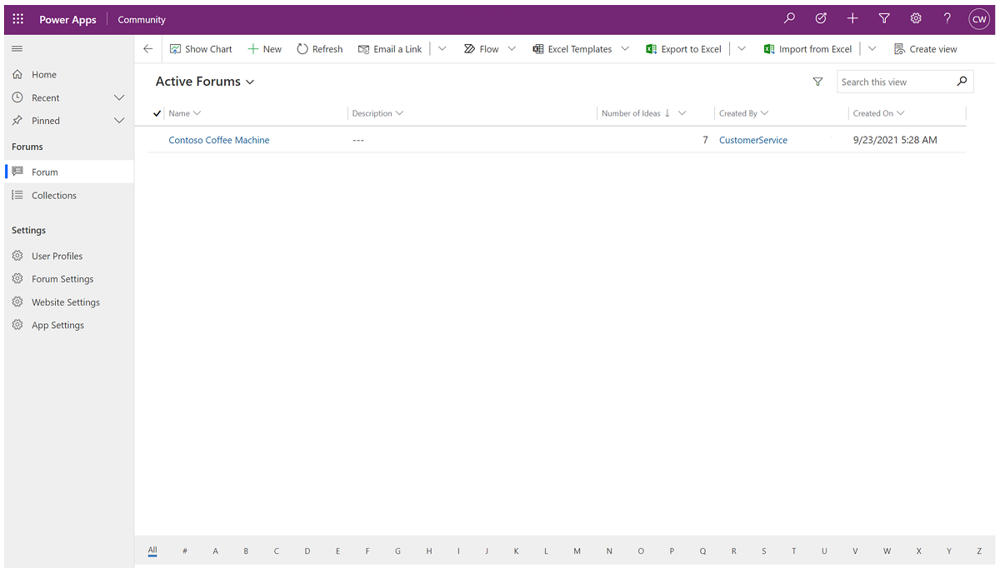
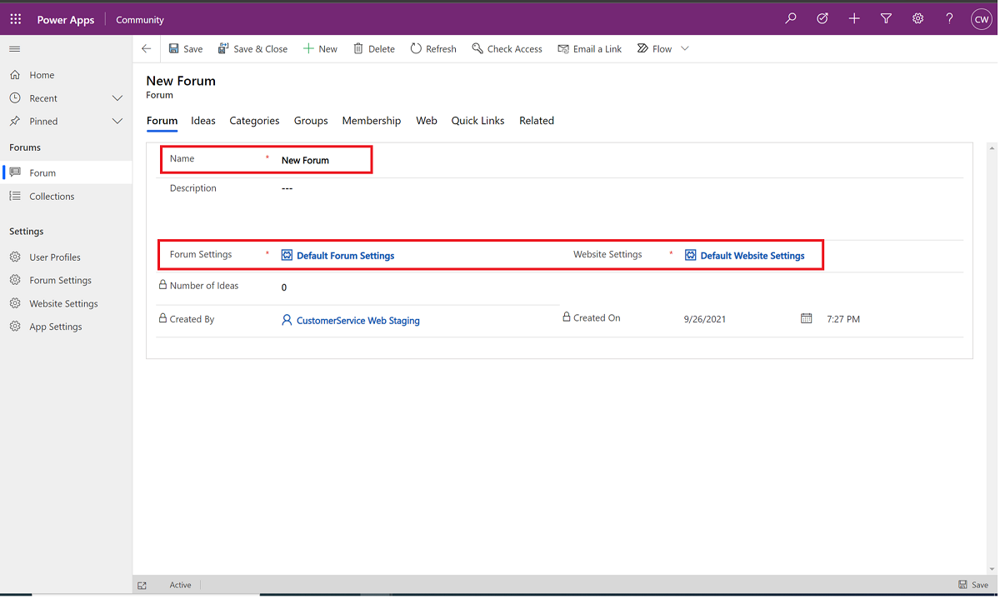
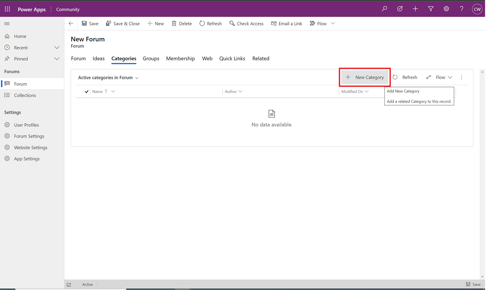
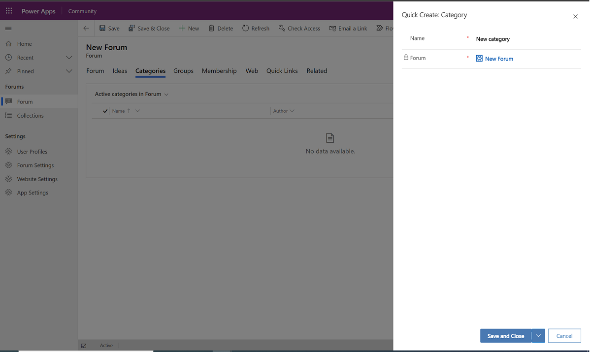
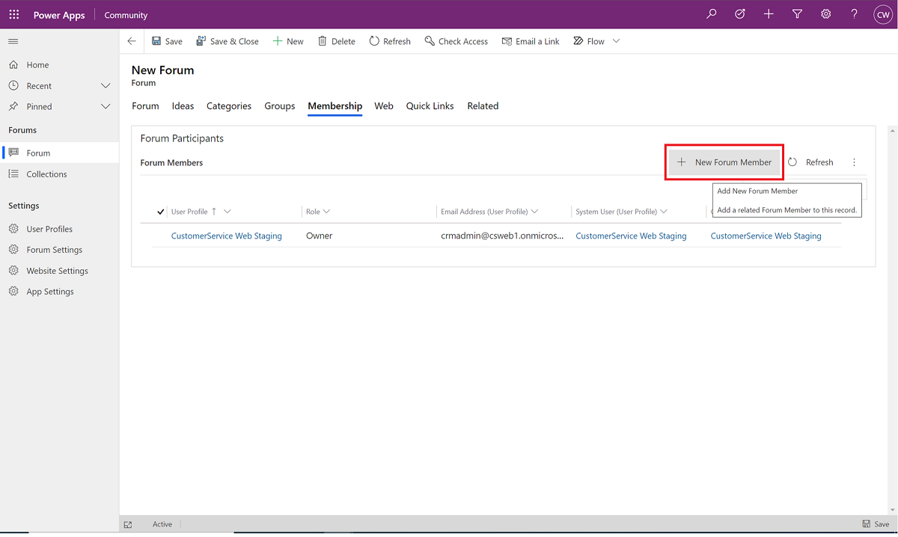
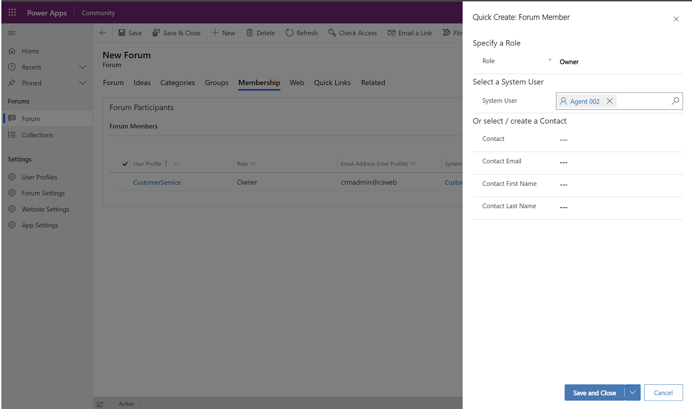
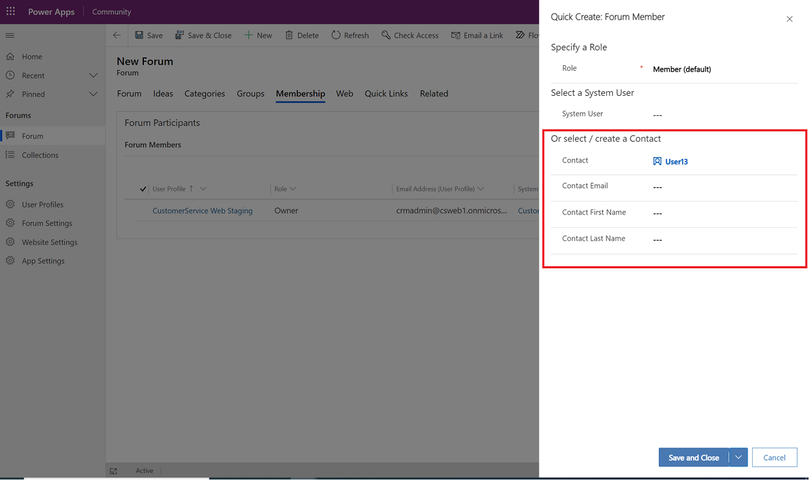
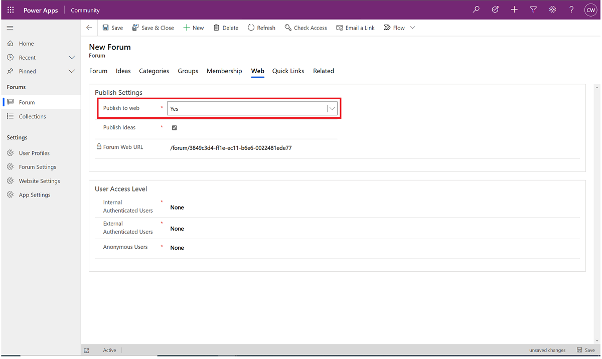
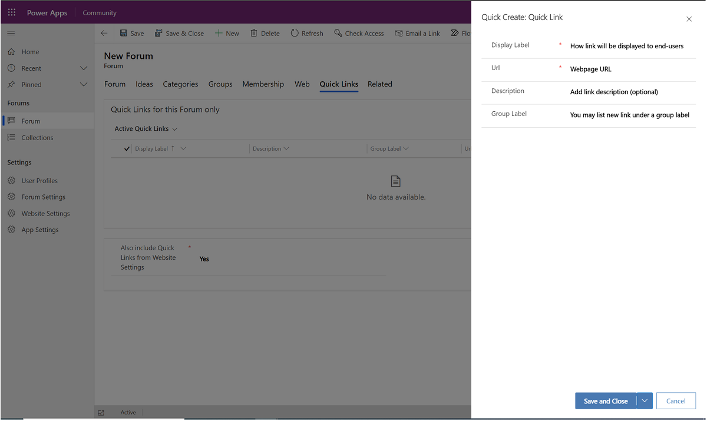

# Create a Community forum

In Customer Service Community, a forum is a container of ideas and the entity where security boundaries are applied. The user who creates a forum automatically becomes the owner, and can assign community roles and membership in the forum, as well as other metadata, like categories and groups.

## Create a forum

1.	On the left-side navigation panel, select **Forum**, and then select **New**.
     > [!div class="mx-imgBorder"] 
     > 
2.	Enter a **Name**, then select the **Forum Settings** and **Website Settings** you want to apply to the forum. Settings are managed by your administrator.
     > [!div class="mx-imgBorder"] 
     > 
3.	Select the **Categories** tab, and then select **+ New Category**. Categories you define here will be available for end-users to select when they create a new idea in this forum.
     > [!div class="mx-imgBorder"] 
     > 
4.	Enter a **Name** for the category, and then select **Save**.
     > [!div class="mx-imgBorder"] 
     > 
5.	To add more categories, repeat steps 3 and 4 above.
6.	When you are finished, select **Save and Close**.
7.	Go to the **Groups** tab and select **+ New Group**. The groups you define here will be available for end-users to select when they create a new idea in this forum.
8.	Enter a group name, and then select **Save**.
9.	To add more groups, repeat steps 7 and 8 above.
10.	Go to the **Membership** tab to add members to your forums. You'll see that you are already added as owner. The **Membership** tab is where you add forum owners and moderators.
11.	Select **+ New Forum Member**.
     > [!div class="mx-imgBorder"] 
     > 
12.	In the **Role** dropdown menu, select **Owner** or **Moderator**, then in **System User**, search and select the user you want.
13.	Select **Save**.
     > [!div class="mx-imgBorder"] 
     > 
14.	To add other owners or moderators, repeat steps 11-13.
15.	(Skip this step if your forum is public.) If your forum is private (for example, accessible to "by-invitation" members only), you'll need to add those individuals as contacts. Select **+ New Forum Member**, select **Member** in **Role**, and then either search for the existing contact in **Contact** or add information for a new contact in **Contact Email**, **Contact First Name**, and **Contact Last Name**. Repeat this step to add all by-invitation members.
     > [!div class="mx-imgBorder"] 
     > 
16.	To publish your forum to the web, go to the **Web** tab, and then select **Yes** in the **Publish to web** dropdown menu.
     > [!div class="mx-imgBorder"] 
     > 
17.	Under the **User Access Level**, select the access level for your users in public forums. The default values are **None** for all three configurations.
    **Important**: For private forums, leave the default settings set to **None**.
    - **Internal Authenticated Users**: Select the access level for users who are authenticated with email domains specified by your admin.
    - **External Authenticated Users**: Select the access level for non-internal authenticated users.
    - **Anonymous Users**: Select the access level for non-authenticated users.
18.	Go to the **Quick Links** tab to define links that show to end-users in the forum. You can choose whether to include quick links that the admin added to the portal home page.
19.	To add a forum **Quick Link**, select **+ New Quick Link**, and then enter the following values: 
    - **Display Label**: Refers to how the link will be displayed in the portal. 
    - **URL**: The webpage URL. 
    - **Description**: An optional field where you can provide additional information to describe this link to users. 
    - **Group label**: An optional field where you can specify the name of the group under which the link will be listed.
     > [!div class="mx-imgBorder"] 
     > 
    
### See also

[Community overview](community-overview.md) 
[Get started with Community](community-get-started.md) 
[Content moderation and management](community-moderator-experience.md) 
[Create new websites in Community](community-create-websites.md) 
[Community FAQs](community-faqs.md)

[!INCLUDE[footer-include](../includes/footer-banner.md)]
