# Content moderation and management

## Moderate content in Customer Service Community

Forum owners and moderators will use Customer Service Community to manage and moderate content, and can do the following tasks:
-	Edit a forum's name and description
-	Edit the idea name and description, and update fields, including category, group, and stage
-	Add a new moderator response to an idea
- Manage comments, including adding a moderator response to a comment, and manage comment flags
- Manage idea votes
- Manage idea flags

Follow these steps to moderate Community content:
1. Navigate to the forum, and then select the **Forum** tab.
2. Update the forum **Name** and **Description**.
3. Select the **Ideas** tab, and then select the idea you want to edit.
    > [!div class="mx-imgBorder"] 
    > 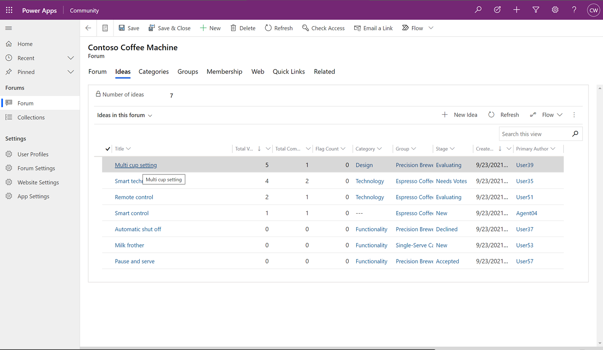
4. Update the fields as desired. You can also add a **Moderator Response** and select **Response Generic Author**. 
   **Response Generic Author** enables you to associate a generic role to your response in portal, rather than show your name. The list of  generic roles is managed by your admin.
    > [!div class="mx-imgBorder"] 
    > 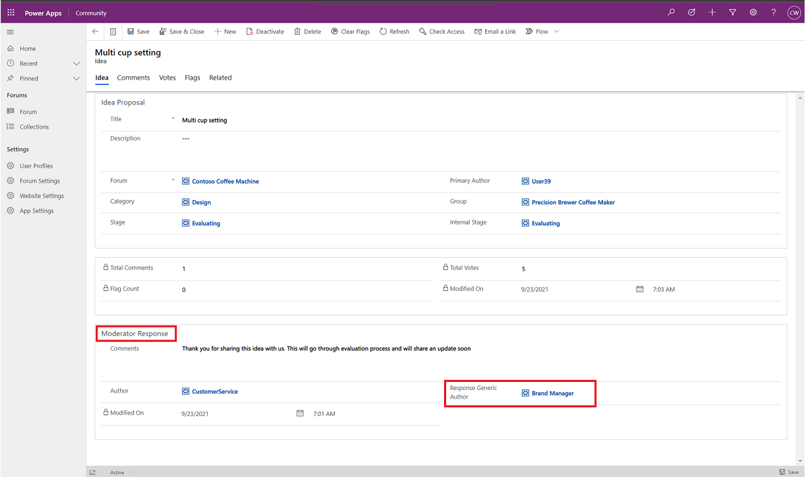
5. To manage idea votes, select the **Votes** tab. A vote value can be either 0 (no vote) or 1 (a single upvote).
    > [!div class="mx-imgBorder"] 
    > 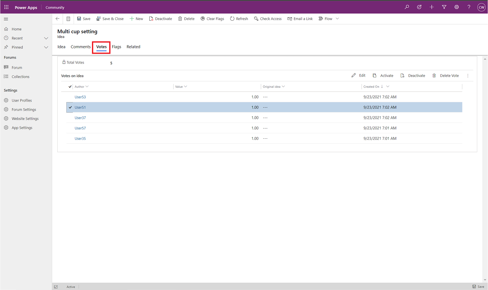
6. From the portal, end-users can flag ideas as inappropriate. Forum owners and moderators can go to **Flags** tab to view and manage idea flags.
    > [!div class="mx-imgBorder"] 
    > 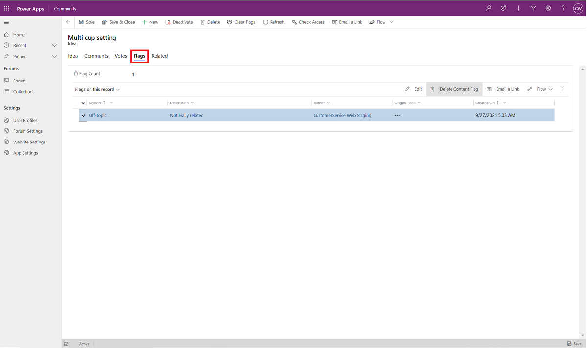
7. Go to the **Comments** tab to manage end-user comments. Under **Active comments on idea**, select the comment you want to edit, and then select **Edit**.
    > [!div class="mx-imgBorder"] 
    > 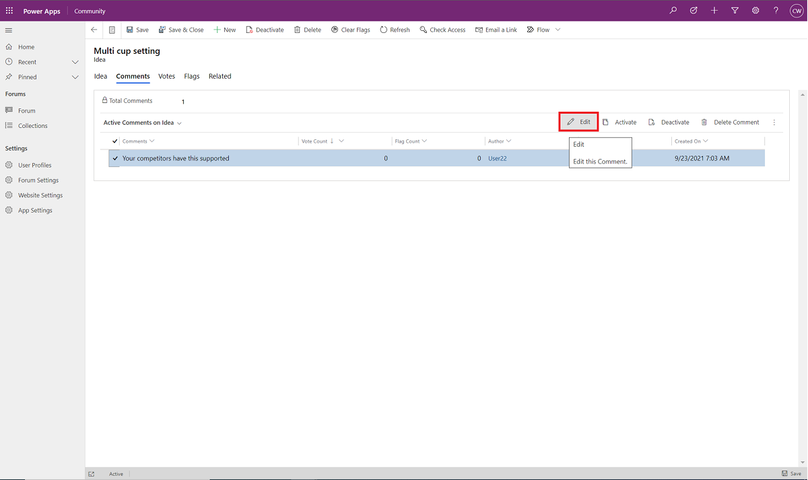
8.  Under **Moderator Response**, in the **Comments** field, type the desired response. Go to the **Flags** tab to manage flags on this comment.
    > [!div class="mx-imgBorder"] 
    > 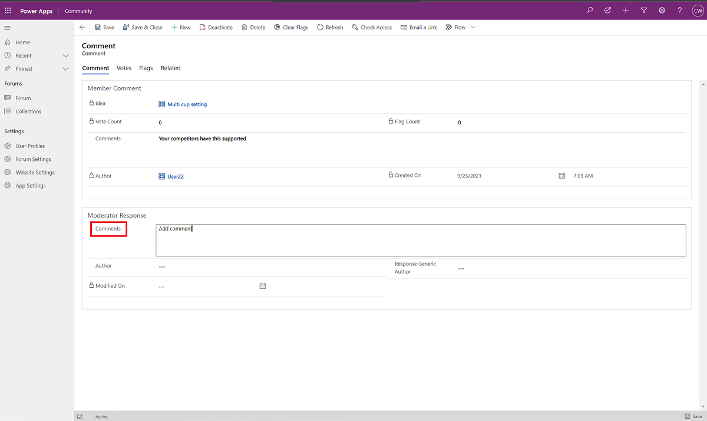

## Create collections

To combine duplicate or related ideas, forum owners and moderators can create a collection. Successfully created collections will show in the portal, and all the associated ideas (also called "children ideas") will be removed. Users who contributed to the children ideas can still view them (read only) on the **My Content** page. 

Follow these steps to create a collection:
1. On the left-side navigation pane, select **Collections**, and then select **+ New**.
    > [!div class="mx-imgBorder"] 
    > 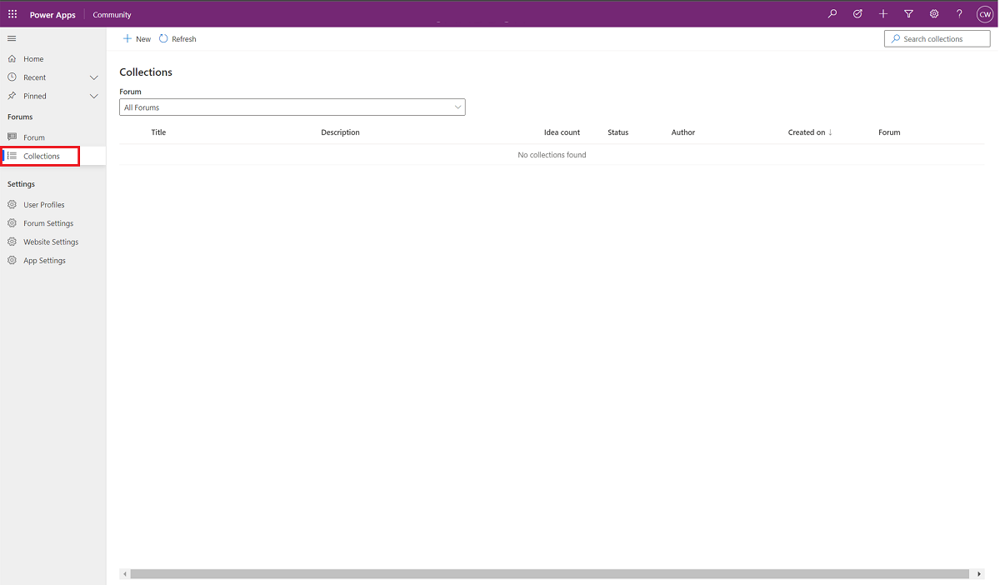
2. Select the forum you want to combine ideas from, and then select **Next**.
    > [!div class="mx-imgBorder"] 
    > 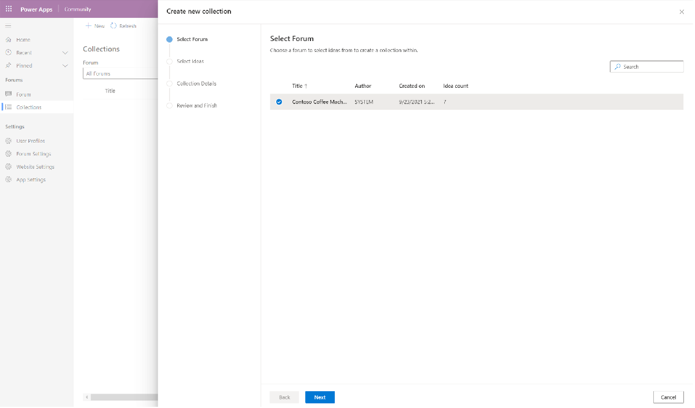
3. Select the plus sign (+) to add ideas from **Active ideas in this forum** list to the collection. Utilize search in long lists. Added ideas will show in the **Collection ideas** list.
    > [!div class="mx-imgBorder"] 
    > 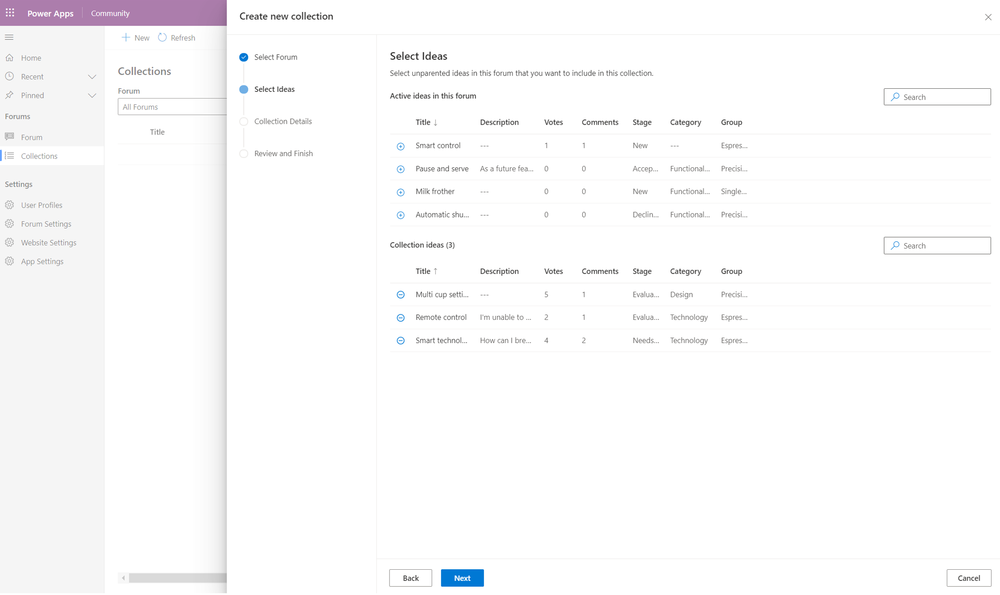
4. When you're done adding ideas, select **Next**.
5. Add a **Title** and **Description** for the new collection. You can also copy these fields from one of the child ideas.
6. Optional: You can select the **Stage**, **Group**, and **Category**, and then select **Next**.
    > [!div class="mx-imgBorder"] 
    > 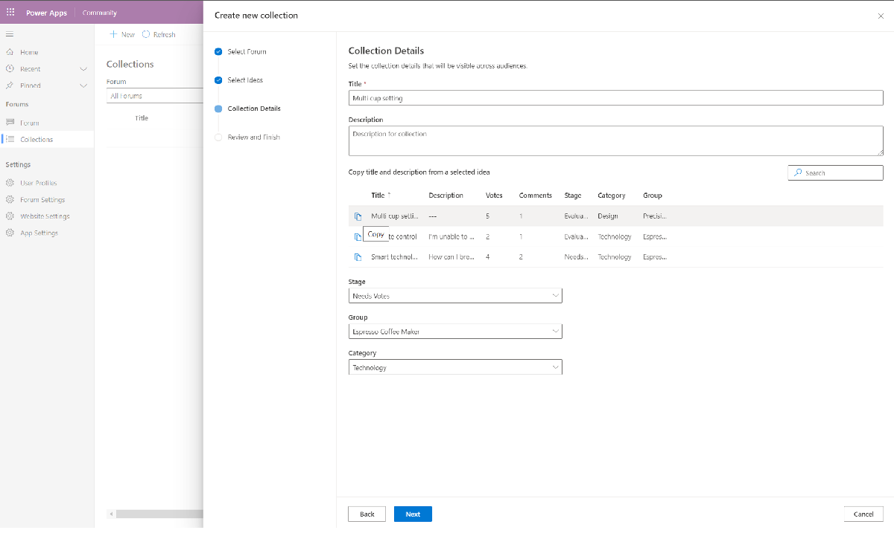
7. Confirm that the details are correct, and then select **Finish**.
    > [!div class="mx-imgBorder"] 
    > 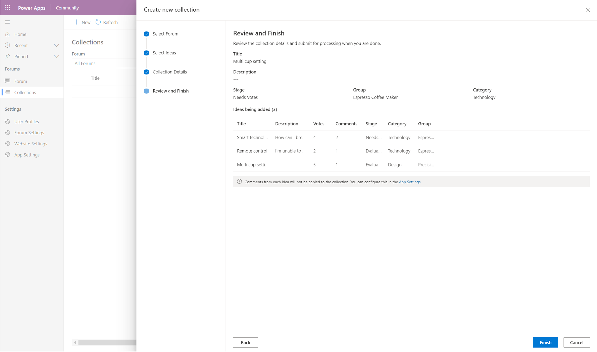
8. Wait for the status of the new collection to change from **In-progress** to **Success**. Refresh the page to get the latest status.
    > [!div class="mx-imgBorder"] 
    > 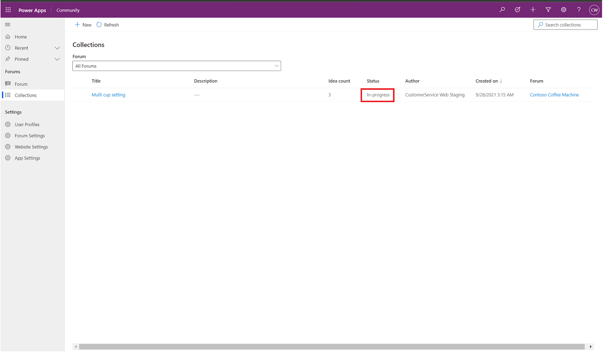
 
    > [!div class="mx-imgBorder"] 
    > 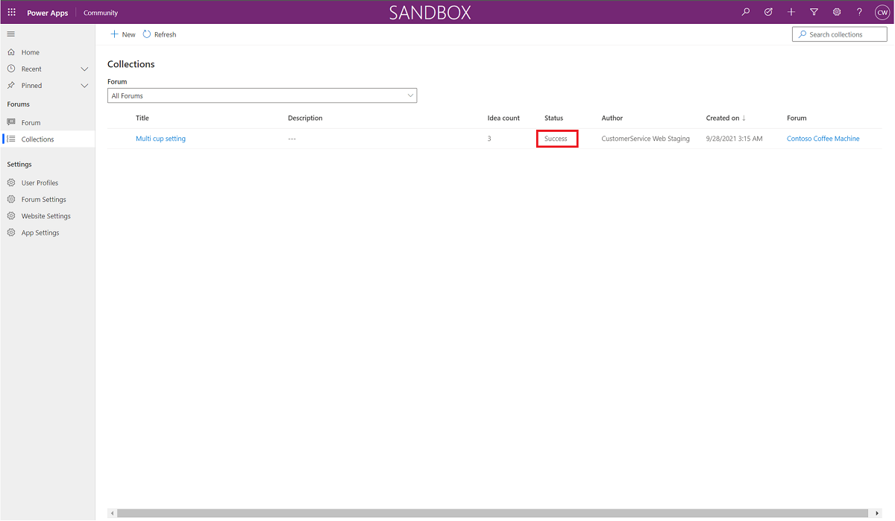

### See also

[Community overview](community-overview.md) 
[Get started with Community](community-get-started.md) 
[Create a Community forum](community-forum-setup.md) 
[Create new websites in Community](community-create-websites.md) 
[Community FAQs](community-faqs.md)

[!INCLUDE[footer-include](../includes/footer-banner.md)]

