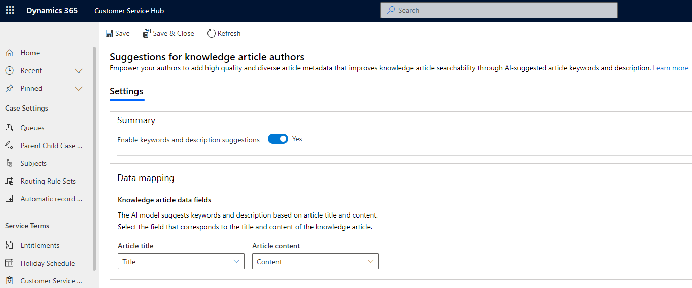

# Configure AI suggestions for article keywords and description

## Introduction

With the use of AI-suggested article keywords and description when authoring or updating knowledge articles, you can help knowledge authors ensure better searchability and surfacing of the right articles. This makes them more productive and supports them in following authoring best practices by adding high quality and diverse keywords and descriptions.

The key highlights of the feature are as follows:

- Enable knowledge authors to get suggested keywords and description based on the article content stored in the built-in Knowledge Article entity.
- Select the source data fields (text fields only) for AI model that should suggest keywords and description, for example, **Title** and **Content**.

> [!NOTE]
> The AI suggestions feature is currently available in few geographical locations. More information, see: [Regional availability and Service limits for Customer Service](cs-region-availability-service-limits.md).

## How AI suggestions for article keywords and description work

When the feature is turned on, the **View suggested keywords and description** link appears in the default knowledge article form for knowledge authors. On selecting the link, a dialog appears that shows the suggested keywords and description.

The AI model works as follows:

 - The text values from selected source data fields in Settings are sent to the AI model to generate suggestions. By default, the source data fields are **Title** and **Content**.
 - The model takes the first 2,200 characters to generate suggestions. It’s recommended that you describe the problem to be solved within the first 1,800 characters in your article to get good suggestions.
 - Knowledge article keywords and descriptions are then suggested based on the knowledge article title and content, and are displayed in the View suggested keywords and description dialog.

## Language support for article keywords and description suggestions

AI suggestions for article keywords and description are now supported in the following languages:

- Dutch
- English
- French
- German
- Italian
- Japanese
- Spanish

The language used in AI-generated suggestions relies on the article language that knowledge authors select in the article record. A knowledge author can specify the language for an article from the Summary tab of the knowledge form.

## Prerequisites

Make sure that the following requirements are met:

- You have the System Administrator role.
- The knowledge authors have the AIB Roles and the AIB SML roles.
- In Public Preview, The keywords and article suggestions are applicable only to the default knowledge article form.

## Enable AI suggestions for article keywords and description

Perform the following steps to enable the AI suggestions for article keywords and description:

1. Sign in to  Customer Service Hub. In the **Change area**, select **Service Management**, and then under **Insights**, select **Settings**.

2. In the **Suggestions for knowledge article authors** area, click **Manage**.
3. In the **Suggestions for knowledge article authors** > **Settings** > **Summary** area, turn on the **Enable keywords and description suggestions** toggle.
4. In the **Data mapping** > **Knowledge article data fields** area, select values for the **Article title** and **Article content** boxes, if you don't want to use the **Title** and **Content** values respectively, which are set by default. The AI model uses the data corresponding to the selected values to provide suggestions keywords and descriptions. 
5. Select **Save**.

   > 

### See also

[Create and manage knowledge articles](customer-service-hub-user-guide-knowledge-article.md)  
[Work with knowledge articles](work-knowledge-articles.md)  
[View AI-suggested similar cases and knowledge articles for active cases](csw-view-ai-suggested-cases-knowledge-articles.md)  
[View smart assist suggestions for knowledge articles and similar cases using AI for ongoing conversations](./oc-view-ai-suggested-cases-articles.md)  
[FAQs on AI-suggested cases and knowledge articles](csw-faqs-ai-suggestions.md)  
[Create a new similarity rule to view similar cases](suggest-similar-cases-for-a-case.md#create-a-new-similarity-rule-to-view-similar-cases)  

[!INCLUDE[footer-include](../includes/footer-banner.md)]
