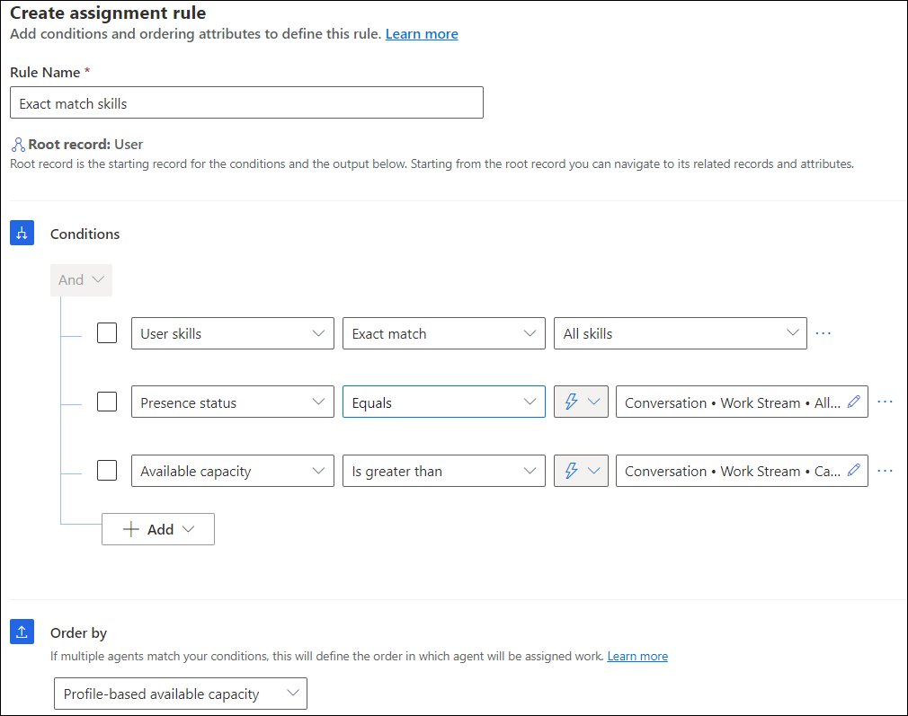

# Configure assignment methods and rules for queues

After creating queues, if you want to use custom assignment methods, you'll create assignment rulesets comprising rules.

You can create the custom assignment methods in the Omnichannel admin center and Customer Service Hub apps.

In unified routing, the process of creating assignment rulesets involves the following steps:

1. **Create assignment rulesets**: For each assignment ruleset, you'll configure the conditions and order by option.

1. **Create selection criteria**: If you create more than one assignment ruleset, you'll need to define the rules for the selection criteria. The selection criteria determines the ruleset that should be run out of the many that exist. More information: [Configure selection criteria](#configure-selection-criteria).

## Create an assignment method and configure rules

Perform the following steps to create a custom assignment method:

1. In Dynamics 365, go to one of the admin apps, and perform the following steps.

   ### [Customer Service admin center](#tab/customerserviceadmincenter)

    1. In the site map, select **Queues** in **Customer support**.

    2. On the **Queues** page, select **Manage** for **Advanced queues**.

   ### [Omnichannel admin center](#tab/omnichanneladmincenter)

    - In the site map, select **Queues** in **General settings**.

   ### [Customer Service Hub](#tab/customerservicehub)

    - Go to the **Service Management** site map, and select **Advanced queues** in **Unified routing**.

1. Select a queue, and on the **Assignment method** page, select **Create New**.

1. In the **Create work assignment** dialog, enter a name and description for the ruleset, and select **Create**.

1. Select the ruleset, and select **Edit**. The options to configure prioritization rulesets and assignment rulesets are displayed.

1. Do the following to set up prioritization rulesets:

   a. On the **Create Prioritization Ruleset** dialog, enter a name and description for the ruleset, and select **Create**.

   b. On the **Decision list** page, select **Create rule**, and on the **Create prioritization rule** dialog, enter a rule name and define the conditions when the rule should be run. By default, the root record is selected and displayed at the top of the condition builder for ease of reference and visibility of the record for which you're creating the rule.

   c. Select the attribute on which you want to define the order-by to route the work item to agents.

   d. Create as many rules as needed.

   > ![NOTE]
   > For routing records, we recommend that you manage custom prioritization rules through the UI only and not create or update them through scripts.

1. To create an assignment ruleset, on the **Assignment method** page, select **Create ruleset**.

1. Enter a name and description for the ruleset, and select **Create**. The ruleset is created.

1. On the **Assignment ruleset** page that appears, select **Create rule**.

1. In the **Create assignment rule** dialog, do the following to add conditions and order by attributes:

   a. **Rule Name**: Enter a rule name.

      By default, the root record is selected and displayed at the top of the condition builder for ease of reference and visibility.

   b. **Conditions**: Select **Add** to select an attribute or related entity and define condition. You can define conditions for up to two levels of the related records and attributes.

   c. **Order by**: Select an attribute to define the order of work assignment if multiple agents match the condition.

      - **Ordering Attributes**:
         - **Most idle (Preview)**: in preview release, this option is available for voice channel queues only. Work item is routed to the agent who is idle the most among all the agents who match skills and capacity. For more information, see [Types of assignment methods](assignment-methods.md#types-of-assignment-methods).
         - Round Robin
         - Unit-based available capacity
         - Profile-based available capacity
         - Proficiency
         - Skill count
      - **User Attributes**: These attributes are defined on the system user entity.

   d. Select **Create**.

   e. Repeat the steps a through d to configure multiple rules.

   > [!NOTE]
   > We recommend that you reduce the granularity of the conditions for the assignment rules in a descending order.
  
1. You can sort the order in which the rules should be evaluated during work assignment. For other tasks that you can perform, such as copy, edit, delete, see [Options available for rulesets](configure-work-classification.md#options-available-for-rulesets).

1. If you create more than one assignment ruleset, a warning message is displayed that alerts you to define the selection criteria to run the rulesets.

   Create a sample assignment rule with the following conditions.

   | Attribute          | Operator                    | Match type    | Attribute value                           |
   | ------------------ | --------------------------- | ------------- | ----------------------------------------- |
   | User skills        | Exact match                 |               | All skills                                |
   | Presence status    | Equals                      | Dynamic match | Conversation.Workstream.Allowed Presences |
   | Available capacity | Is greater than             | Dynamic match | Conversation.Workstream.Capacity                                   |
   |                    |                             |               |              |

   > [!NOTE]
   > If you want to define a condition on unit-based capacity of users, then use the Available capacity attribute only as suggested in the example. Use the "is greater than" operator to ensure that available capacity is more than the required capacity.

   

### Configure selection criteria

Define the selection criteria, when you configure more than one assignment ruleset in the custom assignment method. The selection criteria lets you define a set of conditions to determine the ruleset to be run when the condition is met. After the ruleset is picked up by the work assignment engine, if no rule matches in the selection criteria or if no selection criteria is met, the default ruleset will be run by the system.

Follow these steps to configure the selection criteria for the assignment rulesets:

1. For the assignment method, in the **Assignment** section, select **Create rule**, and in the **Decision list** area, select **Create rule**.

2. In the **Create selection criteria rule** dialog, enter a rule name, and define the conditions.

3. In **Execute ruleset**, select the assignment ruleset that must be run when the conditions are met, and then select **Create**. The rule is listed in the **Decision list** area.

4. Define as many rules as the number of assignment rulesets.

### See also

[Create workstreams](create-workstreams.md)  
[Create queues](queues-omnichannel.md)  
[Set up records for unified routing](set-up-record-routing.md)  
[Set up skill-based routing for unified routing](set-up-skill-based-routing.md)  
[FAQ about unified routing in Customer Service, Omnichannel for Customer Service](unified-routing-faqs.md)  
