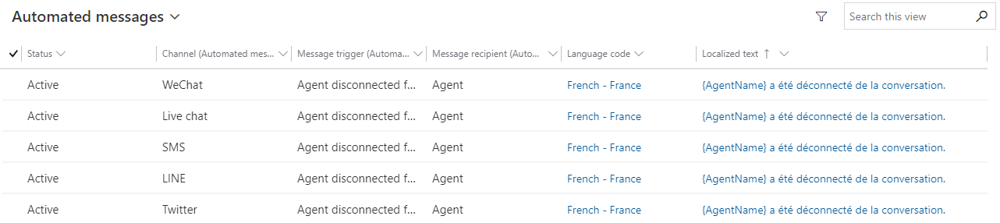

# Configure automated messages

[!INCLUDE[cc-use-with-omnichannel](../includes/cc-use-with-omnichannel.md)]

## Introduction

You can configure Omnichannel for Customer Service to send automated messages through chat, SMS, Microsoft Teams, or social channels. The **Automated messages** tab in each channel instance enables administrators to create channel-specific, locale-specific text. Administrators can customize, deactivate, and activate channel-level customer and agent-facing messages.  

## Display a list of all automated messages

You can view a list of all agent and customer-facing automated messages in your Omnichannel for Customer Service environment. Administrators can overwrite or deactivate the preconfigured, out-of-the-box automated messages for any channel instance. See [Preconfigured automated message triggers](#preconfigured-automated-message-triggers) for more information.

1. In Omnichannel admin center, select **Customer settings** in the site map, and select **Manage** for **Automated messages**. The list of all the automated messages is displayed. If you are using Omnichannel Administration, under **Settings**, select **Automated messages**. A list of all the automated messages is displayed.

    > [!div class=mx-imgBorder]
    > 

2. Select one or more of the records to edit the language code and text. If you want to deactivate the messages, select the **Deactivate** button.

## Customize automated messages at the channel level

You can customize messages across instances within a channel. For example, you can apply a change to all Facebook accounts or all SMS numbers.

1. Select a message in the Automated messages list.

2. Edit the message text, and select **Save**.

    > [!div class=mx-imgBorder]
    > 

## Customize automated messages at the channel instance level

You can customize automated messages at the channel instance level. For example, you can apply a change to one specific Facebook account, one specific SMS number, and so on. If you don't create customized automated messages at the channel instance level, each instance will inherit the channel-level settings. If you create customized automated messages at the channel instance level, the channel-level settings are overwritten.

### Add custom automated messages in Omnichannel admin center

Do the following for the channel in which you want to create custom automated messages:

1. Go to the workstream, and edit the channel instance.
2. On the **Behaviors** page, select **Add message** in the **Custom automated messages** area.
3. On the **Add automated message** pane, select a trigger in the **Message trigger** list.
4. In the **Automated message** box, type the message that should be displayed.
5. Select **Confirm**.
6. Repeat steps 3 through 5 to create multiple messages.
7. Save the settings.

### Add custom automated messages in Omnichannel Administration

1. In Omnichannel Administration, go to **Channels**, and select the channel you will use to send automated messages. This example uses WeChat.
2. In the list of accounts, open the channel instance for which you want to configure an automated message.
3. Select the **Automated messages** tab, and select **New message**.

    > [!div class=mx-imgBorder]
    > 

4. Enter the name of your message, select the message trigger, and then type your message. The **Language Code** field is determined by the language set in the **General settings** tab of the channel instance and cannot be modified. The **Message Trigger** field contains the system events that prompt an automated message to be sent.
12. Select **Save**.

    > [!div class=mx-imgBorder]
    > 
    
    The message is added to the list of channel instance-specific messages. To create localized versions of the message, repeat the steps for each language required. 

To deactivate messages at the channel instance level, select one or more messages, and select the **Deactivate** button.

> [!div class=mx-imgBorder]
> 

## Preconfigured automated message triggers

| **Message trigger** | **Definition** | **When to trigger** |
|-----------------|------------|-----------------|
| Agent assigned to a conversation                                 | Message displayed to the customer when the customer's conversation is created | When the customer's conversation is created |
| Agent couldn’t be assigned to conversation                       | Message displayed to the customer  when agent assignment fails  | When work distribution fails (for example, no agents are linked to the queue, or the default queue is not found)  or when routing is unable to add the agent to the chat due to system (CBB/IC3) failure. |
| Agent disconnected from the conversation                         | Message displayed to the customer  when the agent gets disconnected | When the agent gets disconnected due to browser tab closure, browser closure, offline agent presence, internet disconnected  |
| Agent ended the conversation                                     | Message displayed to the customer when the agent ends the conversation | When the agent clicks the End button  |
| Agent joined the conversation                                    | Message displayed to the customer  when the agent joins a conversation | When the agent accepts the notification  |
| Consult accepted                                                 | Message displayed to the customer  when another agent is consulted successfully  | When another agent accepts the consult request  |
| Consult session ended                                            | Message displayed to the customer when consulted agent ends the session  | When the consulted agent closes the session |
| Holiday message to customer                                      | Message displayed to the customer on holidays  | When the customer initiates a conversation on holidays set up for the Live Chat, channel, or queue  |
| Out of operating hour message to customer                        | Message displayed to the customer outside of the business hours  | When customer initiates a conversation outside of business hours set up for the Live Chat, channel, or queue  |
| Session ended                                                    | Message displayed to the customer when the agent ends the conversation and closes the session | When the agent ends the conversation and closes the session  |
| Transfer to agent accepted                                       | Message displayed to the customer  when the conversation is transferred successfully | When another agent accepts the transfer request  |

### See also

[Add a chat widget](add-chat-widget.md)  
[Channels](channels.md)  

[!INCLUDE[footer-include](../includes/footer-banner.md)]
