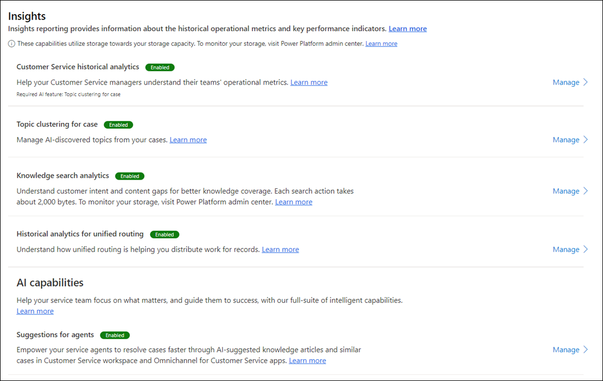

# Configure Customer Service historical analytics reports

You can configure historical analytics to give your service managers a combination of BI analytics and AI insights for their organization. The reports use natural language understanding to automatically detect the language used in your support cases and group related support cases into topics.

The following historical reports are available:

- [Summary report](summary-dashboard-cs.md)
- [Agent report](agent-dashboard-cs.md)
- [Topics report](case-topics-dashboard-cs.md) 

## Enable Customer Service analytics reports in Customer Service Hub 

Make sure that you have administrator permissions for Dynamics 365.

1. Sign in to Dynamics 365 as an administrator, and go to **Customer Service Hub**.

2. In the **Change area**, select **Service Management**.

3. Under **Insights**, select **Settings**. The **Insights** page is displayed.

    > [!div class=ms-imgBorder]
    > 

4. On the right of **Customer Service historical analytics**, select **Manage**.

5. On the **Customer Service historical analytics** page, toggle **Status** to **Enabled**.

6. Select **Save** or **Save & Close**.

This configuration will also enable AI-discovered topics from cases with default settings.

### View Customer Service analytics reports

The service managers must have the admin or service manager role to view the reports. Users with the CSR Manager role will be able to view the reports only after the reports are shared with them.

### Provide report access to additional security roles

Perform the following steps to enable users with different privileges to access reports beyond the default ones.

1. In Dynamics 365, navigate to **Settings** and select **Advanced settings**.

2. Select **Security** and then **Security roles**.

3. Select the security role that you want to enable access for. For example, CSR Manager.

4. Select the **Custom Entities** tab.

5. Select an entity. For example, select Customer Service historical analytics.

6. Select **Save and close**. The CSR Manager can now see the Customer Service historical analytics report.

You can see the following reports by navigating to the **Service** > **Analytics and Insights** > **Customer Service historical analytics** page. By default, the **Summary** page is displayed.

### See also

[Introduction to Customer Service analytics and insights](introduction-customer-service-analytics.md)  
[Dashboard overview](customer-service-analytics-insights-csh.md)  
[Knowledge search analytics](knowledge-search-analytics-cs.md)  

[!INCLUDE[footer-include](../includes/footer-banner.md)]
