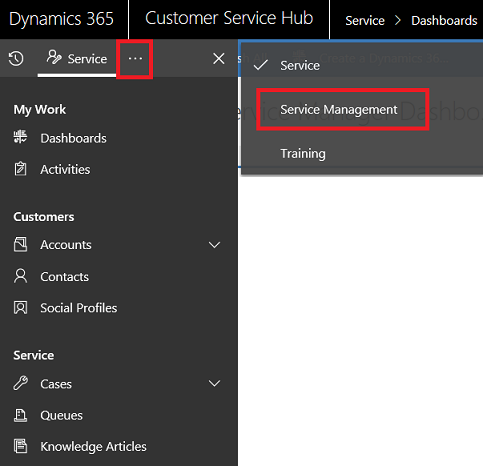
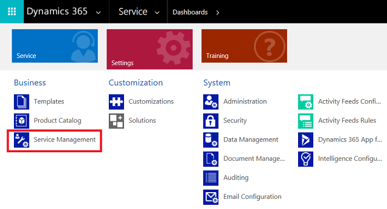

# Configure Customer Service

Use the Customer Service Hub app to set up everything related to customer service, like defining parent-child case hierarchy, creating queues, routing rule sets, rules for automatic case creation, service-level agreements (SLAs), entitlements, and customer service schedules.

## Customer Service Hub

Use the Service Management to set up various admin tasks for customer service.

In the bottom left pane, select the change area, and select Service Management.

[!INCLUDE[proc_more_information](../includes/proc-more-information.md)] [Understand the site map navigation](customer-service-hub-user-guide-basics.md#understand-the-site-map-navigation)

## Customer Service app

In the Customer Service app, navigate to **Settings > Service Management**.

## Case settings

- [Queues](set-up-queues-manage-activities-cases.md)
- [Parent Child Case Settings](define-settings-parent-child-cases.md)
- [Routing Rule Sets](create-rules-automatically-route-cases.md)
- [Automatic Record Creation](set-up-rules-to-automatically-create-or-update-records.md)
- [Subjects](../admin/define-subjects-categorize-cases-products-articles.md)
  
## Service terms  

- [Service Level Agreements](define-service-level-agreements.md)
- [Entitlements](create-entitlement-define-support-terms-customer.md)
- [Holiday Schedule](set-up-holiday-schedule.md)
- [Customer Service Schedule](create-customer-service-schedule-define-work-hours.md)
- [Service Configuration Settings](../admin/system-settings-dialog-box-service-tab.md)

## Templates

[Entitlement Templates](set-up-entitlements-templates.md)

## Knowledge Base Management 

- [Embedded Knowledge Search](set-up-knowledge-management-embedded-knowledge-search.md)
- [Categories](create-manage-categories.md)

## Similar Record Suggestions

[Suggest similar cases using advanced similarity rules](suggest-similar-cases-for-a-case.md)

### See also

[What's new in Dynamics 365 Customer Service](whats-new-customer-service.md)

[!INCLUDE[footer-include](../includes/footer-banner.md)]