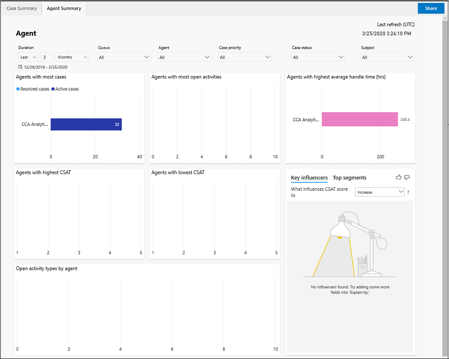
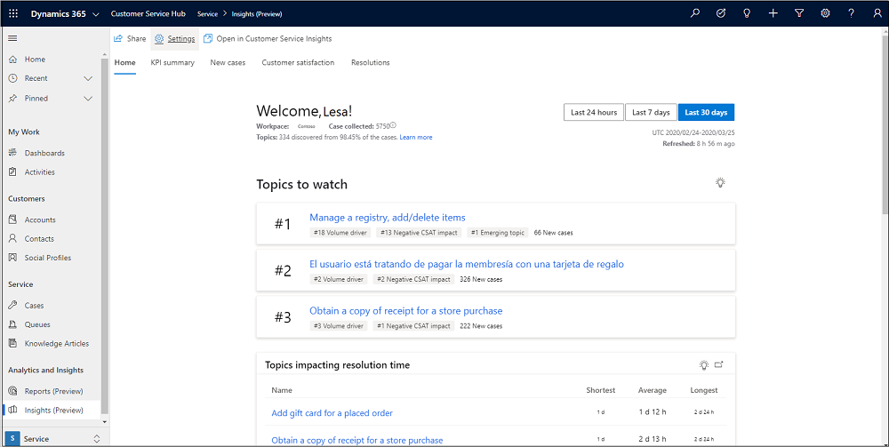

# Preview: Configure Customer Service Analytics and Insights in Customer Service Hub

[!include[cc-beta-prerelease-disclaimer](../includes/cc-beta-prerelease-disclaimer.md)]

> [!IMPORTANT]
>
> - A preview is a feature that is not complete, as it may employ reduced privacy, security, and/or compliance commitments, but is made available before it is officially released for general availability so customers can get early access and provide feedback. Previews are provided “as-is,” “with all faults,” “as available,” and without warranty.​
> - This preview feature does not come with technical support and Microsoft Dynamics 365 Technical Support won’t be able to help you with issues or questions.  If Microsoft does elect to provide any type of support, such support is provided "as is," "with all faults," and without warranty, and may be discontinued at any time.​
> - Previews are not meant for production use, especially to process Personal Data or other data that is subject to heightened compliance requirements, and any use of "live" or production data is at your sole risk.  All previews are subject to separate [Terms and Conditions](../legal/dynamics-insider-agreement.md).

## Overview

You can configure the Customer Service Analytics dashboards in Customer Service Hub and share them with supervisors and service managers who can then view and analyse the different activities perform in Customer Service Hub. The following reports are available out of the box:

- **Analytics reports:** Customers can view business intelligence (BI) analytics and metrics for their customer service organisation.
- **Insights reports:** Customers can view Customer Service Insights reports with a combination of BI analytics and artificial intelligence (AI) insights for their organisation.

## Prerequisites for installing Customer Service Insights reports

Make sure that the following prerequisites are met:

- Administrative privileges for Dynamics 365.
- Valid Customer Service Insights license.

## Install Customer Service Insights reports

Perform the following steps to install the Customer Service Insights reports:

1. Sign in to Dynamics 365 as an administrator, and navigate to Customer Service Hub.
2. In the **Change area**, select **Service Management** > **Settings (Preview)**. The **Analytics and insights settings** page appears.
3. Select **Get started**. The **Install Customer Service Insights** page displays the installation process.
4. Select **Go to settings**. The **Analytics and insights settings** page is displayed.
    > [!div class=ms-imgBorder]
    > 

## Configure Customer Service Analytics reports in Customer Service Hub

Perform the following steps to configure the dashboards:

1. Sign in to Dynamics 365 as an administrator, and navigate to Customer Service Hub.
2. In the **Change area**, select **Service Management** > **Settings (Preview)**. The **Analytics and insights settings** page appears.
    > [!div class=ms-imgBorder]
    > 

3. In **Analytics reporting**, switch the toggle to **Enabled**. A provisioning message displays, and **Share reports** appears after the provisioning is complete.

## Share Customer Service Analytics reports

You can share the reports from the **Service Management** > **Settings (Preview)** > **Analytics and insights settings** page or **Service** > **Analytics and Insights** > **Reports (Preview)** > **Data Analytics Reports** page.

1. On the **Analytics and insights settings** page, select **Share reports**. The **Data Analytics Reports** page displays the list of available reports.
    > [!div class=mx-imgBorder]
    > 

2. Select a report. The report opens on a new page.
3. Select **Share**. The **Share data analytics report** dialog box appears.
    > [!div class=mx-imgBorder]
    > 
4. Select **Add User/Team**. The **Look Up Records** dialog box appears.
5. Search for users, and add them. The users appear in the table.
6. Select the permissions that you want to grant on the report, and select **Share**. The report is shared with the selected users.

## View Customer Service Analytics reports

The service managers and supervisors nust have the admin or the service manager role to view the reports. Users with CSR Manager role will be able to view the reports only after the reports are shared with them.

You can see the reports by navigating to the **Service** > **Analytics and Insights** > **Reports (Preview)** > **Data Analytics Reports** page. You must have the Customer Service Insights license to view the Insights reports.

### Case Summary report

> [!div class=mx-imgBorder]
> 

### Agent Summary report

> [!div class=mx-imgBorder]
> 

## View Customer Service Insights dashboard
if you have the Customer Service Insights license assigned, you can do the following:
- View reports
- Share reports
- Change settings
- 
Perform the following steps to view reports
:
1. On the **Analytics and insights settings** page, select **View report**.

    > [!div class=ms-imgBorder]
    > 
 
  The Home page of the report is displayed.

    > [!div class=ms-imgBorder]
    > 

 

### See also

[Introduction to Customer Service Analytics](introduction-customer-service-analytics.md)

[View and understand Customer Service Analytics](customer-service-analytics.md)

