# Configure Customer Service Analytics dashboards in Power BI

[!INCLUDE[cc-data-platform-banner](../includes/cc-data-platform-banner.md)]

You must perform the following steps to configure the historical Customer Service Analytics dashboards to display in the Customer Service Hub app:

[Step 1: Review the prerequisites](#step-1-prerequisites)

[Step 2: Install Dynamics 365 Customer Service Analytics app](#step-2-install-dynamics-365-customer-service-analytics-app)

[Step 3: Connect Dynamics 365 organization to Customer Service Analytics app](#step-3-connect-dynamics-365-organization-to-customer-service-analytics-app)

[Step 4: Configure refresh frequency on Power BI dataset](#step-4-configure-refresh-frequency-on-power-bi-dataset)

[Step 5: Publish application within your organization](#step-5-publish-application-within-your-organization)

[Step 6: Enable Power BI reporting](#step-6-enable-power-bi-reporting) 

[Step 7: Add Power BI Dashboard to Customer Service Hub](#step-7-add-power-bi-dashboards-to-customer-service-hub) 

## Step 1: Prerequisites

Review the following prerequisites before configuring the supervisor dashboard:

- You have administrative privileges for Dynamics 365 and Microsoft Power BI.
- You have a Power BI Pro license for all supervisors.
- Service Root URL of your Dynamics 365 instance.

## Step 2: Install Dynamics 365 Customer Service Analytics app

1. Sign in to [Power BI](https://app.powerbi.com/) app as an administrator.
2. As a Power BI admin, open the link: [https://aka.ms/cs-analytics](https://aka.ms/cs-analytics)
3. Install the **Customer Service Analytics for Dynamics 365** app. The app configuration options page is displayed.

    > [!div class=mx-imgBorder]
    > 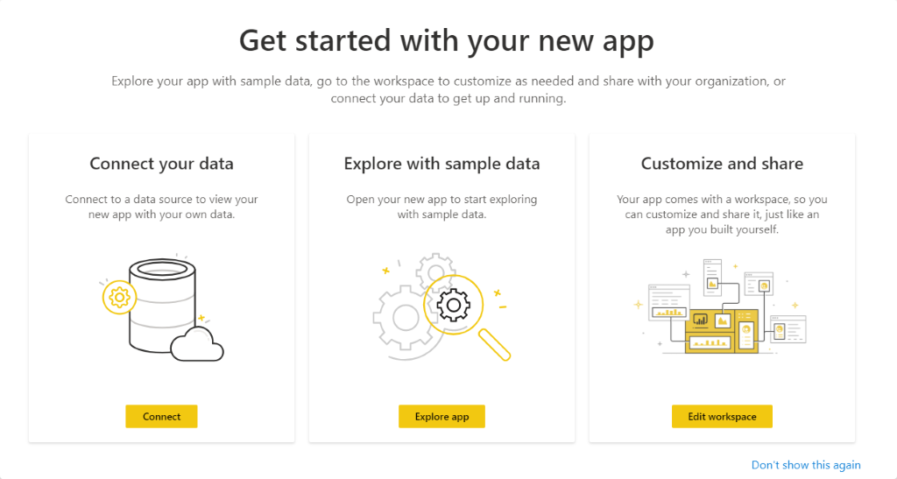

## Step 3: Connect Dynamics 365 organization to Customer Service Analytics app
 
 1. On the app configuration options page, select **Connect**.

    > [!div class=mx-imgBorder]
    > 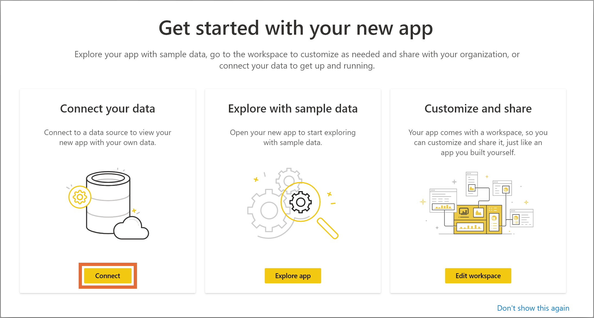

2. On the **Connect to Customer Service Analytics for Dynamics 365** page, enter your organization's Dynamics 365 Service Root URL, and select **Next**.

    > [!div class=mx-imgBorder]
    > 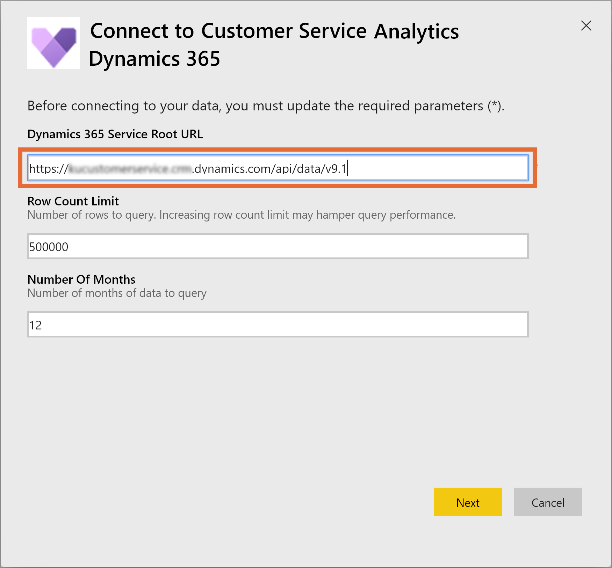

3. (Optional) To find the Microsoft Dynamics 365 Data URL, follow these steps:

    a. Sign in to Dynamics 365 Customer Service.

    b. Go to **Settings** and then select **Developer Resources**.  

    c. Find the Data URL under **Service Root URL**. 

    > [!div class=mx-imgBorder]
    > 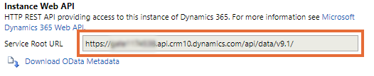

4. On the page that appears, select **OAuth2** in **Authentication method**, and **Organizational** in **Privacy level setting for this data source**.

    > [!div class=mx-imgBorder]
    > 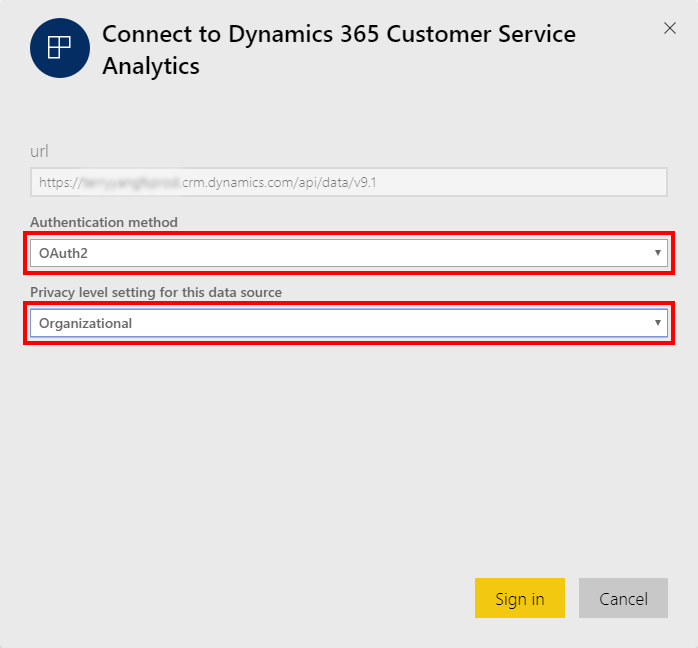

5. Select **Sign in**. The sign-in page appears.
6. Enter your Dynamics 365 organization credentials, and select **Enter**. After you are signed in, the existing report is updated with the data from your organization.

## Step 4: Configure refresh frequency on Power BI dataset

After you connect the Dynamics 365 Customer Service Analytics app with a Dynamics 365 organization, you need to configure the refresh frequency on the Power BI dataset to update reports and dashboards properly.

1. Sign in to Power BI as an administrator.
2. Go to the **Dynamics 365 Customer Service Analytics** app workspace.

    > [!div class=mx-imgBorder]
    > 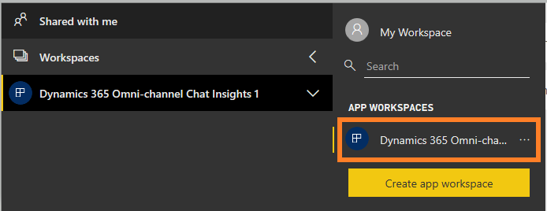

3. Go to the **Datasets** tab and select **Settings**.

    > [!div class=mx-imgBorder]
    > 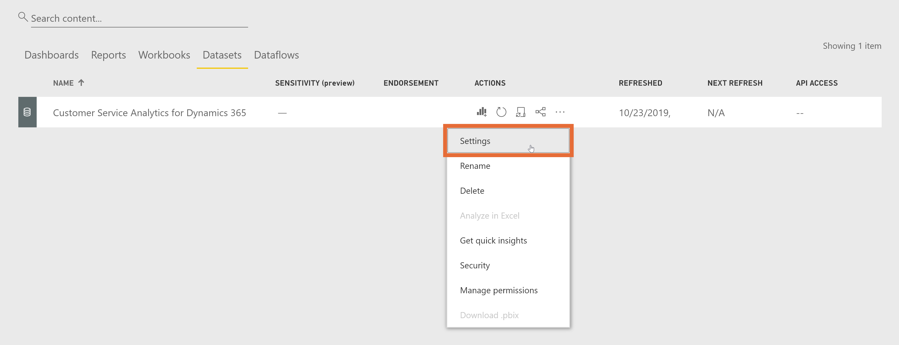

4. Turn **Scheduled refresh** to **On**.

    > [!div class=mx-imgBorder]
    > 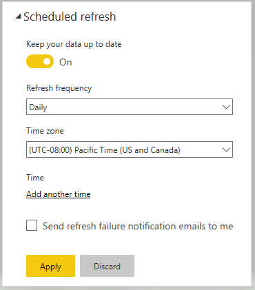

    Now, publish the application in your organization. 

 > [!NOTE]
 > We recommend you configure the refresh frequency to **Daily**. 

## Step 5: Publish application within your organization

You must share the configured application with your entire organization for supervisors to view **Customer Service Analytics** dashboards and reports with their own **Power BI Pro** accounts.

1. On the app workspace, select **Update app**.
  
    > [!div class=mx-imgBorder]
    > 

2. In the Update app wizard, go to the **Access** tab.

3. Choose **Entire organization** and select **Update app**.

    > [!div class=mx-imgBorder]
    > 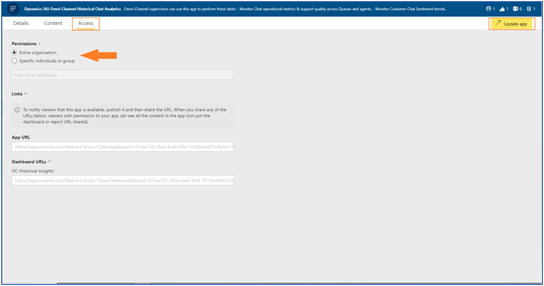

    The app is now available to install for all individuals in your organization.

> [!NOTE]
> Verify your administrator has allowed users in your organization to have read/write data permissions in Omnichannel Engagement Hub. To learn more, see [Provide data access consent](omnichannel-provision-license.md#provide-data-access-consent).  

## Step 6: Enable Power BI reporting

As an administrator, you must enable Power BI reporting in the Dynamics 365 environment for supervisors to view the dashboards.

1. Sign in to Dynamics 365, and go to **Settings**.

2. Select **Administration** > **System Settings**.

3. Go to the **Reporting** tab and enable **Allow Power BI visualization embedding**.

    > [!div class=mx-imgBorder]
    > 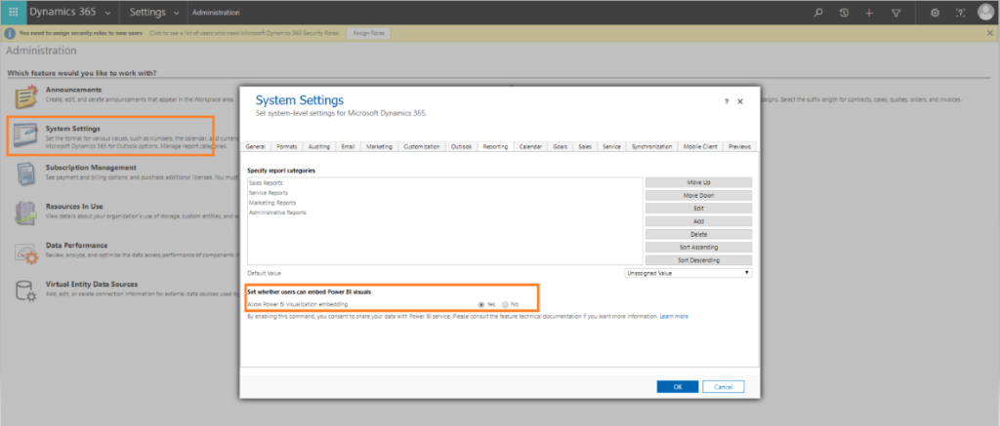

    Supervisors can now configure dashboards.

## Step 7: Add Power BI dashboards to Customer Service Hub

Each supervisor must configure their environment to integrate the Customer Service Analytics dashboard. 

1. Sign in to Dynamics 365 Customer Service and open the **Customer Service Hub** app.

2. Select **Dashboards** under **My Work**.

3. Select **New** > **Power BI Dashboard**.

    > [!div class=mx-imgBorder]
    > 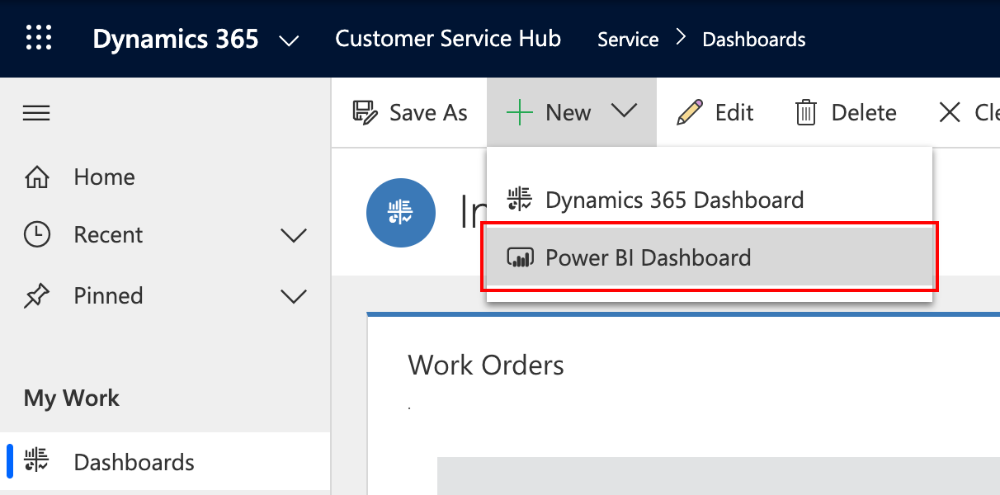

4. For **Workspace**, select **Customer Service Analytics for Dynamics 365**. For **Dashboard**, select **Customer Service Analytics for Dynamics 365**.

    > [!div class=mx-imgBorder]
    > 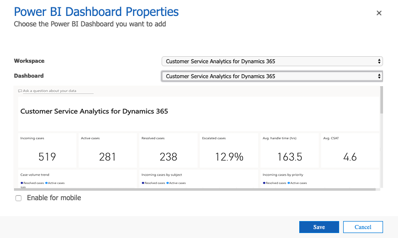

5. Save and close. 

   The Customer Service Analytics dashboard is now available in Dynamics 365.

## Add users to supervisor configuration

You must add users to the supervisor configuration to access any supervisor dashboard in Unified Service Desk. To add users in supervisor configuration, follow these steps: 
 
 1. Sign in to the Unified Service Desk Administrator app.

 2. Select **Configuration**.

 3. On the configuration page, select **Supervisor Configuration**. 

    > [!div class=mx-imgBorder]
    > 

 4. On the **Users** section, select **+ Add Existing User**. The **Lookup Records** pane is displayed.
 
 5. Search for the user and select **Add**.

 6. Select **Save**.

    Users are now added to the supervisor dashboard. When they sign in to Omnichannel Engagement Hub on Unified Service Desk, the supervisor dashboard tabs will be available. 
 
## Customize Customer Service Analytics
  
> [!IMPORTANT]
> Microsoft does not support customizations made to the Power BI template app and does not provide updates once modifications are made. 

Power BI is a comprehensive collection of services and tools that you use to visualize your business data. Power BI Template apps make it easy to visualize and analyze the Customer Service Analytics data with Power BI based on a standard data model. The Customer Service Analytics template app is built with a set of entities and fields that are useful for most reporting scenarios. 

Dynamics 365 apps are often extended with custom fields. These custom fields don't automatically show up in the Power BI model. This topic describes how you can edit and extend the report included in the template app to include custom fields in the Power BI model. 

Before you customize the template app, read the information here and perform each task, as necessary. 

### Prerequisites

- [Power BI service registration](https://powerbi.com "Power BI service registration").

- [Power BI Desktop](https://powerbi.microsoft.com/desktop/ "Power BI Desktop") application for editing Power BI reports. 

- Power BI report for the Customer Service template app that you want to customize.

  [Download the Power BI report for Customer Service Analytics for Dynamics 365](https://aka.ms/CS-Analytics-pbix) 

### Prepare a PBIX for customization

1. Start Power BI Desktop.
 
2. Select **File** > **Open**. Open Customer Service Analytics for Dynamics 365.pbix, and then select **Open**.
 
   Several pages of reports are loaded and displayed in Power BI Desktop.
 
4. On the Power BI Desktop ribbon, select **Edit Queries**.
 
5. In the left navigation pane of the Edit Queries window, under **Queries**, select the **Dynamics 365 Service Root URL** query, and then on the ribbon, select **Advanced Editor**.

    In the source definition, replace **contosuites.crm10.dynamics.com** with your app's instance URL. For example, if the organization name is <i>Contoso</i>, the URL looks like this: Source = https://contoso.crm.dynamics.com/api/data/v9.1/ 
 
6. Select **Done** and then select **Close & Apply** in the Query Editor.
 
7. When the Access an OData feed dialog appears, select **Organizational account** and then select **Sign in**.

    > [!div class=mx-imgBorder]
    > 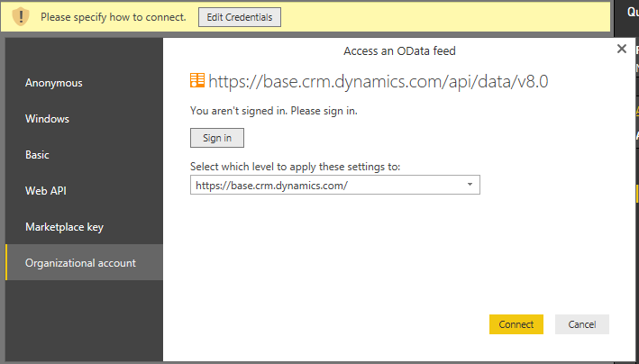

8. When the sign-in field appears, enter your credentials to authenticate to your instance.

9. In the Access an OData feed dialog, select **Connect**.
 
    The queries are updated. This might take several minutes.

## Customer Service Analytics for Dynamics 365 template app data model diagram 

   > [!div class=mx-imgBorder]
   > 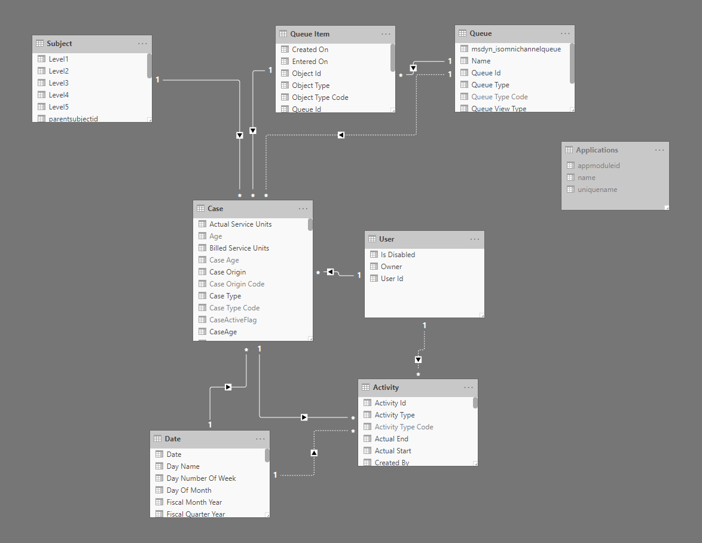

### See also

[Introduction to Customer Service Analytics](introduction-customer-service-analytics.md)  
[View and understand Customer Service Analytics](customer-service-analytics.md)  

[!INCLUDE[footer-include](../includes/footer-banner.md)]