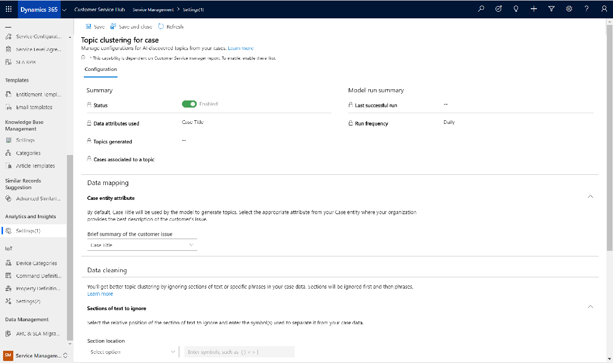
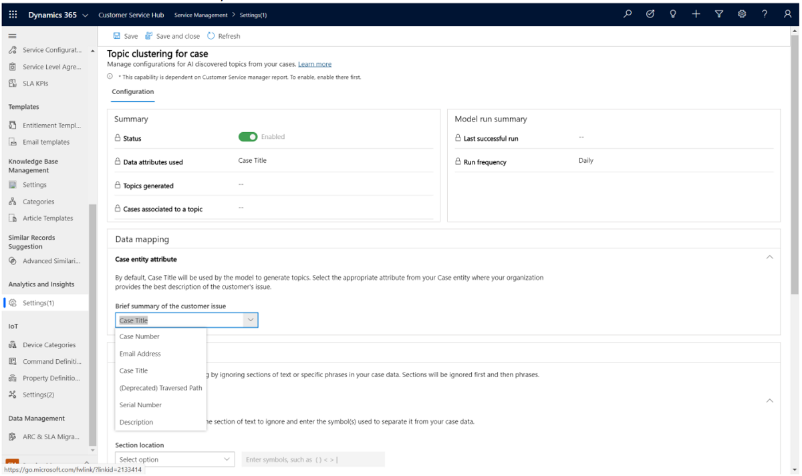
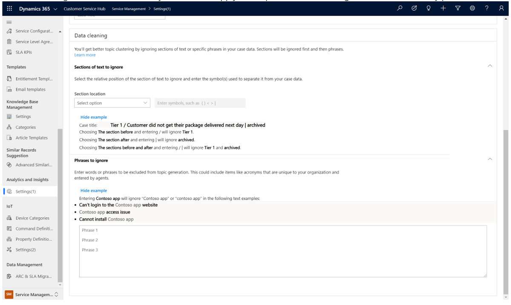

# Preview: Configure Customer Service Insights in Customer Service Hub and Customer Service workspace

[!include[cc-beta-prerelease-disclaimer](../includes/cc-beta-prerelease-disclaimer.md)]

> [!IMPORTANT]
>
> - A preview is a feature that is not complete, as it may employ reduced privacy, security, and/or compliance commitments, but is made available before it is officially released for general availability so customers can get early access and provide feedback. Previews are provided "as-is," "with all faults," "as available," and without warranty.
> - This preview feature does not come with technical support and Microsoft Dynamics 365 Technical Support won't be able to help you with issues or questions.  If Microsoft does elect to provide any type of support, such support is provided "as is," "with all faults," and without warranty, and may be discontinued at any time.
> - Previews are not meant for production use, especially to process Personal Data or other data that is subject to heightened compliance requirements, and any use of "live" or production data is at your sole risk. All previews are subject to separate [Terms and Conditions](../legal/supp-dynamics365-preview.md).

## Overview

You can configure the Customer Service Insights reports in Customer Service Hub and Customer Service workspace and share them with service managers, who can then view and analyze the different activities performed. The following reports are available out of the box:

- **Analytics reports:** Customers can view BI analytics and metrics for their customer service organization.
- **Insights reports:** Customers can view Customer Service Insights reports with a combination of BI analytics and AI insights for their organization. The reports use natural language understanding to automatically detect the language used in your support cases and group related support cases into topics.

The following historical reports are available:

- **Summary**  
- **Agent**
- **Topics** 
- **Knowledge search insights** 

## Configure Customer Service analytics reports in Customer Service Hub and Customer Service workspace

Make sure that you have administrator permissions for Dynamics 365.

### Enable Customer Service analytics reports

1. Sign in to Dynamics 365 as an administrator, and go to Customer Service Hub.
2. In the **Change area**, select **Service Management** > **Settings (Preview)**. The **Analytics and insights settings** page is displayed.

    > [!div class=ms-imgBorder]
    > 

3. In **Analytics reporting**, switch the toggle to **Enabled**. A provisioning message appears, and then **Share reports** appears after the provisioning is complete.

### Enable Customer Service historical analytics reports

1. Sign in to Dynamics 365 as an administrator, and go to Customer Service Hub.
2. In the **Change area**, select **Service Management** > **Settings (Preview)**. The **Analytics and insights settings** page is displayed.
3. On the right side of **Customer Service Historical Analytics**, choose **Manage**.
4. For **Customer Service Historical Analytics report**, set the toggle to **Enabled**.

This configuration will enable AI-discovered topics from cases with default settings.

### View Customer Service analytics reports

The service managers must have the admin or service manager role to view the reports. Users with the CSR Manager role will be able to view the reports only after the reports are shared with them.

You can see the following reports by navigating to the **Service** > **Analytics and Insights** > **Reports (Preview)** > **Data Analytics Reports** page.

- [Case Summary report](customer-service-analytics.md#1-summary)
- [Agent Summary report](customer-service-analytics.md#2-agent-and-queue)

### Install Customer Service Insights reports

1. Sign in to Dynamics 365 as an administrator, and go to Customer Service Hub.
2. In the **Change area**, select **Service Management** > **Settings (Preview)**. The **Analytics and insights settings** page appears.
3. Select **Get started**. The **Install Customer Service Insights** page displays the installation process for the following:
   - Checks whether the administrator has a valid Customer Service Insights license to run the installation.
   - Installs the Customer Service Insights solution if the license check is passed. The following are also created:
     - **Customer Service Insights AppUser:** An application user entity that's used to allow Customer Service Insights to perform actions on behalf of users.
     - **Customer Service Insights Configuration:** A Common Data Service entity in your organization environment that's used by admins to control the report's entry access in the site map.
   - Generates insights and sets up reports for the administrator.
  
  The installation process might take a few minutes. You can navigate away from the page and revisit it to check the status. 
  
  After the installation, **Go to settings** appears on the installation page.

   > [!div class=ms-imgBorder]
   > 

4. Select **Go to settings**. The **Analytics and insights settings** page is displayed.
    > [!div class=ms-imgBorder]
    > 

### Change security roles

By default, users with the following security roles will be able to see **Insights (Preview)** in the site map:

- Administrator
- CSR Manager

To change the security role, edit the permission of the security role to the Customer Service Insights Configuration custom entity. More information: [Edit a security role](https://docs.microsoft.com/power-platform/admin/create-edit-security-role#edit-a-security-role)

### Configure Customer Service Insights settings

On the **Analytics and insights settings** page, you can do the following after the reports are created:

- **View reports:** Go to the Customer Service Insights reports in Customer Service Hub.
- **Share reports:** Open the Customer Service Insights standalone application, and share the reports with your coworkers. More information: [Sharing a workspace in Customer Service Insights](https://docs.microsoft.com/dynamics365/ai/customer-service-insights/use-workspaces#sharing-a-workspace).
- **Change settings:** Open the Settings dialog box in the Customer Service Insights standalone application, including data mapping and settings for topic generation. More information:
  - [Map your data to custom entities and fields](https://docs.microsoft.com/dynamics365/ai/customer-service-insights/map-data#to-map-data-by-specifying-data-mapping-settings)
  - [Improve data quality by cleansing support case titles](https://docs.microsoft.com/dynamics365/ai/customer-service-insights/settings)
  - [Set the granularity of how Customer Service Insights generates customer service topics](https://docs.microsoft.com/dynamics365/ai/customer-service-insights/granularity)

> [!IMPORTANT]
> After you share the reports, only those users who have a valid Customer Service Insights license can view them.

### View Customer Service Insights reports

Go to **Service** > **Analytics and Insights** > **Insights (Preview)**. The **Home** page is displayed.

  > [!div class=ms-imgBorder]
  > 

You can view the following reports:

- **Home page:** Presents key insights from your customer service data in a visually rich way, making it easier to discover topics and issues to focus on and see why they were suggested.
- **KPI summary:** Gives a broad overview of the customer service experience at your organization. It uses AI technology to show you topics that are generating the highest volume and emerging topics with the highest rate of change in volume.
- **New cases:** Gives an overview of the new cases in your customer service system. It uses AI technology to help you identify popular and emerging issues.
- **Customer satisfaction:** Gives an overview of customer satisfaction and uses AI technology to show you topics that are having the greatest impact on customer satisfaction scores.
- **Resolutions:** Gives you an overview of your customer service system's case resolution performance. It uses AI technology to show you topics that are having the greatest positive or negative impact on resolution time.

## Configure topics from cases
Customer Service historical analytics uses AI to automatically group your cases into topics using natural language understanding. Topics help you discover and adapt to current and emerging trends, improve brand sentiment, and identify problem areas. By pinpointing and fixing issues before they impact customers, you can deliver better customer service experiences. 

The AI-driven technology empowers informed decision making about how to improve resolution rates, reduce wait times, and decrease customer service costs. You can use case resolution insights, backlog trends, and historical comparisons to evaluate agent performance and business impact, and address inefficiencies in your system. 

### Summary and Model Run Summary

The Summary and Model Run Summary views provide key information about how the topic model is operating.  

| Status | Whether the feature is enabled or disabled |  
|-----------------|------------------|  
| Data attributes used | Which text field from the Case entity is used for topic generation. |
|Topics generated | The total number of topics generated by the model. |
| Cases associated to a topic |  The percentage of cases that were considered for topic generation and classified to a topic. |
| Last successful run | Timestamp of the last time new cases were processed. |
| Run frequency | The cadence in which new cases are processed and tagged with topics. |

  > [!div class=ms-imgBorder]
  > 

## Configure data mapping

Data mapping enables you to choose which text field where agents in your organization are most likely to describe the reason why a customer reached out to support. By default, the Case Title attribute is used, but this setting enables you to select and string attribute in the Case entity.

  > [!div class=ms-imgBorder]
  > 

## Improve data quality by cleaning support case data 

Customer Service Insights uses AI to give you insights into your customer service data by grouping support cases as topics that are a collection of related cases. This can help you identify areas for improvement that can have the greatest impact on system performance. 

The AI Insights charts displayed on the Customer Service Insights dashboards are generated by applying language understanding technology to the titles of support cases. However, the results can be misleading if the titles include extraneous information such as product name, case status, or ticket number tags. You can improve the quality of the results displayed in AI Insights charts by specifying Data Cleaning settings to disregard tags in titles when they are grouped into topics, as well as specific phrases that should be ignored. Note that when you choose to apply both options, sections are ignored first, followed by phrases.

  > [!div class=ms-imgBorder]
  > 
  
## Language availability for topics

The topics capability in the Customer Service historical analytics reports comes with a natural language understanding model that can understand the text semantics and intent in the following languages: 

- English 
- French 
- German 
- Italian 
- Japanese 
- Portuguese 
- Simplified Chinese 
- Spanish 

The language-specific models enable better language understanding capability for the corresponding languages. When Customer Service Insights refreshes your workspace and processes the case data, it will automatically detect the primary languages used in your cases. 

If more than 70% of the cases are in languages supported by a specific language model, that model will be used to discover topics from all of your cases; otherwise, a mixed-language model is used. 

For example, if you have more than 70% of cases detected in English, the English language model will be used to process all of your cases. If more than 70% of your cases are in Spanish, or most in Spanish with some English cases (since all language models have the capability to process English), the Spanish model will be used to process all of your cases. 

If you have questions, find issues, or have general inquiries, please refer to our [forum](https://community.dynamics.com/365/aicustomerservice/f/dynamics-365-customer-service-insights).

### See also

[Introduction to Customer Service analytics and insights](introduction-customer-service-analytics.md)  
[View and understand Customer Service analytics and insights in Customer Service Hub](customer-service-analytics-insights-csh.md)  
[View and understand Customer Service analytics](customer-service-analytics.md)  
