# Configure customer support swarming for complex cases

> [!IMPORTANT]
> [!INCLUDE[cc-preview-feature](../includes/cc-preview-feature.md)]
>
> [!INCLUDE[cc-preview-features-definition](../includes/cc-preview-features-definition.md)]
>
> [!INCLUDE[cc-preview-features-expect-changes](../includes/cc-preview-features-expect-changes.md)]
>
> [!INCLUDE[cc-preview-features-no-ms-support](../includes/cc-preview-features-no-ms-support.md)]

Customer support swarming is a way to quickly bring together experts across your business to help agents solve issues. As an administrator, you can enable your agents and subject matter experts to "swarm" together to resolve complex cases.

Customer support swarming is particularly useful when agents need to take the following actions:

- Collaborate with experts across your organization to get help on complex cases. 
- Use an expert finder to locate experts with the right skills to help.

Some of the key benefits of customer support swarming include:

- Improved first contact resolution
- Reduced average time to resolution
- Accelerated on-the-job training for agents

Swarming features are available in Dynamics 365 Customer Service workspace, Customer Service Hub, and custom apps. Swarming works with either the Microsoft Teams desktop or web apps.

### Prerequisites

The following licenses are required for the swarm feature.

- To configure the customer support swarming feature, you must have the Customer Service System Administrator role.
- Agents who use the swarm feature must have both a Dynamics 365 Customer Service Enterprise license and Microsoft Teams license.
- Experts who join a swarm must have a Teams license.

## Overview of the customer support swarming page

Use the following image and legend to understand the layout of the customer support swarming page.

   > [!div class="mx-imgBorder"] 
   > 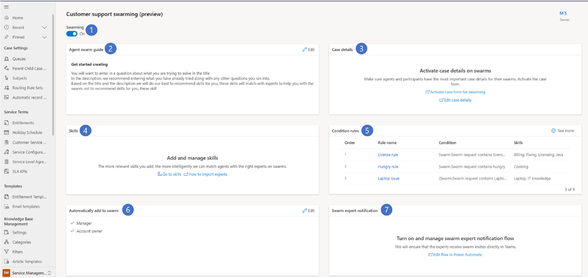

**Legend**

| Number | Functionality | Description |
|-----|------------|------------|
|1 | Swarming toggle | Turns on the swarming feature. |
|2 | Expert notifications | The Power Automate flow that turns on and manages swarm invitations that are sent to experts. |
|3 | Case details | Add out-of-box case fields. Administrators can configure which case fields show on the form. |
|4 | Skills | Add relevant skills to help match experts for swarming. Onboard coworkers outside of your team as experts (through mapping or bulk-importing) so they can be recommended for swarms. |
| Experts | Displays a list of experts and their skills who are configured for swarming.
|5 | Condition rules | Conditions that define which skills to attach to swarms. The attached skills are then used to find and invite experts to swarms. |
|6 | Automatically add to swarm | Team contacts automatically added to swarms because of their relationship to the customer or the agent assigned to the issue. |
|7 | Agent guide | Administrator-provided guidance to help agents know what content to include to begin a swarm or manage the swarm process. |

To configure customer support swarming, you must have administrator privileges and complete the following steps.

1. [Turn on the Embedded chat using Teams feature](#turn-on-embedded-chat-using-teams) for Microsoft Teams desktop or web apps.
1. [Turn on the swarm expert notification flow in Power Automate](#turn-on-the-swarm-expert-notification-flow-in-power-automate)

### Turn on Embedded chat using Teams

You can set up Embedded chat using Teams in the Customer Service admin center. The settings you configure for embedded chat using Teams in the Customer Service admin center app are carried over to the Customer Service Hub app.

1. Select **Collaboration** in the site map. The **Collaboration** page is displayed.
1. Next to **Embedded chat using Teams**, select **Manage**.
1. Set the **Turn on Microsoft Teams chats inside Dynamics 365** toggle to **On**.
   
### Turn on the swarm expert notification flow in Power Automate

To ensure that swarm experts receive invitations directly in Teams, turn on the Microsoft Power Automate flow for swarm expert notifications. Perform the following steps.

1. On the **Customer support swarming (preview)** configuration page, go to the **Expert notifications** card.

1. Select the **Edit in Power Automate** link. The **Send swarm invitation card** page is displayed.

1. After completing the edits, select **Save**.

1. Return to the main form and select **Turn on** to activate the flow.

   > [!div class="mx-imgBorder"] 
   > 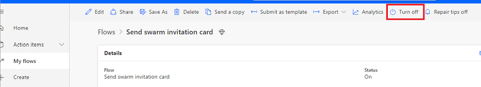

> [!Note]
> You can configure various administration sections without turning on swarming. This is useful in ensuring you've fully configured the feature before enabling the feature. Once enabled, it appears on the agent's desktop, which might cause issues if it's not fully functional.

## Add a new tab, section, or field to the swarm form

You can customize your swarm form by adding a new tab, section, or field to it. More information: [Create, edit, or configure forms using the form designer](/power-apps/maker/model-driven-apps/create-and-edit-forms)

## Edit case details

When an agent creates a swarm, the system includes fields from the related case and account to provide more context for the swarm participants who join. 

You can configure which case fields to include as part of the swarm form. Out of box, the following fields are included:
   - Account
        - Customer Name
        - Email
        - Phone number
   - Case
        - Case title
        - Case number
        - Subject
        - Customer priority
        - Status
        - Product
        - Case description

To configure case details, perform the following steps:

1. On the **Customer support swarming (preview)** configuration page, go to the **Case details** card.
1. Select **Edit in Power Apps**.
1. Select **Case form for swarming** from the list, and then select **Edit** either from the command bar or by selecting the ellipsis next to the form.
1. Edit the form. When finished, select **Back**.
1. Select the **Solutions** from the site map, and then select **Publish all customizations**.

## Add and manage skills

If your organization is already using skills in resource scheduling or Omnichannel for Customer Service, you can reuse the skills to define swarm rules. 

If you haven't already configured skills, then complete the following steps.

1. On the **Customer support swarming (preview)** configuration page, go to the **Skills** contact card.
1. Select the **Add a new skill** link.

   > [!div class="mx-imgBorder"] 
   > 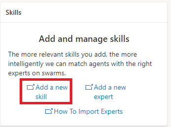

1. On the **Skills** page, select **Create**.
1. On the **Create Skill** page, select the **Skill type**, and then in the **Skill name** field, type a name for the skill.

   > [!div class="mx-imgBorder"] 
   > 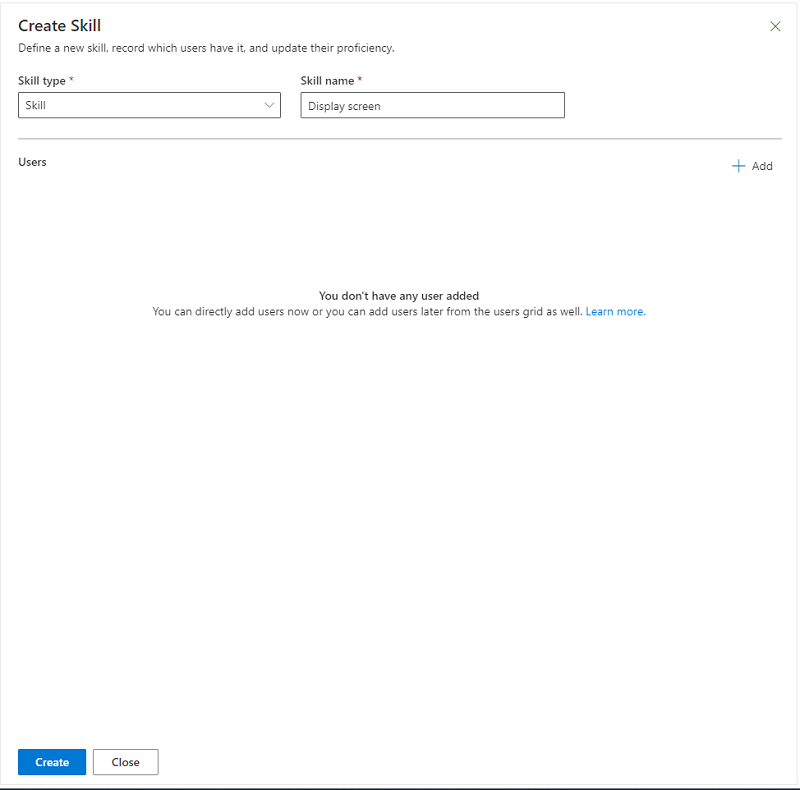

1. Select **Create**.

### Attach the new skill to an expert

To use the new skill in customer support swarming, you must attach it to a user.

1. On the **Edit Skill** page, in the **Users** section, select **+ Add**.
1. On the **Add Users** page, select the user type from the dropdown list.
1. Select the name of the user you want to add, and then select **Add selected users**.
1. Select **Save**.

### Bulk import skills (optional)

If the skills you want to use to match experts to swarms are stored in another system outside of Dataverse, you can import them using Excel using the following steps.

1. In the Customer Service admin center site map, select **User management**. The **User management** page is displayed.
1. Next to **Skills**, select **Manage**.
1. On the skills page, select the list of skills, and then select **Export to Excel**.

   > [!div class="mx-imgBorder"] 
   > 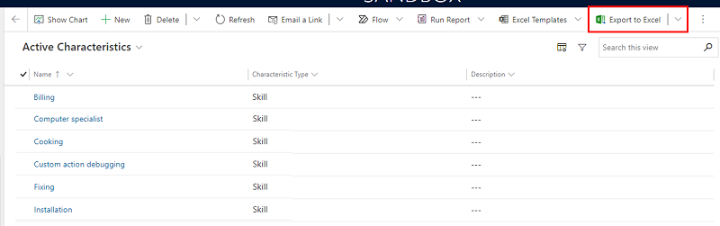

1. Add the needed skills to the spreadsheet, and then save it.

1. Import it using the **Import from Excel** wizard.

   > [!div class="mx-imgBorder"] 
   > 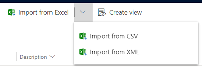

## Add experts

If your organization is already using bookable resources in resource scheduling or omnichannel, you can reuse the resources to define your swarm rules.

If you haven't already configured experts, then perform the following steps.

1.  On the **Customer support swarming (preview)** configuration page, go to the **Skills** card and select **Add a new expert**.

1.  On the **Contact center users** page, select **Swarm experts** from the dropdown menu.

    > [!div class="mx-imgBorder"] 
    > 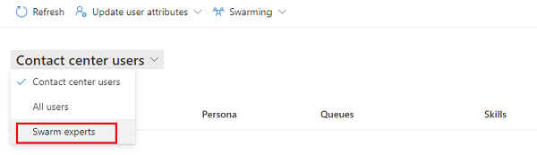

### Bulk update skills

If you want to update the skills for multiple experts, you can update them in bulk using the following steps.

1. On the **Customer support swarming (preview)** configuration page, go to the **Skills** card and select **Add a new expert**.

1. On the **Contact center users** page, select **Swarm experts** from the dropdown menu.

1. Select the users you for which you want to bulk update the skills, and then on the command bar, select **Update user attributes**.

1. On the **Update Skills** page, select the skills and proficiency levels from the dropdown list, and then select **Save**.

## Define condition rules

You can define swarm rules that identify the skills that should be suggested when an agent makes a swarm request. Expert suggestions are defined with the goal of finding the minimum set of experts in your organization who match the maximum number of skills suggested for a swarm.

   > [!div class="mx-imgBorder"] 
   > 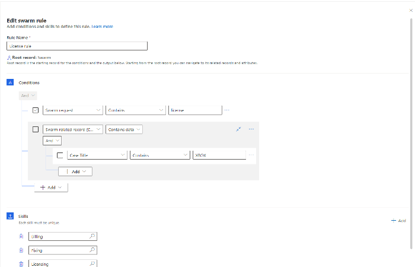

The following aspects apply to swarm rule configuration.

- Only the top three rules are shown on the main swarm page. To view more rules, select **See more**.

- You can define rules based on the related case and account attributes. By default, the swarm request, or the question the agent needs help with, is automatically suggested as one of the conditions.

- Depending on the rules you define, you can add one or more specific unique skills.

- When skills are being matched, the system runs through all possible rules, up to 100 rules.

- Rules are run in the order in which they're listed. As an administrator, you can reorder, edit, delete, or copy rules.

To add a new rule, perform the following steps.

1. On the **Condition rules** card, select **See more**.

1. On the **Condition rules** page, select **Create rule**. The **Create swarm rule** page is displayed.

   > [!div class="mx-imgBorder"] 
   > 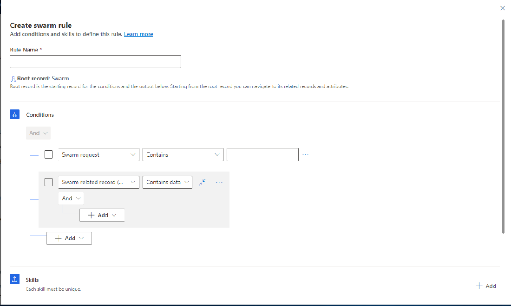
 
1. Add a name for the rule, and then add the conditions and skills to define the rule.

1. To add a new skill from the rule builder, do the following:
   1. In the **Select skills** field, select the search icon. A **Lookup Records** pane is displayed.
   1. In the **Look for characteristic** field, select the search icon. A list of **Characteristics** is displayed.
   1. Select the characteristics you want, or select **Advanced lookup**. A page opens where you can choose skills (characteristics) using **Add new record**. If you choose **New characteristic** on the **Lookup records** pane, you have to leave the current page to create the new skill.

## How contacts are added automatically to swarms

In addition to matching skills to find experts, by default, the system adds out-of-box contacts to the swarm. These participants are added to the swarm automatically without a swarm invitation. Typically, their role is to observe the swarm process and provide customer information if needed, or manage customer communications.

Swarm contacts can optionally include any of the following persons.
 - The agent's supervisor. (This person can be the same for many agents on the team). If a supervisor isn't identified for the agent, the administrator who enabled the swarm is automatically added.
 - The administrator of the team the agent is a member of.
 - The owner of the related account.

## Edit the agent guide

The agent guide is the direction provided by you, as the administrator, that appears in the swarm form when the agent opens it. The agent guide helps ensure that your agent types the right questions. It provides helpful context to effectively match skills and experts. 

When creating the agent guide, keep the following things in mind:
 
 - You can edit the guide content, and the guide you create will apply to all different swarm types. It can't be further customized.
 
 - The guide template is rich text-enabled.
 
 - The guide template has a 2,000-character limit.

To create the agent guide, perform the following steps.

1. On the **Agent guide** card, select **Edit**. The **Agent guide** page is displayed.

   > [!div class="mx-imgBorder"] 
   > 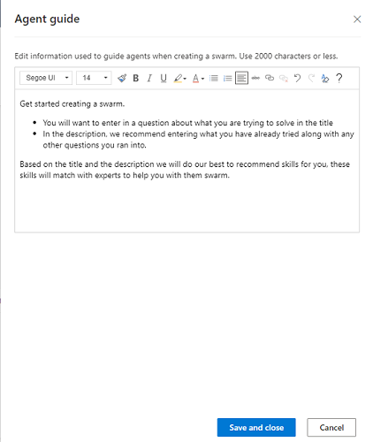

1. Type your details, and then select **Save and close**.

## Grant swarm privileges for agents

Agents need specific privileges to ensure that they can effectively swarm. Use the following table to understand the privileges and types.

|Swarm privilege | Privilege type |
|-----------|-----------|
|Swarm | Read, create, update, share |
|Swarm participant | Read, create, update, share |
|Swarm participant rule | Read |
|Swarm skill | Read, create, update, share |
|Swarm role | Read |
|Characteristic | Read |
|System user | Read |

To set up swarm privileges for agents, perform the following steps.

1. Go to Power Platform admin center, and then in **Environments** > **Environment name**, select the ellipsis, and then select **Settings**.

1. In **Users + permissions**, select **Security rules**.

1. Select the security role (for example, **Customer Service Representative**), and then select the following roles to apply the following privileges: 
   - Swarm
   - Swarm participant
   - Swarm participant rule
   - Swarm role
   - Swarm skill

   > [!div class="mx-imgBorder"] 
   > 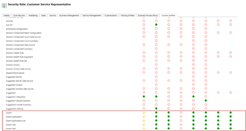

1. Select the **Service** tab, and then for **Characteristic**, select the security privileges.

1. Save and publish your changes.

## Turn on the swarm feature on the Customer support swarming page

1. Select **Collaboration** in the site map. The Collaboration page is displayed. 

1. Next to **Customer support swarming (preview)**, select Manage. 

1. Set the **Swarming** toggle to **On**. 

### See also

[Use customer support swarming](use-customer-support-swarming.md)
