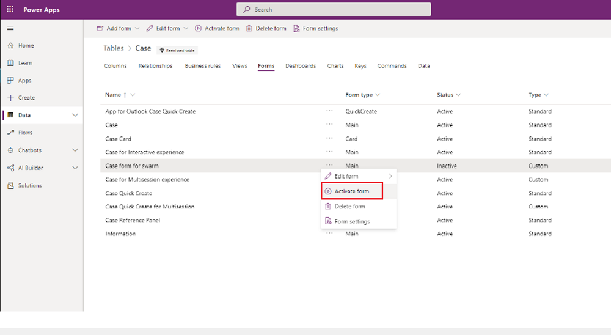
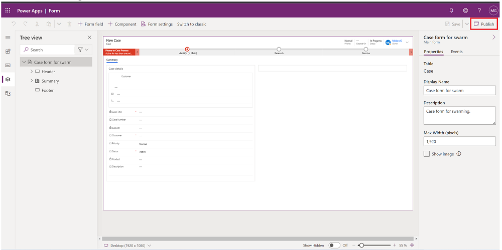
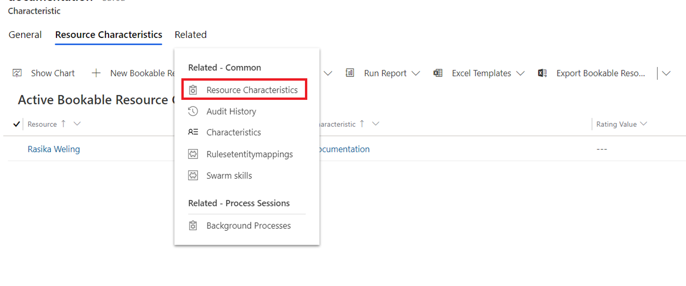
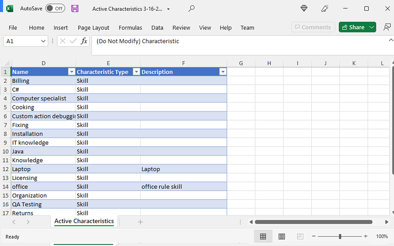
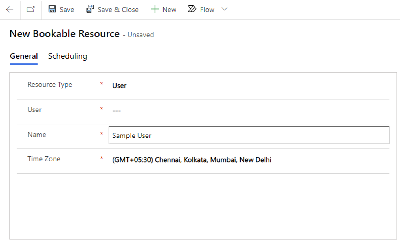
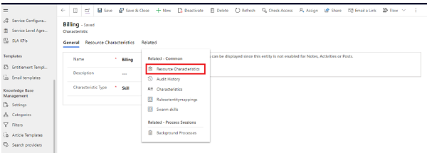
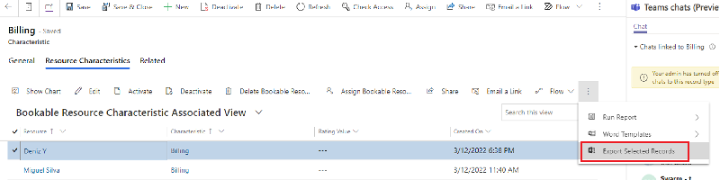

# Configure customer support swarming for complex cases (preview)

> [!IMPORTANT]
> [!INCLUDE[cc-preview-feature](../includes/cc-preview-feature.md)]
>
> [!INCLUDE[cc-preview-features-definition](../includes/cc-preview-features-definition.md)]
>
> [!INCLUDE[cc-preview-features-expect-changes](../includes/cc-preview-features-expect-changes.md)]
>
> [!INCLUDE[cc-preview-features-no-ms-support](../includes/cc-preview-features-no-ms-support.md)]

Customer support swarming is a way to quickly bring together experts across your business to help agents solve issues. As an administrator, you can create a more unified customer service team by configuring your applications so that agents and subject matter experts can "swarm" together when resolving complex cases.

Some of the key benefits of customer support swarming include:

- Improved first contact resolution
- Reduced average time to resolution
- Accelerated on-the-job training for agents

## Availability and licensing for customer support swarming

Swarming features are available in Dynamics 365 Customer Service workspace, Customer Service Hub, and custom apps.

### License requirements

To use customer support swarming, you need either of the following:
 - If you're an agent, you must have both a Dynamics 365 Customer Service Enterprise license and Microsoft Teams license. 
 - If you're an administrator, you must have a Teams license.

## Overview of the customer support swarming page

Use the following image and legend to understand the layout of the customer support swarming page.

   > [!div class="mx-imgBorder"] 
   > 

**Legend**

| Number | Functionality | Description |
|-----|------------|------------|
|1 | Swarming toggle | Turns on the swarming feature. |
|2 | Agent swarm guide | Admininstrator-provided guidance to help agents know what content to include to begin a swarm or manage the swarm process. |
|3 | Case details | Add out-of-box case fields. Administrators can configure which case fields show on the form. |
|4 | Skills | Add relevant skills to help match experts for swarming. Onboard coworkers outside of your team as experts (through mapping or bulk-importing) so they can be recommended for swarms. |
|5 | Rules for skills | Conditions that define which skills to attach to swarms. The attached skills are then used to find and invite experts to swarms. |
|6 | Participants automatically added to swarms | Team contacts automatically added to swarms because of their relationship to the customer or the agent assigned to the issue. |
|7 | Swarm expert notification | The Power Automate flow that turns on and manages swarm invitations that are sent to experts. |

## Prerequisites 

To configure customer support swarming, you must have administrator privileges and complete the following prerequisite steps.

1. [Turn on the Embedded chat using Teams feature](#turn-on-embedded-chat-using-teams)
1. [Activate case details on swarms](#activate-case-details-on-swarms)
1. [Turn on the swarm expert notification flow in Power Automate](#turn-on-the-swarm-expert-notification-flow-in-power-automate)

### Turn on Embedded chat using Teams

1. In Customer Service Hub, go to **Service Management**.
1. In **Collaboration** in the site map, select **Embedded chat using Teams**.
1. Toggle on **Turn on Microsoft Teams chats inside Dynamics 365**.
   

### Activate case details on swarms

If you haven't already activated the case details for the swarm form, perform the following steps.
      
1. In Customer Service Hub, go to **Service Management**.
1. In **Collaboration** in the site map, select **Swarming using Teams**.
1. Go to **Case details** on the administration page. Follow the link in the case details section titled **Activate case form for swarming**. The Power Apps Case table form page is displayed.
1. Select the **Case form for swarm** form, select the ellipsis, and then select **Activate form**. The form becomes active.

   > [!div class="mx-imgBorder"] 
   > 

1. Open the form (or select the ellipsis and then select **Edit form**), and then publish it by selecting **Publish** on the top-right side of the form.

   > [!div class="mx-imgBorder"] 
   > 

### Turn on the swarm expert notification flow in Power Automate

To ensure that swarm experts receive invitations directly in Teams, turn on the Microsoft Power Automate flow for swarm expert notifications. Perform the following steps.

1. On the customer support swarming configuration page, go to the **Expert notifications** card.

1. Select the **Edit in Power Automate** link.

1. On the form header, select **Edit**, and then either sign in or select **Continue**.

1. After completing the edits, select **Save**.

1. Return to the main form and select **Turn on** to activate the flow.

   > [!div class="mx-imgBorder"] 
   > 

> [!Note]
> You can configure various administration sections without turning on swarming. This is useful in ensuring you have fully configured the feature before enabling the feature. Once enabled, it appears on the agent's desktop, which might cause issue if it's not fully functional.

## Edit case details

When an agent creates a swarm, the system includes fields from the related case and account to provide more context for the swarm participants who join. 

You can configure which case fields to include as part of the swarm form.

   - Out-of-box account fields include customer name, email, and phone number.
  
   - The following out-of-box case fields are included:

      - Case title
      - Case number
      - Subject
      - Customer priority
      - Status
      - Product
      - Case description

To configure case details, perform the following steps:

1. On the **Case details** card, select **Edit in Power Apps**.
2. Edit as desired, and then when finished, select **Publish** on the top-right side of the Power Apps page.

## Add and manage skills

If your organization is already using skills in resource scheduling or Omnichannel for Customer Service, you can reuse the skills to define swarm rules. 

If you haven't already configured skills, then complete the following steps.

1. On the **Skills** contact card, select the **Add a new skill** link.
2. On the **All skills** page, select **Create skill**.
3. On the **Create Skill page**, Select the **Skill type**, and then in the **Skill name** field, type a name for the skill.
4. Select **Create**.

### Attach the new skill to an expert

To use the new skill in customer support swarming, you must attach it to a user.

1. On the **Edit Skill** page, in the **Users** section, select **+ Add**.
1. Select the **Related** tab on the characteristic, and then select **Resource Characteristics**.
 
   > [!div class="mx-imgBorder"] 
   > 

1. Select **New Bookable Resource**.

1. On the **New Bookable Resource Characteristic** page, select the **Resource** field, and then search for the resource.

1. Select **Save**.

### Bulk import skills (optional)

If the skills you want to use to match experts to swarms are stored in another system outside of Dataverse, you can import them using Excel.

1. On the skills page, select the list of skills, and then select **Export to Excel**.

   > [!div class="mx-imgBorder"] 
   > 

1. Open the downloaded Excel spreadsheet, and add rows that include the information for the different skills that match your business needs.

   > [!div class="mx-imgBorder"] 
   > 

1. Save the spreadsheet, and then import it using the **Import from Excel** wizard.

   > [!div class="mx-imgBorder"] 
   > 

## Add experts

If your organization is already using bookable resources in resource scheduling or omnichannel, you can reuse the resources to define your swarm rules.

If you haven't already configured experts, then perform the following steps.

1. In Customer Service Hub, in **Scheduling**, select **Resources**. The **Active Bookable Resources** page is displayed.

1. On the command menu, select **New**.

1. On the **New Bookable Resource** form, enter the **User** and **Name** information.

   > [!div class="mx-imgBorder"] 
   > 

1. Confirm or change the **Time Zone**, and then select **Save**.

### Bulk import resources (optional)

If the experts you want to use are stored in another system outside of Dataverse, you can import them using Excel, and then upload the experts who can be used as matches in swarms.

1. On the **Active Bookable Resources** page, on the command bar, select **Export to Excel**.

1. Open the downloaded Excel spreadsheet to edit it. Add rows with the different resource names and types that match your business needs.

1. On the **Active Bookable Resources** page, select **Import from Excel**, and then complete the wizard to import the spreadsheet.

## Map skills and experts (optional)

You can map skills and expert resources using respective grids on the skills and resources form.

1. On the **Characteristic** page of a skill, select the **Related** tab, and then select **Resource Characteristics**.

   > [!div class="mx-imgBorder"] 
   > 

1. Select **+New Bookable Resource** to add a new resource to the skill.

### Bulk map skills and experts (optional)

If you want to bulk map skills and experts, perform the following steps.

1. On the **Characteristic** page of a skill, select the **Resource Characteristics** tab.

1. Select the ellipsis, and then select **Export Selected Records**. An Excel spreadsheet is opened.

   > [!div class="mx-imgBorder"] 
   > 

1. Enter the resource and characteristic to match the fields that are exported. 

1. Import the record back into Customer Service Hub.

## Attach characteristics in the Resources form

You can attach characteristics (skills) in the **Resources** form by performing the following steps.

1. In the **Resources characteristics** grid, select **+New Bookable Resource Characteristic**.

1. Edit the form, and then select **Save**.

## Define swarm rules

You can define swarm rules that identify the skills that should be suggested when an agent makes a swarm request that matches the conditions of a rule. Expert suggestions are defined with the goal of finding the minimum set of experts in your organization who match the maximum number of skills suggested for a swarm.

   > [!div class="mx-imgBorder"] 
   > 

The following aspects apply to swarm rule configuration.

- Only the top four rules are shown on the main swarm page. To view more rules select **See more**.

- To add a new rule, select **+Create rule**, and then add the conditions and skills to define the rule.

- You can define rules based on the related case and account attributes. By default, the swarm request, or the question the agent needs help with, is automatically suggested as one of the conditions.

- Depending on the rules you define, you can add one or more specific unique skills.

- To add a new skill from the rule builder, in the **Select skill** field, select the search icon, and then on the **Lookup records** pane. Select the search icon in the **Look for characteristic** field, and then select **Advanced lookup**. A page opens where you can choose skills (characteristics) using **Add new record**.

- If you choose **+New characteristic** on the **Lookup records** pane, you have to leave the current page to create the new skill.

- When skills are being matched, the system runs through all possible rules, up to 100 rules.

- Rules are run in the order in which they're listed. As an administrator, you can reorder, edit, delete, or copy rules.

## Configure contacts to automatically add to swarms

In addition to matching skills to find experts, by default, the system adds out-of-box contacts to the swarm. These participants are added to the swarm automatically without a swarm invitation. Typically, their role is to observe the swarm process and provide customer information if needed, or manage customer communications.

A minimum of two participants are required for a swarm. Swarm contacts include the following persons.
 - The agent's supervisor (this setting cannot be edited). Ensure that the agent has a supervisor. (This person can be the same for many agents on the team). If a supervisor isn't identified for the agent, the administrator who enabled the swarm is automatically added.
 - Optional: The administrator of the team the agent is a member of.
 - Optional: The owner of the related account.

## Edit the agent guide

The agent guide is the direction provided by you, as the administrator, that appears in the swarm form when the agent opens it. The agent guide helps ensure that your agent types the right questions. It provides helpful context to effectively match skills and experts. 

Important things to keep in mind when creating the agent guide:
 
 - You can edit the guide content, and the guide you create will apply to all different swarm types. It can't be further customized.
 
 - The guide template is rich text-enabled.
 
 - The guide template has a 2,000-character limit.

To create the agent guide, perform the following steps.

1. On the **Agent guide** card, select **Edit**.

1. Type your details, and then select **Save and close**.

## Grant swarm privileges for agents

Agents need specific privileges to ensure that they can effectively swarm. Use the following table to understand the privileges and types.

|Swarm privilege | Privilege type |
|-----------|-----------|
|Swarm | Read, create, update, share |
|Swarm participant | Read, create, update, share |
|Swarm participant rule | Read |
|Swarm skill | Read, create, update, share |
|Swarm role | Read |
|Characteristic | Read |
|System user | Read |

To set up swarm privileges for agents, perform the following steps.

1. Go to Power Platform admin center, and then in **Environments** > **Environment name**, select the ellipsis, and then select **Settings**.

1. In **Users + permissions**, select **Security rules**.

1. Select the security role (for example, **Customer Service Representative**), and then select the following roles to apply the following privileges: 
   - Swarm
   - Swarm participant
   - Swarm participant rule
   - Swarm role
   - Swarm skill

   > [!div class="mx-imgBorder"] 
   > 

1. Select the **Service** tab, and then for **Characteristic**, select the security privileges.

1. Save and publish your changes.

1. On the **Customer support swarming** page, set the **Swarming** toggle to **On**.

### See also

[Use customer support swarming](use-customer-support-swarming.md)
