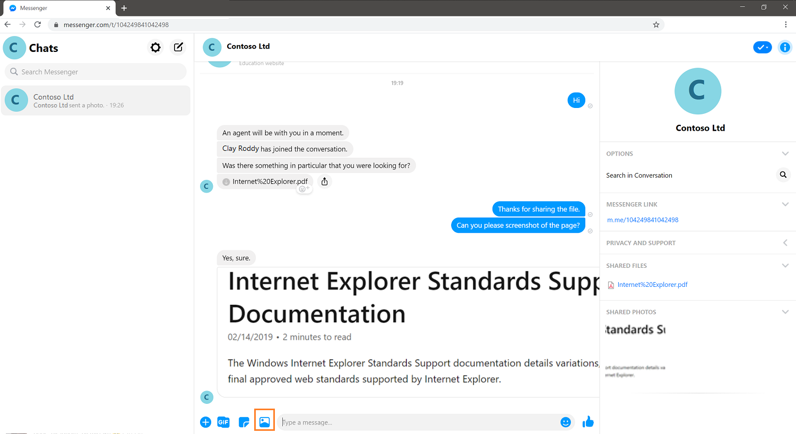

# Configure Facebook channel

[!INCLUDE[cc-use-with-omnichannel](../includes/cc-use-with-omnichannel.md)]

Many customers use social messaging channels like LINE for their personal communication needs. Many also prefer using these messaging channels to engage with businesses. The asynchronous nature of these channels gives customers the convenience of getting their issues resolved as and when they find time, unlike real-time channels like Chat for Dynamics 365 Customer Service, where the session ends when the chat window is closed.

> [!NOTE]
> If you use access tokens in Facebook, refresh them on a 60-day schedule or as required because the tokens might randomly expire. More information: [Facebook access tokens](https://developers.facebook.com/docs/pages/access-tokens)

## Prerequisites

The following prerequisites must be met before you configure the Facebook channel in Omnichannel for Customer Service.

- Create a Facebook page and enable Messenger. More information: [Create and Manage a Page and Messaging](https://www.facebook.com/help/994476827272050/?helpref=hc_fnav)
- Create a Facebook application. More information: [App Development](https://developers.facebook.com/docs/apps/)
- Add Messenger and Webhooks to the Facebook application. More information: [Setting Up Your Facebook App](https://developers.facebook.com/docs/messenger-platform/getting-started/app-setup/)
- If you'll use a test environment, set up test accounts in Facebook so that agents can send and receive messages in Omnichannel for Customer Service.
- Values for application ID and application secret from the **App ID** and **App Secret** fields in the Facebook application > **Settings** > **Basic**.

## Roles and permissions

The following Facebook roles and permissions are required for integrating your Facebook app with Omnichannel for Customer Service.

- Facebook users who don’t have a role in the Facebook app must have the `pages_messaging` permission to send messages to a Facebook page from Omnichannel for Customer Service. The app owner must provide the `pages_messaging` permission for users to be able to send messages. More information: [pages_messaging](https://developers.facebook.com/docs/permissions/reference/pages_messaging/)

- If the Facebook app that you’re using is currently in development mode, then only those Facebook users who have roles within the app can send messages to the Facebook page; the messages can be received by or forwarded to Omnichannel for Customer Service. More information: [App roles](https://developers.facebook.com/docs/development/build-and-test/app-roles/)

- For Omnichannel for Customer Service to be able to retrieve the customer’s username from Facebook, the customer must request for Business Asset User Profile Access in their Facebook app. More information: [Business Asset User Profile Access](https://developers.facebook.com/docs/features-reference/business-asset-user-profile-access)

## Configure a Facebook channel

To configure a Facebook channel, the following steps are required:

1. Create a Facebook channel account.

1. Configure a Facebook workstream and work distribution settings

### Create the Facebook channel account

1. In Dynamics 365, go to one of the apps, and perform the following steps.

   ### [Customer Service admin center](#tab/customerserviceadmincenter)

    1. In the site map, in **Customer support**, select **Channels**.
    
    1. In **Accounts**, for **Messaging accounts**, select **Manage**.
   
   ### [Omnichannel admin center](#tab/omnichanneladmincenter) 

    - In the site map, in **General settings**, select **Channels**.

1. On the **Accounts and channels** page, select **New account**.

1. Enter the following details:

   1. On the **Channel details** page, enter a name and select Facebook in **Channels**.

   1. On the **Add account** page, in the **Application ID** and **Application secret** fields, specify the Facebook App ID and App secret that you'd copied from the Facebook application.

   1. On **Add Facebook Pages to this account**, do the following steps:

   1. Select **Add**, and in the **Add Facebook Page** pane, enter the following details:
      - **Page name:** Name of the Facebook page.
      - **Page ID:** ID of the Facebook page. To get the page ID, go to your Facebook page, select About, and copy the value in the Page ID field.
      - **Page access token:** Specify the Page access token of the Facebook application. To get the page access token, go to your Facebook application and then go to **Messenger** > **Settings**. In the **Access Tokens** section, select the page, and copy the value in the **Page Access Token** field.

   1. On the **Callback information** page, the **Callback URL** and **Verify token** fields are populated automatically when you save the settings. Use the information to configure webhooks in the Facebook application. The values for the fields will not be generated if the Facebook page is reused across multiple instances of the channel.

### Create a Facebook workstream

1. To configure routing and work distribution, perform the steps outlined in [create a workstream](create-workstreams.md).

1. Select the workstream that you've created for the Facebook channel and on the workstream page, select **Set up Facebook**, and do the following steps:
   
   1. In the **Available Facebook Pages** area, select a page from the list.
   
   1. On the **Language** page, select the language to use.
   
   1. On the **Behaviors** page, configure the following options:
      - Custom automated messages
      - [Post-conversation survey](configure-post-conversation-survey.md)
   1. On the **User features** page, configure the following options:
      - **File attachments:** When set to yes for both customer and agent, customers and agents can send and receive file attachments. More information: [Enable file attachments](enable-file-attachments.md). The availability and support of media is dependent on the Facebook application settings. More information: [Facebook updates](https://developers.facebook.com/docs/messenger-platform/europe-updates)
      - **Facebook message tag:** Set to **Yes** to enable your agents to message customers after 24 hours have passed. When set to **No**, agents will be unable to respond to customers after 24 hours unless the customer sends another message.

      If you enable the Facebook human agent message tag during an active conversation between the agent and customer, the agent must close the conversation and reopen it to communicate with customers after 24 hours of inactivity. Agents can start conversations with customers for up to seven days.

      To use the Facebook human agent message tag, you must also turn it on in the Facebook app. For more information, see [Facebook Developer Tools](https://developers.facebook.com/tools/).  
   1. Review the **Summary** page, and select **Create**. The channel instance is configured.

1. Configure routing rules. More information: [Configure work classification](configure-work-classification.md)

1. Configure work distribution. More information: [Work distribution settings](create-workstreams.md#configure-work-distribution)

1. Optionally, you can add a bot; skip this step if your conversations are handled by human agents only. More information: [Configure a bot](create-workstreams.md#add-a-bot-to-a-workstream)

1. In **Advanced settings**, configure the following options based on your business needs:
   - [Sessions](../app-profile-manager/session-templates.md)
   - [Agent notifications](../app-profile-manager/notification-templates.md#out-of-the-box-notification-templates)
   - [Context variables](manage-context-variables.md#add-context-variables)
   - [Smart assist bots](smart-assist-bot.md)
   - [Quick replies](create-quick-replies.md)

## Customer experience

A customer can start a conversation in any of the following ways:

- Messenger on the Facebook page
- [www.messenger.com](https://www.messenger.com/)
- Messenger app on a mobile device
- Messenger widget on a custom website

If a customer starts a conversation from the Facebook page and then later switches to the mobile device, the previous conversation persists, and the customer can continue the conversation.

The agent receives the notification of the incoming conversation request. More information: [Use Facebook channel](facebook.md)

After the Facebook social profile is linked to a customer or contact record by the agent, subsequent Facebook conversations are linked to the customer records and the customer summary is populated.

If the customer is not identified based on name, a new contact record can be created.

The customer can send attachments only if you enable them. When the option isn't enabled for the customers, they can still attempt to send the file. However, agents won't receive the file and will see an error.

> [!div class=mx-imgBorder]
> 

## Privacy notice

By enabling this feature, your data will be shared with Facebook and flow outside of your organization's compliance and geo boundaries (even if your organization is in a Government Cloud Community region). Consult the feature technical documentation for more information [here](/azure/bot-service/bot-service-channel-connect-facebook?preserve-view=true&view=azure-bot-service-4.0).

Customers are solely responsible for using Dynamics 365, this feature, and any associated feature or service in compliance with all applicable laws, such as laws relating to monitoring, recording, and storing communications with their end users. This includes adequately notifying end users that their communications with agents may be monitored, recorded, or stored and, as required by applicable laws, obtaining consent from end users before using the feature with them. Customers are also encouraged to have a mechanism in place to inform their agents that their communications with end users may be monitored, recorded, or stored.

### Configure a Facebook channel in Omnichannel Administration

[!INCLUDE[cc-omnichannel-administration-deprecation-note.md](../includes/cc-omnichannel-administration-deprecation-note.md)]

After completing the prerequisites, you can add the Facebook channel for your organization by following these steps:

1. [Create a Facebook workstream](#create-a-facebook-workstream)  
2. [Create a Facebook channel](#create-a-facebook-channel)
3. [Create routing rules](#create-routing-rules)
4. [Modify settings for a specific Facebook page](#modify-settings-for-a-specific-facebook-page)

#### Create a Facebook workstream

1. Sign in to Omnichannel Administration.

2. Go to **Work Distribution Management** > **Work Streams**.

3. Select **New** to create a Facebook workstream.

4. On the **Work Distribution** tab, in the **Channel** field, select **Facebook**.

5. Specify other details as required. To learn more, see [Understand and create workstreams](work-streams-introduction.md).

6. Select **Save**.

#### Create a Facebook channel

1. Go to **Channels** > **Facebook**.

2. Select **New** to create a Facebook channel.

3. On the **New Facebook Application** page, provide the following information:

    - **Name**: Name of the Facebook application. 

    - **Application Id**: ID of the Facebook application. To get the application ID, go to your Facebook application, select **Settings** > **Basic**, and copy the value in the **App ID** field.

    - **Application Secret**: Application secret of the Facebook application. To get the application secret, go to your Facebook application, select **Settings** > **Basic**, and copy the value in the **App Secret** field.

4. Select **Save**. After you save the record, the **Facebook Pages** section is enabled, and it allows you to add the Facebook pages through which a customer can connect to an agent.

    > [!NOTE]
    > In this release, you can create only one Facebook application per organization. However, you can add multiple pages in a Facebook application.

5. In the **Facebook Pages** section, select **Add New Facebook Page** to add a Facebook page.

6. On the **New Facebook Page** page, **Account setup** tab, provide the following information:

    - **Page Id**: ID of the Facebook page. To get the page ID, go to your Facebook page, select **About**, and copy the value in the **Page ID** field.

    - **Page Name**: Name of the Facebook page.

    - **Page Access Token**: Page access token from the Facebook application. To get the page access token, go to your Facebook application and then go to **Messenger** > **Settings**. In the **Access Tokens** section, select the page, and copy the value in the **Page Access Token** field.

    - **Facebook Application**: The Facebook application record is auto filled from which you added a Facebook page.
    
    - **Work Stream**: Browse and select the workstream you created for the Facebook channel.

7. Select **Save** to create the record.

After you add a Facebook page, values for **Callback Uri** and **Verify Token** are generated automatically. These values are used to configure webhooks in the Facebook application.

   > [!Note]
   > You can add multiple Facebook **Page Id** (pages) to a **Facebook Application** channel. However, a Facebook **Page Id** can be linked to one **Facebook Application** only. If you link the same Facebook **Page Id** to multiple **Facebook Application** channels, then **Callback Uri** and **Verify Token** won't be generated automatically.

#### Create routing rules

1.	Go to **Work Distribution Management** > **Work Streams**.

2.	Open the workstream you created in Step 1.

3.	On the **Routing rules items** tab, create a routing rule to transfer the message to an appropriate agent. Select the entity as **Facebook Engagement Context**.

    For example, you can create a rule to transfer Facebook chat from a customer named Lesa to the default queue. 

When you create conditions for routing rules, the **Facebook Engagement Context (Conversation)** entity enables you to set the following attributes:

  - **Customer name**: The customer name is shown in the format "first name, last name".
  - **Locale**: For a list of locales, see Facebook developer documentation.
  - **Timezone**: Timezone is shown as a number relative to GMT, for example, “5.5”.
  - **User Page Scoped Id**: This is shown as a number string.

#### Modify settings for a specific Facebook page

1. In the Omnichannel Administration app, go to your Facebook application and select the Facebook page you want to modify. 

2. On the **General settings** tab, provide the following information:
    
    - **Language**: Select the preferred language for your Facebook page.
    
    - **Work stream**: Select an existing workstream or create a new one.

    - **Enable file attachments for customers**: Set to **Yes** to allow customers to send file attachments to agents. Otherwise, set to **No**.

    - **Enable file attachments for agents**: Set to **Yes** to allow agents to send file attachments to customers. Otherwise, set to **No**.
    
    > [!NOTE]
    >
    > - To learn more about attachments, see [Enable file attachments](enable-file-attachments.md).
    > - To learn about uploading media in Facebook, see the Facebook developer documentation. The availability and support of media is dependent on the Facebook application settings. More information: [Facebook updates](https://developers.facebook.com/docs/messenger-platform/europe-updates)

    - **Turn on your Facebook human agent message tag**: Set to **Yes** to enable your agents to message customers after 24 hours have passed. When set to **No**, agents will be unable to respond to customers after 24 hours unless the customer sends another message. 
    
      If you enable the Facebook human agent message tag during an active conversation between the agent and customer, the agent must close the conversation and reopen it in order to communicate with customers after 24 hours of inactivity. Agents can start conversations with customers for up to seven days.
    
      To use the Facebook human agent message tag, you must also turn it on in the Facebook app. For more information, see [Facebook Developer Tools](https://developers.facebook.com/tools/).

3. On the **Automated messages** tab, [configure automated messages](configure-automated-message.md).

4. On the **Surveys** tab, [configure a post-conversation survey](configure-post-conversation-survey.md).

### See also

[Understand and create workstreams](create-workstreams.md)  
[Create and manage routing rules](routing-rules.md)  
[Configure automated messages](configure-automated-message.md)  
[Configure a pre-chat survey](configure-pre-chat-survey.md)  
[Configure a post-conversation survey](configure-post-conversation-survey.md)  
[Delete a configured channel](delete-channel.md)  
[Support for live chat and asynchronous channels](card-support-in-channels.md)  

[!INCLUDE[footer-include](../includes/footer-banner.md)]
