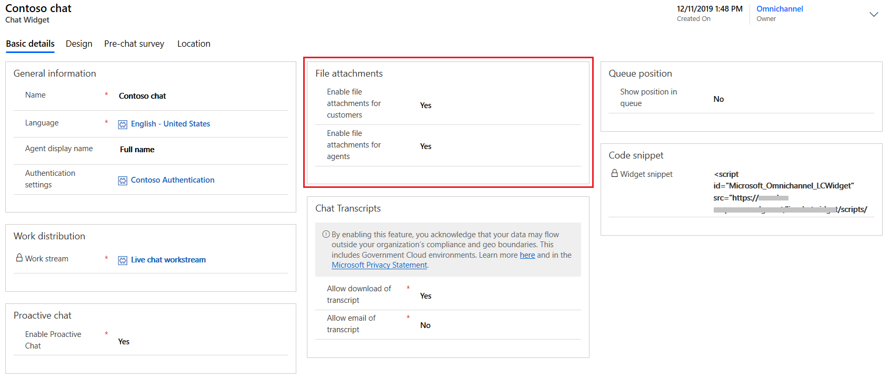
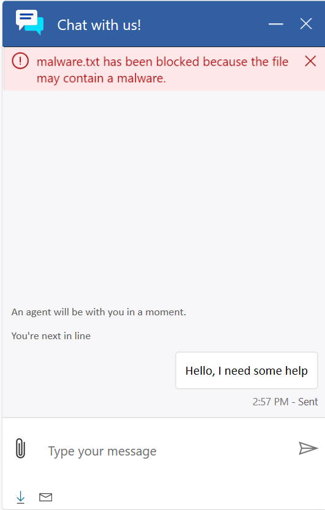
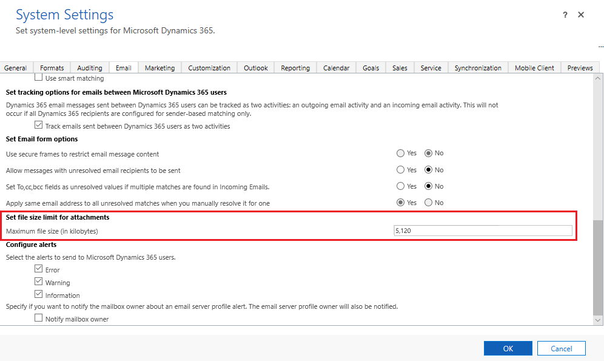

# Configure file attachment capability 

As an administrator, you can enable or disable the capability for your agents and customers to attach files during a conversation. When enabled, your customers and agents can send files and share more information about their issues. For example, if a customer receives an error while trying to complete a process, they can send the screenshots of the steps and error message to the agent. 

Customers must use the **Attach** icon to send files. The drag-and-drop operation is not supported in the live chat widget. For information about file attachment limitations, see [Enable file attachments](enable-file-attachments.md).

If an agent transfers the chat to another agent, the agent who receives the chat can also access the files attached in the conversation.

> [!NOTE]
> In Unified Service Desk, if you sign in as an agent and want to attach a file while conversing with a customer, ensure that you select the required file type first and then attach the required file.

1.	Sign in to Omnichannel Administration.

2.	Go to **Channels** > **Chat**.

3.	Open the chat widget in which you need to configure the file attachment capability.

4.	Go to the **Basic details** tab.

5.	Under **File attachments**, select **Yes** or **No** for the following:

    - **Enable file attachments for customers**: Allows your customers to send a file to the customer service agent during a conversation. By default, it is set to No.
    - **Enable file attachments for agents**: Allows your customer service agents to send a file to a customer during a conversation. By default, it is set to Yes.

      > [!div class=mx-imgBorder]
      > 

## Customer experience of attaching a file

When the file attachment capability is enabled for customers, the attachment icon is displayed in the chat widget. A customer can then use the **Attach** icon to send files. The drag-and-drop operation is not supported. 

> [!div class=mx-imgBorder]
> 

If a customer tries to attach an unsupported file type, a file larger than the allowed size limit, or a file with malicious content, the file is not uploaded and a corresponding error message is displayed. 

> [!div class=mx-imgBorder]
> 

The file size limit for attachments and unsupported file types are defined in the web client. To configure the file size limit and unsupported file types:

1. Open the web client and go to **Settings** > **Administration** > **System Settings**.

2. In the **System Settings** window, go to the **Email** tab.

3. In the **Maximum file size (in kilobytes)** field, enter the value in kilobytes.

    > [!div class=mx-imgBorder]
    > 

4. To specify unsupported file types, go to the **General** tab.

5. In the **Set blocked file extensions for attachments** field, add or edit the file types.

    > [!div class=mx-imgBorder]
    > 

6. Select **OK**.

> [!NOTE]
> Customers with Apple devices must have iOS version 13 to send file attachments.

### See also

[Enable file attachments](enable-file-attachments.md)  
[Add a chat widget](add-chat-widget.md)  
[Configure a pre-chat survey](configure-pre-chat-survey.md)  
[Configure agent display name](agent-display-name.md) 
[Create quick replies](create-quick-replies.md)  
[Create and manage operating hours](create-operating-hours.md)  
[Create chat authentication settings](create-chat-auth-settings.md)  
[Embed chat widget in your website or portal](embed-chat-widget-portal.md)

[!INCLUDE[footer-include](../includes/footer-banner.md)]