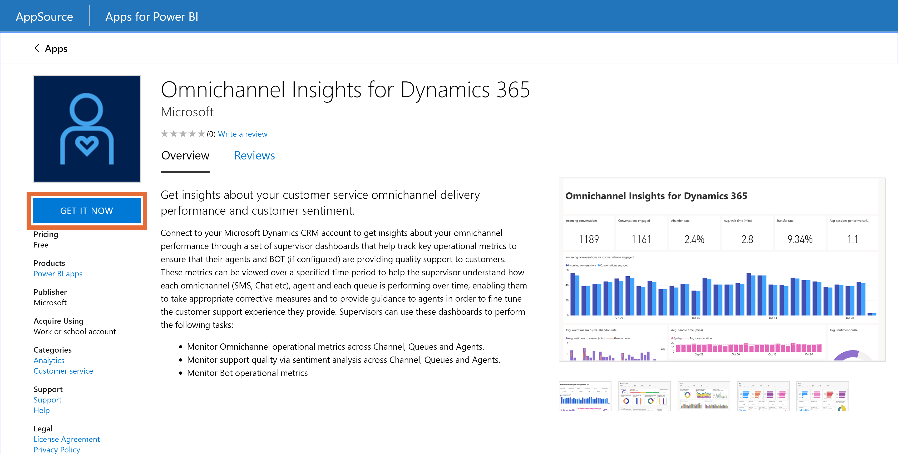
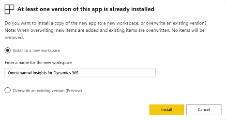
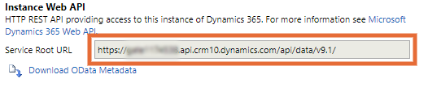
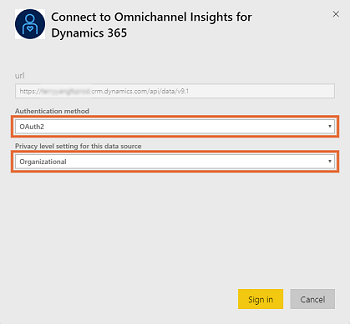
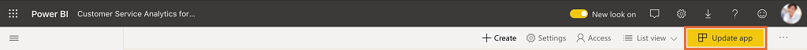
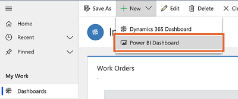
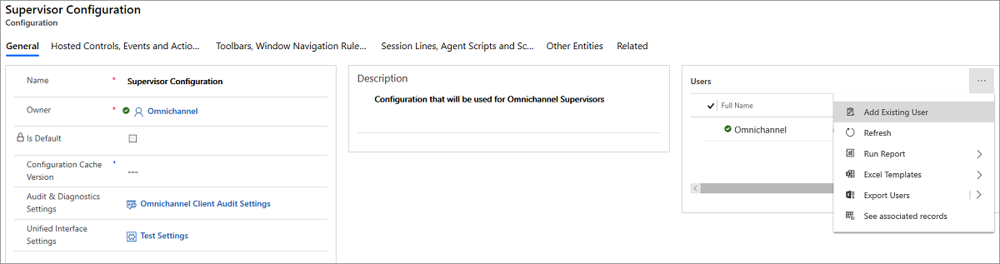
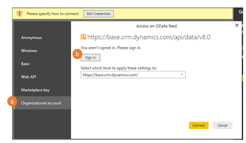

# Configure Omnichannel Insights dashboards

[!INCLUDE[cc-use-with-omnichannel](../includes/cc-use-with-omnichannel.md)]

Customer service managers or supervisors are responsible for managing agents who work to resolve customer queries every day through various service channels. They need to know key operational metrics to ensure that their agents are providing quality support. Omnichannel Insights consists of channels and sentiment analysis dashboards that can help with this.

> [!IMPORTANT]
> The supervisor dashboards that are based on Power BI, such as Omnichannel Insights and sentiment analysis, are not available on Government Community Cloud (GCC).

## Configure Omnichannel Insights

As an administrator, you must download the Omnichannel Insights for Dynamics 365 app and configure it to display channels and sentiment analysis dashboards in the Omnichannel for Customer Service app. To configure Omnichannel Insights, follow these steps:

[Step 1: Review prerequisites](#step-1-review-prerequisites)

[Step 2: Install Omnichannel Insights for Dynamics 365 app](#step-2a-install-omnichannel-insights-for-dynamics-365-app)

[Step 3: Connect to Omnichannel Insights for Dynamics 365 app](#step-3-connect-to-omnichannel-insights-for-dynamics-365-app)

[Step 4: Configure refresh frequency on Power BI Dataset](#step-4-configure-refresh-frequency-on-power-bi-dataset)

[Step 5: Publish application within your organization](#step-5-publish-application-within-your-organization)

[Step 6: Add Power BI Dashboards to Omnichannel for Customer Service](#step-6-add-power-bi-dashboards-to-omnichannel-for-customer-service)

### Step 1: Review prerequisites

Make sure the following prerequisites have been met before configuring the dashboard:

- You have administrative privileges for Dynamics 365 Customer Service and Power BI.
- You have Power BI Pro license that is required to do the following:
  - To get Omnichannel insights from app store and install it in your organization.
  - For users to use the template app or to share it with other Power BI Pro users.
- You have assigned template app workspace to a premium capacity so that every free user in the organization can consume the report. For information, see [Ways to collaborate and share in Power BI](https://docs.microsoft.com/power-bi/collaborate-share/service-how-to-collaborate-distribute-dashboards-reports).
- You have enabled the embedding of Power BI reports in Dynamics 365 Customer Service by doing the following:
  1. Sign in to **Dynamics 365 Customer Service** and go to **Settings** > **Administration** > **System Settings**.
  2. Go to the **Reporting** tab and select **Yes** for **Allow Power BI visualization embedding**.

        > [!div class=mx-imgBorder]
        > 

  3. Select **OK**.

### Step 2A: Install Omnichannel Insights for Dynamics 365 app

1. Sign in to the [Power BI](https://app.powerbi.com/) app as an administrator.
2. As a Power BI administrator, open the [Omnichannel Insights for Dynamics 365](https://aka.ms/d365-oc-insights) app page.

   > [!IMPORTANT]
   > The **Install template apps not listed in AppSource** in **Tenant settings** should be enabled by your administrator in the Power BI admin portal.

4. Select **GET IT NOW** to install the app.

    > [!div class=mx-imgBorder]
    > 

5. After the **Omnichannel Insights** app is installed, select the app and the configuration options page will be displayed.

    > [!div class=mx-imgBorder]
    > 

    Proceed to configure the app by connecting your organization.

### Step 2B: Configure existing Omnichannel Insights for Dynamics 365 app

If a previous version of Omnichannel Insights was installed, we strongly recommend that you install the latest version of Omnichannel Insights to avoid losing any customization.

1. During the Omnichannel Insights app installation, the following appears:

    > [!div class=mx-imgBorder]
    > 

2. Choose the **Install to a new workspace** option.
3. Select **Install**.
4. Re-implement customizations into the new workspace.

### Step 3: Connect to Omnichannel Insights for Dynamics 365 app

1. On the **Omnichannel Insights for Dynamics 365** app configuration page, select **Connect**.

    > [!div class=mx-imgBorder]
    > 

2. On the connect data page, enter your organization's CRM OData feed URL, and select **Next**.

    > [!div class=mx-imgBorder]
    > 

3. (Optional) To find the Microsoft Dynamics 365 OData URL, follow these steps:

    1. Sign in to Dynamics 365 Customer Service.
    2. Go to **Settings** > **Customizations** and then select **Developer Resources**.
    3. Find the OData URL under **Service Root URL**.

       > [!div class=mx-imgBorder]
       > 

4. Select **Authentication method** as **OAuth2** and **Privacy level** as **Organizational**. Select **Sign in**.

    > [!div class=mx-imgBorder]
    > 

5. Enter your Dynamics 365 Customer Service credentials and select **Enter**.

    When you are signed in, the existing report is updated with the data from your organization.

### Step 4: Configure refresh frequency on Power BI dataset

After you connect the Dynamics 365 Omnichannel Insights app with a Dynamics 365 organization, you need to configure the refresh frequency on the Power BI dataset so reports and dashboards refresh properly.

1. Sign in to [Power BI](https://app.powerbi.com/) as an administrator.

2. Go to the **Omnichannel Insights** app workspace.

    > [!div class=mx-imgBorder]
    > 

3. On the **Datasets** tab, select **Settings**.

    > [!div class=mx-imgBorder]
    > 

4. Turn **Scheduled refresh** to **On**.

    > [!div class=mx-imgBorder]
    > 

    > [!NOTE]
    > We recommend that you set the refresh frequency to **Daily**.

5. Select **Apply**.

Omnichannel Insights reports and dashboards will refresh daily.

### Step 5: Publish application within your organization

You must share the configured application with your entire organization for supervisors to view the **Omnichannel Insights** dashboards and reports with their own **Power BI Pro** accounts.

1. On the App workspace, select **Update app** to open the Update app wizard. 

    > [!div class=mx-imgBorder]
    > 

2. On the **Update app** wizard, go to the **Access** tab.

3. Choose **Entire organization** and select **Update app**.

    > [!div class=mx-imgBorder]
    > 

    The app is now available to install for all individuals in your organization.

> [!NOTE]
> Verify your administrator has allowed users in your organization to have read/write data permissions in Omnichannel Engagement Hub. To learn more, see  [Provide data access consent](omnichannel-provision-license.md#provide-data-access-consent).

### Step 6: Add Power BI Dashboards to Omnichannel for Customer Service

Each supervisor must configure their Dynamics 365 Customer Service environment to integrate the Omnichannel Insights and Omnichannel Sentiment Analysis dashboards.

1. Sign in to the Omnichannel for Customer Service app.

2. Select **Overview Dashboard** under **Supervisor Experience**.

3. Select **New** and then select **Power BI Dashboard**.

    > [!div class=mx-imgBorder]
    > 

4. a. In the Workspace field, select **Omnichannel Insights for Dynamics 365**.  
   b. In the Dashboard field, select **Omnichannel Insights for Dynamics 365**.

    > [!div class=mx-imgBorder]
    > 

5. Save and close.

6. Repeat Steps 3–5 to add Omnichannel Insights - Sentiment Analysis dashboard.

    > [!div class=mx-imgBorder]
    > 

    The Omnichannel Insights and Omnichannel Sentiment Analysis  dashboards are now available in Dynamics 365.

## Add users to supervisor configuration

You must add users to the supervisor configuration to access any supervisor dashboard in Unified Service Desk. To add users to the supervisor configuration, follow these steps:

1. Sign in to Unified Service Desk.

2. Go to **Configuration** under **Advanced Settings**.

3. Select **Supervisor Configuration**.

    > [!div class=mx-imgBorder]
    > 

4. On the **Users** section, select **...** and select **Add Existing User**. The **Lookup Records** pane is displayed.

    > [!div class=mx-imgBorder]
    > 

5. Type the name of the user you want to add, and select **Add**.

6. Save and close the configuration.

    Users are added to the supervisor dashboard. Now when they sign in to Omnichannel on Unified Service Desk, the supervisor dashboard tabs are available.

## Customize Omnichannel Insights

> [!IMPORTANT]
> Microsoft does not support customizations made to the Power BI template app and does not provide updates after modifications are made.

Power BI is a comprehensive collection of services and tools that are used to visualize business data. The Power BI Template apps make it easy to visualize and analyze the Omnichannel Insights data with Power BI based on a standard data model.

The Omnichannel Insights template app is built with a set of entities and fields that are useful for most reporting scenarios. Dynamics 365 apps are often extended with custom fields. These custom fields don't automatically show up in the Power BI model.

The following shows you how edit and extend the report included in the template app to include custom fields in the Power BI model.

Before customizing the template app, read the following information and perform each task as necessary.

## Requirements

1. [Power BI service registration.](https://app.powerbi.com/)
2. [Power BI Desktop](https://powerbi.microsoft.com/desktop/) application for editing Power BI reports.
3. Power BI report for Omnichannel Insights template app that you want to customize. [Download the Omnichannel Insights report.](https://aka.ms/OC-Insights-pbix)
4. Preview: [Download template app for sentiment drivers reporting](https://go.microsoft.com/fwlink/?linkid=2124573)

## Prepare PBIX for customization

1. Start Power BI Desktop.

2. Select **File** > **Open**, open Omnichannel Insights for Dynamics 365.pbix, and then select **Open**.

   Several pages of reports are loaded and displayed in Power BI Desktop.

3. On the Power BI Desktop ribbon, select **Edit Queries**.

4. In the left navigation pane of the Edit Queries window, under **Queries**, select the **Dynamics 365 Service Root URL** query.

5. In the ribbon, select **Advanced Editor**.

6. In the source definition, replace **contosuites.crm10.dynamics.com** with your apps instance URL.

    Example: if the organization name is Contoso, the URL looks like this:
    Source = https://contoso.crm.dynamics.com/api/data/v9.1/

7. Select **Done**.

8. Select **Close & Apply** in Query Editor.

9. When the "Access an OData feed" appears, select **Organizational account**.

10. Select **Sign in**.

     > [!div class=mx-imgBorder]
     > 

11. When the sign-in field appears, enter your credentials to authenticate to your instance.

12. In the **Access an OData feed** dialog, select **Connect**.

    Queries are updated. This might take several minutes.

### See also

[Introduction to Omnichannel Insights dashboard](intro-dynamics-365-omnichannel-insights-dashboard.md)  
[View and understand Omnichannel Insights dashboards](omnichannel-insights-dashboard.md)  

[!INCLUDE[footer-include](../includes/footer-banner.md)]