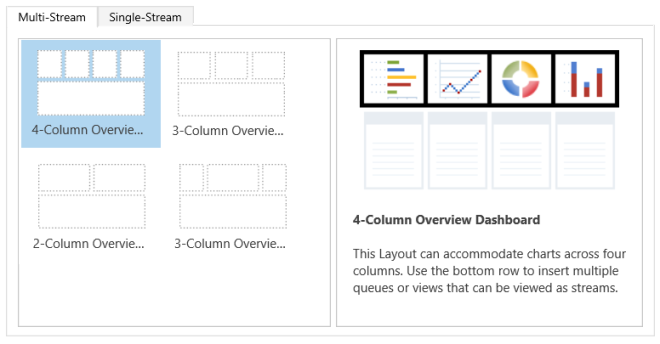
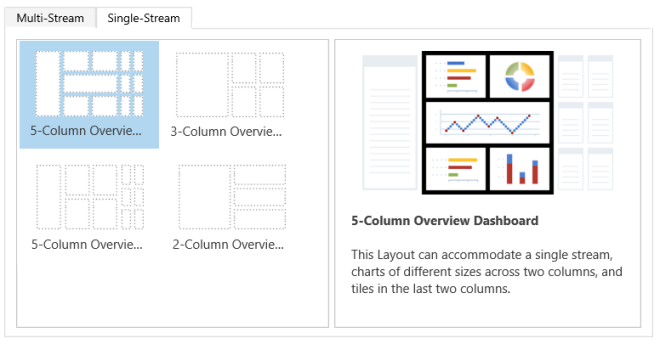
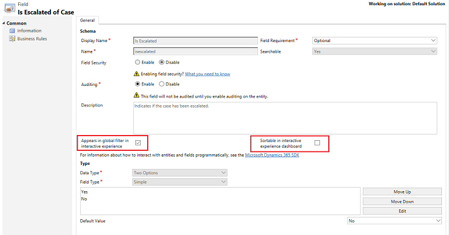
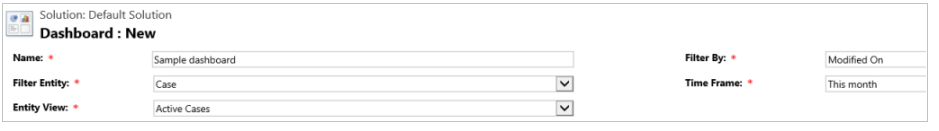
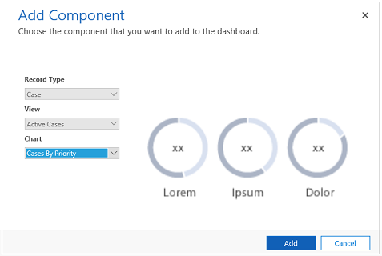

# Customize interactive dashboards that are based on Unified Interface

[!INCLUDE[cc-data-platform-banner](../includes/cc-data-platform-banner.md)]

## Dashboards overview

Customer Service Hub provides a modern, intuitive, and interactive experience for managing your customer service operations. For service reps, the interactive dashboards are a one-stop workplace to see what's important and take actions. 

Dashboards pull together key information, so customer service representatives can focus on what’s important to them and get things done faster. The dashboards are fully configurable, security-role based, and deliver workload information across multiple streams. 

For more information about dashboards, see [Use interactive dashboards to effectively manage service cases in the Customer Service Hub](../customer-service/customer-service-hub-user-guide-dashboard.md)

> [!NOTE]
> The interactive dashboards are solution aware and can be exported and then imported into a different environment as a solution. However, the queues that the streams and tiles are based on aren’t solution aware. Before importing the dashboard solution into the target system, the queues must be manually created in the target system in **Settings** > **Service Management** > **Queues**. After you create the queues, import the dashboard solution to the target system, and then edit the streams or tiles that are based on the queues  to assign the newly created queues appropriately.  
  
The illustrations in this topic show multi-stream and single-stream dashboards with the header pane. Below the header you see visual filters and streams. In the single-stream dashboard, you also see tiles. For each dashboard type, you can choose from several different layouts that are also shown. The dashboard header contains the following controls and clickable icons, from left to right: dashboard picker, refresh, visual filter icon, global filter icon, and timeframe filter.  

The interactive dashboards come in two flavors:

- Multi-stream dashboards
- Single-stream dashboards
  
### Multi-stream dashboard standard view  

In the multi-stream dashboard, you see a row of visual filters at the top with the data streams below them: 
  
   
  
### Multi-stream dashboard tile view  
 Multi-stream dashboard in tile view:  
  
   
  
### Multi-stream dashboard layouts  
 For multi-stream dashboards, you can choose from four different layouts.  
  
   
  
### Multi-stream entity-specific dashboard  
 The entity-specific dashboard for the **Case** entity is shown here.  
  

  
### Single-stream dashboard  
 The single-stream dashboard contains the data stream on the left and visual filters and tiles on the right.  
  

  
### Single-stream dashboard layouts  
 For single-stream dashboards, you can choose from four different layouts.  
  
   
  
## Configure filter fields and security roles for the interactive dashboards

When you configure interactive dashboards, your first task is to enable fields and security roles, so that interactive dashboards can be configured for them. Note, that interactive dashboards are now enabled for all entities and custom entities by default.

To know more about how to enable custom entities, see [Enable custom entities in the Customer Service Hub](../customer-service/create-design-forms-customer-service-hub.md#enable-custom-entities-in-the-customer-service-hub).

> [!NOTE]
> All customization tasks for the Customer Service Hub must be done in Microsoft Dataverse.
  
### Configure filter fields  

For a field to appear in the global filter and to be included in the data stream sort, you must set two flags: 

- Appears in global filter in interactive experience
- Sortable in interactive experience dashboard

Refer the screen below to see the two flags enabled in the **Case** entity for the **IsEscalated** field:
  

#### Configure the flag "Appears in global filter in interactive experience"

1. [!INCLUDE[proc_settings_customization](../includes/proc-settings-customization.md)]  
  
2. Select **Customize the System**.  
  
3. Under **Components**, expand **Entities**, and then expand the entity you want.  
  
4. In the navigation pane, select **Fields** and in the grid, double-click the field you want to enable.  
  
5. In the **General** tab, select the **Appears in global filter in interactive experience** check box. Select **Save and Close**.  
  
6. Select **Publish All Customizations** for your changes to take effect.
  
The fields that you configure will appear in the global filter flyout window when the global filter icon is selected from the dashboard header. In the flyout window, the service reps can select the fields on which they want to filter globally, in charts, and also in streams and tiles that are based on the filter entity.  

The global filter flyout window is shown here:  
  

  
> [!TIP]
>  When you configure a visual filter based on the fields like priority or status, a best practice is to also enable these fields (priority, status) to appear in the global filter.  
     
#### Configure the flag "Sortable in interactive experience dashboard"

1. [!INCLUDE[proc_settings_customization](../includes/proc-settings-customization.md)]  
  
2. Select **Customize the System**.  
  
3. Under **Components**, expand **Entities**, and then expand the entity you want.  
  
4. In the navigation pane, select **Fields** and in the grid, double-click the field you want to enable.  
  
5. In the **General** tab, select the **Sortable in interactive experience dashboard** check box. Select **Save and Close**.  
  
6. Select **Publish All Customizations** for your changes to take effect.

The fields that you configure for sorting will appear when you select the drop-down list on the stream header. 

The following illustration shows the flyout dialog with the list of the available fields for sorting, in the drop-down list. The default sort is always set on the **Modified On** field.  
  
 
  
### Enable security roles  

Select and enable security roles that will be able to view the interactive dashboards.  
  
#### To enable the security roles  
  
1. [!INCLUDE[proc_settings_customization](../includes/proc-settings-customization.md)]  
  
2. Select **Customize the System**.  
  
3. Under **Components**, select **Dashboards**.  
  
4. In the grid, select the interactive dashboard you want and select **Enable Security Roles** on the task bar.  
  
5. In the **Assign Security Roles** dialog, select the **Display only to these selected security roles** option and select the roles that you want to enable. Select **OK**.  
  
6. Select **Publish All Customizations** for your changes to take effect. 

   

     
## Configure interactive dashboards  

The following sections describe how to configure various types of interactive dashboards.  
  
### Configure a multi-stream interactive dashboard using the 4-column layout
  
1. [!INCLUDE[proc_settings_customization](../includes/proc-settings-customization.md)]  
  
2. Select **Customize the System**.  
  
3. Under **Components**, select **Dashboards**.  
  
4. In the grid, select **New**, and select **Interactive experience dashboard** in the drop-down list, as shown below:  
  
   
  
5. Choose the layout and select **Create**.  
  
6. When the dashboard form opens, fill in the filtering information at the top of form, as shown here.  
  
     
  
   - **Filter Entity**: The visual filters and global filter attributes are based on this entity.  
      
   - **Entity View**: The visual filters are based on this view.  
      
   - **Filter By**: The field that the time frame filter applies to.  
      
   - **Time Frame**: The default time frame filter value for the **Filter By** field.  
      
   After you  have specified the filtering information, start adding components for the charts and the data streams in the **Visual filters** section . To add a component, simply select the element in the center of the chart or stream, and when the dialog appears, select the required information from the drop-down, as shown in the following illustrations.  
  
   The following shows adding the **Cases By Priority** doughnut chart.  
  
   
  
   Some charts, such as bar charts or pie charts, render showing the data stored in the system. The doughnut charts and tag charts load as static images and don’t show the preview of the actual data.  
  
> [!NOTE]
>  The charts configured for the visual filters can use the fields of the **Filter** entity as well as related entities. When you use charts based on related entity fields, the customer service representatives can filter charts using these related entity fields. The fields that are based on the related entity usually have the following format in the chart configuration window: “field name (entity name)”, such as the **Modified By (Delegate)** field. To create multi-entity charts, you must add  fields of a related entity to any of the views, and then use these fields while creating charts.
 
 

  
 Next, configure the **Streams**. Just like with adding components in the charts, select the element inside the stream panel. When the dialog appears, select **View** or **Queue** depending on what element you want the stream to use. Enter the required information, as shown in the following illustration.  

Configure the stream for the **Items available to work on** as shown here:

  
> [!NOTE]
>  The **Queue** option is available in the dialog box only for queue-enabled entities. For entity dashboards, if the entity is not queue enabled, you won't see the **Queue** option in the dialog box. You can only use the **View option** in the stream of dashboards for entities that are not queue enabled.  
  
The following illustration is an example of a fully configured chart panel, and stream panel:
  

After you have completed configuring the dashboard, save it and publish the customizations for your changes to take effect.
  
#### Edit or delete individual streams of an existing dashboard  

Follow the steps given below to edit individual streams of an existing dashboard: 
  
1. [!INCLUDE[proc_settings_customization](../includes/proc-settings-customization.md)]  
  
2. Select **Customize the System**.  
  
3. Under **Components**, select **Dashboards**.  
  
    -OR-  
  
    If you want to edit the stream of an entity dashboard, then under **Components**, expand **Entities** and select the entity you want. Select **Dashboards** under the entity, in the navigation pane.  
  
4. In the grid, double-click the interactive dashboard that you want to edit, to open it.  
  
5. Select the stream that you want to edit, and then select **Edit Component**.  
  
6. Depending on whether you want to add a view or queue to the stream, select the view or queue details for the stream, and then select **Set**.  
  
7. Select **Save**.  
  
   You can also delete an individual stream from a dashboard. To do this, select the stream, and then on the command bar, select **Delete**.  
  
### Configure an entity-specific dashboard  
 An entity-specific dashboard is a multi-stream dashboard. Configuring this dashboard is similar to configuring a home page multi-stream dashboard, but you do it in the different place in the UI and there are other minor differences. 

For example, instead of selecting an entity, some fields in the entity-specific dashboard are preset to the entity for which you are creating the dashboard.  
  
1. [!INCLUDE[proc_settings_customization](../includes/proc-settings-customization.md)]  
  
2. Select **Customize the System**.  
  
3. Under **Components**, expand **Entities** and select the entity you want. Select **Dashboards** under the entity, in the navigation pane.  
  
4. In the grid, select **New**, and select **Interactive experience dashboard** in the drop-down list.  
  
5. Choose the layout and select **Create**.  
  
6. When the dashboard form opens, the **Filter Entity** is preset to the entity for which you are creating the dashboard. The **Entity View** drop-down list contains the available views for the entity. Select the view and fill in the rest of the required information on the page.  
  
   The rest of the setup is very similar to the home page multi-stream dashboard setup described in the previous section.  
  
### Configure a single-stream dashboard  
 Configuring a single-stream dashboard is similar to the multi-stream dashboard. All UI navigation steps are the same as for the multi-stream dashboard. You can choose a layout that includes tiles or the layout that doesn’t include tiles. 

 If the tiles are included, they are always displayed on the dashboard. To configure a tile, you select on the icon in the center of the tile. When the **Add Tile** window opens, fill in the required data. The following illustration is an example of the tile setup.  
  

  
## Configure dashboard colors  
 For all **Option Set** and **Two Options** type fields, such as the **Case Type**, **IsEscalated** or **Priority** of the **Case** entity, you can configure a particular color that will appear in the charts and streams for specific field values. For example, high priority cases can be shown in red, medium priority cases in blue, and low priority cases in green in the interactive charts. In the streams, there will be a thin vertical line in color next to the work item description.  
  
> [!NOTE]
>  The color coding isn’t available for the tag charts and doughnut charts. These charts appear on the dashboard in white, gray, and black shades.  
  
1. [!INCLUDE[proc_settings_customization](../includes/proc-settings-customization.md)]  
  
2. Select **Customize the System**.  
  
3. Under **Components**, expand **Entities**, and then expand the entity you want.  
  
4. In the navigation pane, select **Fields**. In the grid, double-click the field that you want to configure the color for.  
  
5. In the **General** tab, in the **Type** sub-area, select **Yes** and select **Edit**.  
  
6. When the **Modify List Value** dialog appears, set the new value in the **Color** text box. Select **OK**.  
  
    Select **Save and Close**.  
  
7. Select **Publish** for your changes to take effect.  
  
In the following example, we’re changing the color for the **IsEscalated** field. Use the **Edit** button to open the **Modify List Value** dialog box:  
  

  
When the **Modify List Value** dialog box opens, choose the color as shown here:  

  

Similarly, if you go to the **Priority** field to modify the colors of the case priority options, choose the color in the **Options** sub-area of the **General** tab, as shown below:

  
### See also  
[Use interactive dashboards to effectively manage service cases in the Customer Service Hub](customer-service-hub-user-guide-dashboard.md)  
 [Create and edit dashboards](../customerengagement/on-premises/customize/create-edit-dashboards.md)    
 [Create or edit a chart](../basics/create-edit-chart.md)  

[!INCLUDE[footer-include](../includes/footer-banner.md)]