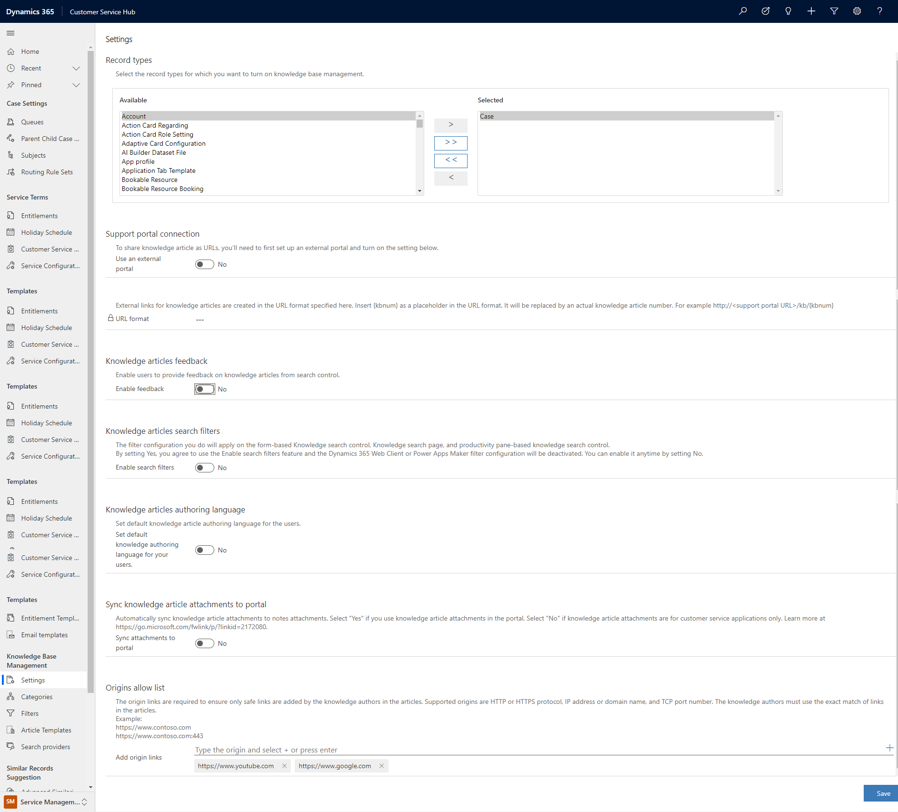

# Configure the origins allow list for knowledge articles

Enabling the origins allow list feature ensures that knowledge authors add only safe links to their articles. The supported origins are HTTP or HTTPS protocol, IP address or domain name, and TCP port number. Knowledge authors must use the exact match of links in the articles.

To enable the origins allow list:

1. Sign in to Customer Service Hub.	
2. In the **Change** area, select **Service Management**.
3. Go to **Knowledge Base Management** and select **Settings**. The **Settings** page is displayed.
> 
4.	Navigate to **Origins allow list** and add your links to the **Add origin links** field.
5.	Select **Add**.
6.	Select **Save**.

To remove a domain, select **Close** next to the domain.