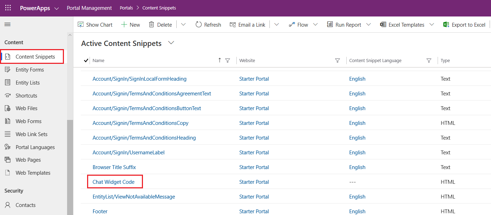
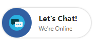

# Quickly configure a chat widget

[!INCLUDE[cc-use-with-omnichannel](../includes/cc-use-with-omnichannel.md)]

Use the Omnichannel Administration app to quickly configure and add a chat widget to your portal to chat with your website visitors. To configure a chat widget and embed it in portal, you must:

## Step 1: Create a live chat work stream

1. Sign in to the Omnichannel Administration app, and in the site map, go to **Work Streams** and select **New** from the command bar.
2. On the **Summary** tab of the new work stream page, provide the name of the work stream.
3. In the **Channel** drop-down list, select **Live chat** as the channel.
4. Select **Save** to save the live chat work stream.

   > [!div class=mx-imgBorder]
   > 

## Step 2: Configure a chat widget

1. Go to **Channels** &gt; **Chat**.
2. Select **New** to create a chat widget. The **New Chat Widget** page opens.
3. On the **Basic details** tab, provide the following information:
   1. In the **General information** section, enter a name for the chat widget.
   2. In the **Work Distribution** section, browse and select the work stream you created for the chat widget, and save the record.
4. Copy the widget snippet code from the **Code snippet** section. This snippet code will be used in [Step 3](#step-3-embed-chat-widget-in-portal).

    > [!div class=mx-imgBorder]
    > 

## Step 3: Embed chat widget in portal

> [!NOTE]
> The chat widget requires session storage and local storage to be functional in your customers’ browsers. Make sure to notify your customers to enable cookies in their browsers so these services can work properly.

Follow these steps to embed your chat widget into a Power Apps portal. For steps to embed your chat widget into your website, see [Embed chat widget in your website or Power Apps portal](embed-chat-widget-portal.md). For steps to embed your chat widget into mobile experiences, see [Render a live chat widget on the mobile app](render-live-chat-widget-mobile.md).

1.	[Open the Portal Management app](https://docs.microsoft.com/powerapps/maker/portals/configure/configure-portal).
2.	Go to **Portal** > **Content Snippets**.
3.	Find the **Chat Widget Code** content snippet and open it.
    > [!div class=mx-imgBorder]
    > 
4.	On the **General** tab, scroll down to the **Value (HTML)** section.
5.	Paste the chat widget snippet code in the **HTML** tab.
    > [!div class=mx-imgBorder]
    > 
6.	Save the changes. The chat widget is now embedded into the portal. By default, the chat widget is displayed in minimized mode as follows:

    > [!div class=mx-imgBorder]
    > 
    
You can maximize the chat widget by selecting it.

> [!div class=mx-imgBorder]
> 

### See also

[Understand and create work streams](work-streams-introduction.md)  
[Create and manage routing rules in Omnichannel](routing-rules.md)  
[Configure a chat widget](set-up-chat-widget.md)  
[Embed chat widget in your website or Power Apps portal](embed-chat-widget-portal.md)  
[Supported browsers for live chat widget](system-requirements-omnichannel.md#browsers-for-chat)  
[Render a live chat widget on the mobile app](render-live-chat-widget-mobile.md)   
