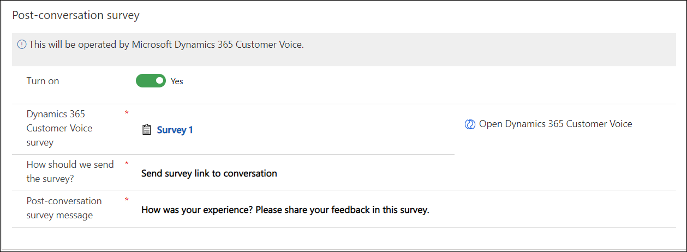

# Configure a post-conversation survey

[!INCLUDE[cc-use-with-omnichannel](../includes/cc-use-with-omnichannel.md)]

## Introduction

You can configure your chat widget to show users a survey that they can respond to after they finish a conversation.

> [!NOTE]
> Post-conversation survey is not supported in Government Community Cloud.

## How post-conversation surveys work

When you enable a post-conversation survey for a channel, the survey will appear for the customer after the agent or customer ends the conversation. While configuring the survey, you can use the settings for the response options available in Dynamics 365 Customer Voice. More information: [Work with survey settings](https://docs.microsoft.com/dynamics365/customer-voice/distribution-settings)

The post-conversation works as follows:

1. Create a survey in Dynamics 365 Customer Voice
2. Configure a survey
3. Experience the runtime behavior

You can enable post-conversation surveys for the following channels:

- Live chat
- SMS for Twilio, SMS for TeleSign
- Facebook
- LINE
- Twitter
- WeChat
- WhatsApp
- Custom channel
- Microsoft Teams

For a Live chat channel only, you can configure the survey link or survey questions to be displayed in the chat window.

## Prerequisite

The post-conversation survey uses Dynamics 365 Customer Voice to create surveys. Make sure that you have access to create surveys in Dynamics 365 Customer Voice in the same org as Omnichannel for Customer Service, and you've created the required survey. The survey that you create will be listed as an option to choose for linking to the conversation. More information: [Create surveys with Dynamics 365 Customer Voice](/dynamics365/customer-voice/create-survey)

## Configure the post-conversation survey

In the Omnichannel admin center or Omnichannel Administration app, you can set up surveys when configuring a channel or update an existing channel instance that is already configured.

### Configure the survey in Omnichannel admin center

1. In Omnichannel admin center, select the workstream pertaining to the channel for which you want to configure a post-conversation survey, and then select **Edit**.
2. On the **Behaviors** tab, set the toggle for **Post-conversation survey** to **On**.
3. In **Dynamics 365 Customer Voice survey**, search for the survey you want to configure, and select it.
4. Optionally, if you want to create a survey, select **Create Dynamics 365 Customer Voice**. The Dynamics 365 Customer Voice page opens on a new tab. After you create the survey, it will be available for selection in the **Dynamics 365 Customer Voice survey** box in the **Post-conversation survey** area.
5. In the **How should we send the survey** box, the following options are available depending on the channel you select:
   - **Send survey link to conversation:** At runtime, the survey link is sent to the customers.

       - In the **Message** box that appears, select the default message text or type a custom message. The personalized survey link will be appended to the message and displayed to the customer.
   - **Insert survey in conversation:** At runtime, the agent can insert a survey link in an active conversation that results in the survey questions being displayed on the customer chat window. This option is available only for the Live chat channel.
6. Select **Save and close**.

### Configure the survey in Omnichannel Administration

1. Go to **Channels**, and select a channel for which you want to configure a post-conversation survey.

2. On the page that appears, select the channel instance in which you want to configure the survey.

3. Go to the **Surveys** tab.

    > [!NOTE]
    > The navigation to the **Surveys** tab varies for every channel. For example, for the Facebook channel, surveys can be configured at the page level.

4. In the **Post-conversation survey** area, set the toggle for **Turn on** to **Yes**.

5. In **Dynamics 365 Customer Voice survey**, search for a survey and select it.

6. Optionally, if you want to create a survey, select **Open Dynamics 365 Customer Voice**. The Dynamics 365 Customer Voice page opens on a new tab. After you create the survey, it will be available for selection in the **Dynamics 365 Customer Voice survey** box in the **Post-conversation survey** area.

7. In the **How should we send the survey** box, the following options are available depending on the channel you select:
   - **Send survey link to conversation:** At runtime, the survey link is sent to the customers.

       - In the **Message** box that appears, select the default message text or type a custom message. The personalized survey link will be appended to the message and displayed to the customer.
   - **Insert survey in conversation:** At runtime, the agent can insert a survey link in an active conversation that results in the survey questions being displayed on the customer chat window. This option is available only for the Live chat channel.

8. Select **Save**.

    > [!div class=mx-imgBorder]
    > 

## Runtime experience of post-conversation surveys

If the post-conversation survey is enabled for a conversation, after the conversation ends, the pre-designed survey is shared with the customer. This survey allows you to keep a track of the customer's feedback of the service provided. Any conversation can be considered as closed when one of the following scenarios happen:

- Agent closes the chat conversation.
- Customer closes the chat conversation.
- System closes the chat conversation after a pre-defined time.

For Live chat conversations, customers can receive survey questions within the same conversation or through a link that takes them to an external site. For SMS and social channels, a survey link is shared.

> [!NOTE]
> The surveys that you create and survey data that is processed are not hosted or stored in Omnichannel for Customer Service.

### See also

[Add a chat widget](add-chat-widget.md)  
[Channels](channels.md)  

[!INCLUDE[footer-include](../includes/footer-banner.md)]