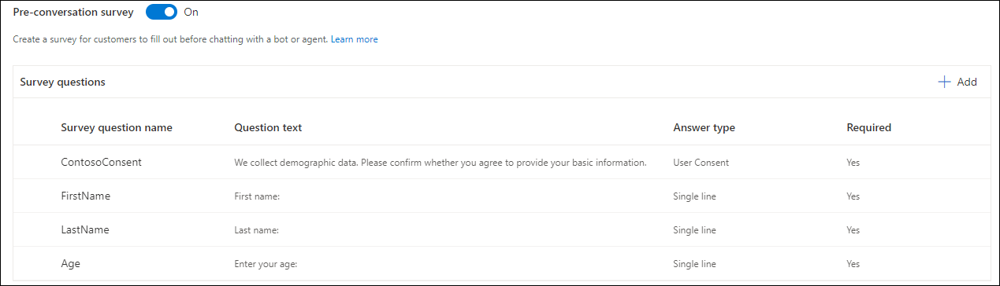
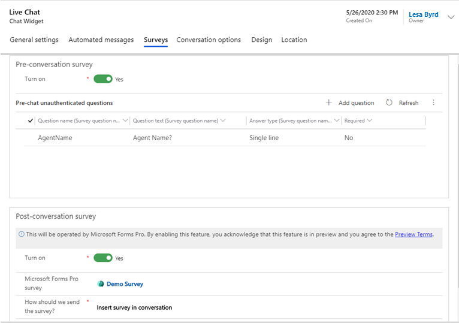
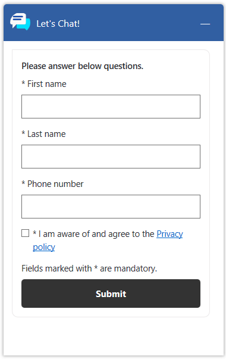

# Configure a pre-conversation survey

[!INCLUDE[cc-use-with-omnichannel](../includes/cc-use-with-omnichannel.md)]

## Configure a pre-conversation survey in Omnichannel admin center

For the chat channel, you can configure a survey that users can respond to when they access the widget to start a conversation.

1. In Omnichannel admin center, select the workstream for the chat channel in which you want to configure the pre-conversation survey, and then select **Edit**.
2. On the **Behaviors** tab, set the toggle for **Pre-conversation survey** to **On**.
3. In the **Survey questions** area, select **Add**, and then enter the following details on the **Survey question** page:
   - **Survey question name**: Specify a name that will be used internally.
   - **Question text**: Enter the question text. The will be displayed as a question to the user at runtime.
   - **Answer type**: Select one of the following values from the list:
        - **Single line**: The user can enter a single line of text.
        - **Multiple lines**: The user can enter multiple lines of text.
        - **Option set**: The user can select an option in a drop-down list. You must enter options separated by a semi-colon.
        - **User consent**: Use this option to request user consent for the pre-chat survey. You can provide a link to a webpage, such as the privacy policy page. Links must be in the following format: [link text](link to the webpage). A check box will appear beside the question text in the pre-chat survey.
    - **Required**: Set the toggle to Yes if the response to the question needs to be mandatory. If the answer type is **User Consent**, make sure you specify **Yes**.

    > [!NOTE]
    > Validations in pre-conversation surveys are supported only for mandatory fields.

4. Select **Confirm**. The survey question with its details is listed in the **Survey questions** area.
5. Repeat steps 3 and 4 to create additional questions. You can add up to five questions only.

    > [!div class=mx-imgBorder]
    > 

6. Optionally, you can change the order in which the questions are listed.

## Configure a pre-conversation survey in Omnichannel Administration

You can configure your chat widget to show users a survey that they must respond to before they start the conversation.

1. Sign in to Omnichannel Administration.
2. Go to **Channels** &gt; **Chat**.
3. Open the chat widget in which you want to configure a pre-chat survey, and select **Surveys**.
4. In the **Pre-conversation survey** area, set the **Turn on** toggle to  **Yes**. The options to add questions and refresh the page are displayed.
5. Select **Add question**.

    > [!NOTE]
    > You can add only five questions to a pre-chat survey. The length of each question should be less than or equal to 512 characters.

6. In the **New Question** pane, provide the following information:

    - **Question name**: Enter a name for the question.
    - **Question text**: Enter the text of the question.
    - **Question type**: Select one of the following options to indicate how user response needs to be provided:

        - **Single line**: The user can enter a single line of text.
        - **Multiple lines**: The user can enter multiple lines of text.
        - **Option set**: The user can select an option in a drop-down list. You must enter options separated by a semi-colon.
        - **User consent**: Use this option to request user consent for the pre-chat survey. You can provide a link to a webpage, such as the privacy policy page. Links must be in the following format: [link text](link to the webpage). A check box will appear beside the question text in the pre-chat survey.

    - **Mandatory**: Select **Yes** or **No** to indicate whether the question is mandatory. If question type is **User Consent**, make sure you specify **Yes**.

    > [!NOTE]
    > Validations in pre-chat surveys are supported only for mandatory fields.
    

    > [!div class=mx-imgBorder]
    > 

7. Select **Save and Close**. The questions are added in the **Pre-chat unauthenticated questions** area.
  
    > [!div class=mx-imgBorder]
    > 

8. Optionally, select a question and select **Move up** or **Move down** in the right corner to change its order.

    > [!div class=mx-imgBorder]
    > 

## Runtime view of survey questions

The following screenshot is a sample of the pre-conversation survey that will be displayed for customers.

> [!div class=mx-imgBorder]
> 

More information: [Automatically identify customers using pre-chat responses](record-identification-rule.md)

### See also

[Add a chat widget](add-chat-widget.md)  
[Configure agent display name](agent-display-name.md) 
[Configure file attachment capability](configure-file-attachment.md) 
[Create quick replies](create-quick-replies.md)  
[Create and manage operating hours](create-operating-hours.md)  
[Create chat authentication settings](create-chat-auth-settings.md)  
[Embed chat widget in your website or portal](embed-chat-widget-portal.md)

[!INCLUDE[footer-include](../includes/footer-banner.md)]