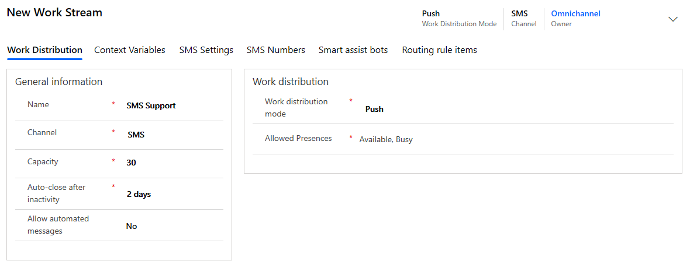
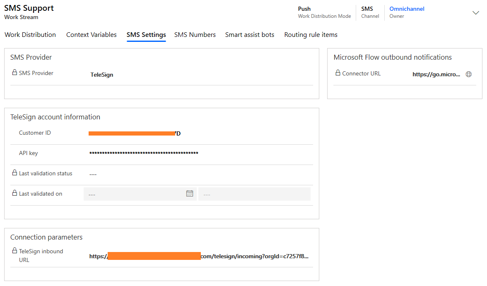

# Configure an SMS channel for TeleSign

[!INCLUDE[cc-use-with-omnichannel](../includes/cc-use-with-omnichannel.md)]

An SMS channel allows your organization to connect to customers by using text messages. After you configure an SMS channel, your customers can send text messages and connect with a customer service agent. This provides your customers the flexibility to connect with their mobile devices when an internet connection is not available to connect to a chat channel.

Agents can view the incoming SMS requests on their dashboard and respond accordingly.

The tasks to add SMS support for TeleSign are as follows:

1. Enable SMS channel in your Dynamics 365 organization.

2. Register with TeleSign and get your customer ID and API key, and purchase a phone number.

3. Add SMS support through Omnichannel for Customer Service.

> [!NOTE]
>
> - The maximum number of characters supported for sent and received messages is 1600.
> - SMS is an asynchronous mode of communication. Agents can close the conversation and then work on them later. Ending the conversation will mark it as resolved. More information: [Understand conversation states](oc-conversation-state.md)

## Enable SMS channel in your Dynamics 365 organization

You can enable the SMS channel from the Dynamics 365 Administration Center. For steps on enabling SMS in your organization as a part of provisioning Omnichannel for Customer Service, see [Provision Omnichannel for Customer Service](omnichannel-provision-license.md).

> [!NOTE]
> The SMS channel is available only if you have an active subscription of Dynamics 365 for Customer Service Digital Messaging.

## Sign up for TeleSign account

An SMS channel can be enabled within Omnichannel for Customer Service by integrating with TeleSign. This integration uses public APIs of TeleSign for sending and receiving text messages. You must sign up for a TeleSign account to enable an SMS channel in your organization.

To sign up for TeleSign

1. Go to [TeleSign](https://go.microsoft.com/fwlink/p/?linkid=2127719) to sign up for a self-service account, and upgrade to standard or enterprise account for a complete integration with Omnichannel for Customer Service. If you expect to send high volumes of SMS traffic, such as more than 100,000 messages per month, contact [TeleSign support](mailto:support@telesign.com) to request an invoiced enterprise account.

2. Purchase support phone numbers through your TeleSign account.

3. Get the customer ID and API key from your TeleSign account. You will need to provide these while setting up the SMS channel in Omnichannel for Customer Service.

4. You are provided with a callback URL that must be sent to [TeleSign support](mailto:support@telesign.com). This callback URL is specific to your organization and is available when you add SMS support for your organization. When you send an email to TeleSign support, include the callback URL, your customer ID, and enter the subject line as **Omnichannel for Customer Service callback URL update request**.

## Add SMS support in Omnichannel admin center

## Add SMS support for your organization

1. Sign in to Omnichannel Administration.

2. Go to **Work Distribution Management** > **Work Streams**.

3. Select **New** to create a work stream.

4. On the **Work Distribution** tab, enter the following information:
    - **Name**: Name of the work stream.
    - **Channel**: Select **SMS**.
    - **Auto-close after inactivity**: Select a duration of at least 8 hours
    - **Allow automated messages**: Specify **Yes** to be able to define the business hours.

    > [!div class=mx-imgBorder]
    > 

5. On the **SMS Settings** tab, enter the following information:
    - **Customer ID**: Customer ID generated from the TeleSign account.
    - **API key**: API key generated from the TeleSign account.

6. Copy the value from the **TeleSign inbound URL** field, and send it to TeleSign at [support@telesign.com](mailto:support@telesign.com) with your customer ID; enter the subject line as "Omnichannel for Customer Service callback URL update request". This value is the callback URL that is used to process incoming SMS messages.

7. Select **Save**.

    > [!div class=mx-imgBorder]
    > 

8. On the **SMS Numbers** tab, select **New SMS Number**, and then enter the following details:

    - **Number**: Specify the support phone number that you purchased from TeleSign in the *<country_code><phone_number>* format, such as 14252306549. Make sure that you don't enter blank spaces or special characters.
    - **SMS number language**: This is the preferred language that will be used when you configure automated messages on the **Automated messages** tab. 
    - **Type**: Select **Long code**, **Short code**, or **Toll free**.
    - **Description**: Specify a description for the number. (Optional) 
    - **Operating Hours**: Specify the business hours when the customer support team is active and available to serve customers.

    > [!NOTE]
    >
    > - You can configure only one phone number per work stream.
    > - Ensure that the phone number is entered in the following format without spaces and special characters: &lt;country code&gt;&lt;phone number&gt;. For information on availability of international numbers, see [TeleSign coverage map](https://www.telesign.com/coverage-map/).
    > - Short code is supported for enterprise accounts.

    > [!div class=mx-imgBorder]
    > 

9. Select **Save**.

10. Optionally, on the **Automated messages** tab, [configure automated messages](configure-automated-message.md).

11. Optionally, on the **Surveys** tab, [configure a post-conversation survey](configure-post-conversation-survey.md).

12. Select **Validate API Key** from the toolbar at the top of the page to validate the customer ID and API key.

    > [!div class=mx-imgBorder]
    > 

13. Open the work stream you created for SMS.

14. On the **Routing rules items** tab, create a routing rule to transfer the SMS to an appropriate agent. Routing rule for SMS works on the **Mobile Phone** field of the Contact entity. The customer is identified based on the **Mobile Phone** field and the conversation is automatically linked to the contact record.

## Flow of data between Omnichannel for Customer Service - SMS channel and TeleSign

### Incoming text messages

For an incoming text message sent by a customer to the support phone number, the message is first sent to the TeleSign service and then pushed by TeleSign to Omnichannel for Customer Service using the callback URL. After this, the message gets routed and associated to either a new or an existing conversation by Omnichannel for Customer Service.

### Outgoing Text Messages

For an outgoing message sent by an agent from within Dynamics 365, the message is first sent to the TeleSign service and then TeleSign sends it to the customer. In addition to the text message, Omnichannel for Customer Service uses the APIs provided by TeleSign to send the customer's phone number, support phone number (TeleSign SenderID), and the TeleSign account information (CustomerID and the API Key) to the TeleSign service.

### TeleSign API Key Validation

When you validate the API key while setting up the SMS channel, a call is made to TeleSign to validate customer ID and the API key.

### See also

[Overview of channels](channels.md)  
[Understand and create work streams](work-streams-introduction.md)   
[Create and manage routing rules](routing-rules.md)  
[Configure automated messages](configure-automated-message.md)  
[Delete a configured channel](delete-channel.md) 
[SMS FAQ](faqs.md#sms)

[!INCLUDE[footer-include](../includes/footer-banner.md)]
