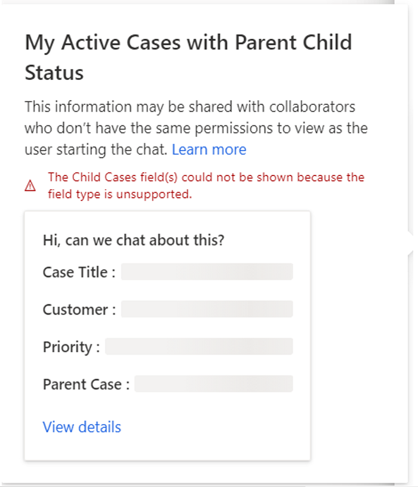
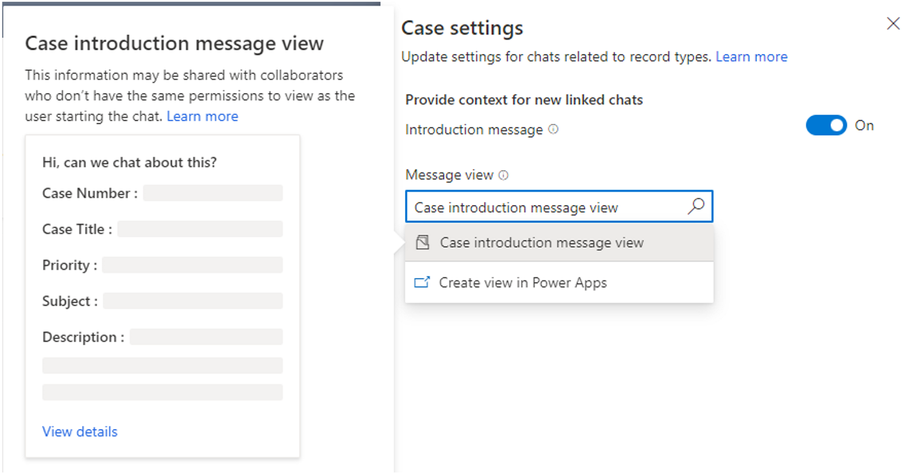
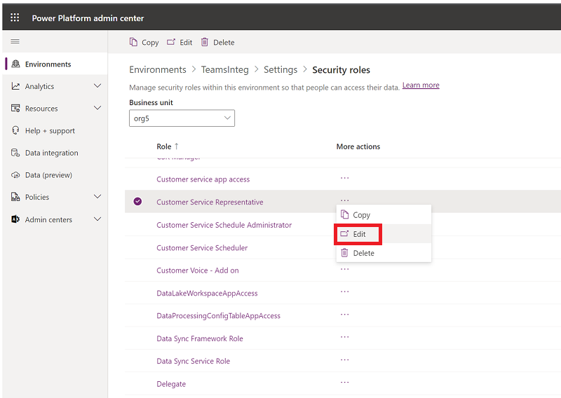
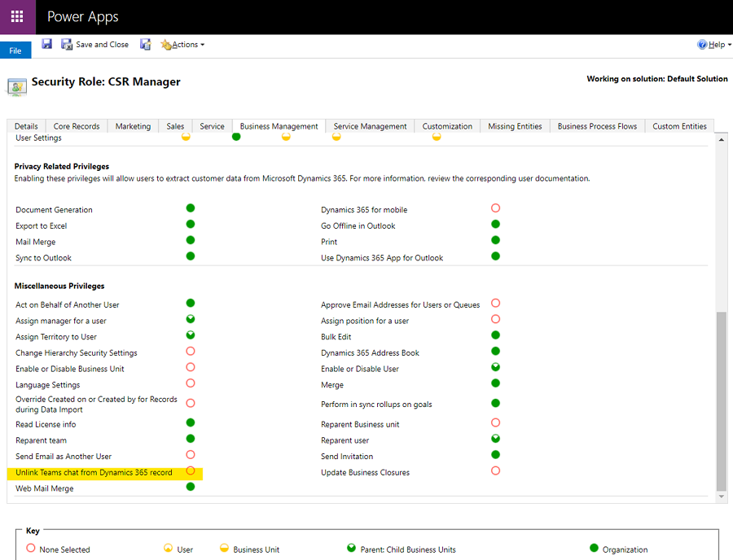
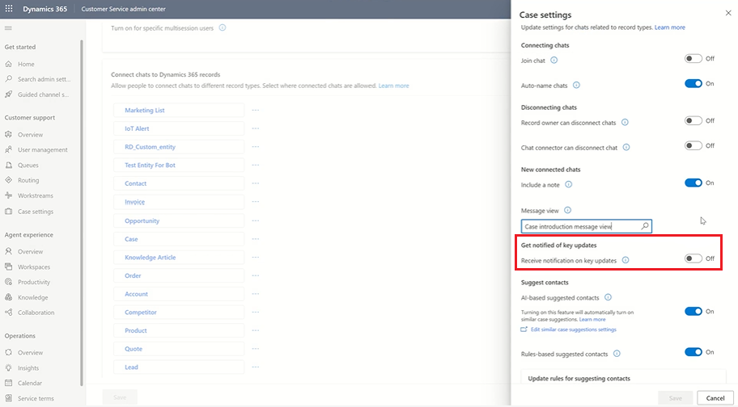
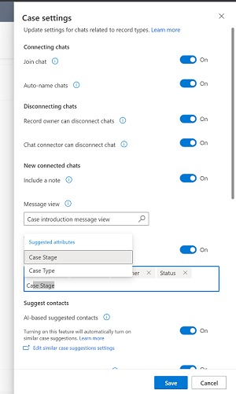

# Configure Microsoft Teams chat in Customer Service

You can configure the ability for agents to chat in Microsoft Teams from within Customer Service Hub, Customer Service workspace, and your custom apps. Teams chat is also available in other customer engagement apps such as Dynamics 365 Field Service and Dynamics 365 Sales.

> [!NOTE]
> Teams settings apply across all supported customer engagement apps. Whether you enable the feature from Customer Service Hub or a custom app, it'll be enabled for all supported customer engagement apps.

When the feature is enabled, while working on customer records, agents can start a new chat or connect an existing chat to a record, and thus collaborate efficiently without switching context or leaving the application. Connecting all the associated chats to a record can help agents maintain all the chats related to the record in one place. You can also configure an optional introduction note that agents can use to provide further context when collaborating in Teams.

## Enable or disable Teams chat

The Teams chat feature must be enabled in customer engagement apps and custom apps. It requires certain permissions to access Teams data. Review the following permissions required section to learn more.

### Permissions required

As a tenant administrator, when you enable the Teams chat feature, the app has the following permissions:

|Permission | What the app does with the permission |
|-------------|-----------------------|
|Chat.ReadWrite.All |Reads user’s chats and recent messages to display in chat list. |
|Directory.Read.All	|Reads user’s teams and channels display name. |
|Presence.Read.All	|Reads presence information of all users to be displayed on the user avatars in chat list. |
|User.Read.All	|Reads users’ display name and licenses to validate if the suggested participants have a Teams license assigned. This is used by the suggested section in the chat list.|
|User.ReadBasic.All	|Reads users’ photos. |

In order to use Teams chat in multisession environments, users must have the same permissions as available in the **Productivity tools user** role. 

Users need read permission for the following entities to access the productivity pane for custom roles:

- App profile
- Application tab template
- Notification field
- Notification template
- Pane tab configuration
- Pane tool configuration
- Productivity pane configuration

### Data security and privacy

The following data security and privacy considerations apply for Teams chat functionality in Dynamics 365:

- Dynamics 365 doesn't store any Teams data except for the mapping between the record ID and the connected chat ID. No data from Teams is duplicated in Dynamics 365 unless the user manually adds it to the record notes or tasks.

- The communication between the applications is secured through TLS.

- Policies that apply both to Teams and Dynamics 365 are honored by the integration. For example, confidential files shared in a connected chat can only be accessed by permitted users. Similarly, a record shared in a Teams chat in Dynamics 365 can only be accessed if the user has permission to view it.

- The app requires certain permissions to start a chat, display suggested contacts, show presence, and so on. For more information, review [Permissions required](#permissions-required).


### Add the Teams collaboration and chat settings page to the sitemap of your app

1. Sign in to [Power Apps](https://make.powerapps.com/).

1. Select the environment, and then select **Apps**.

1. Select your custom app, and then select **Edit**.

1. In the **App Designer**, edit the **Sitemap**.

1. To add the Teams **Chat and collaborate** settings page, add a subarea component, and then for the **Type**, select **URL**.

1. Copy the following value and paste it into URL field: <br>
    ```/main.aspx?pagetype=control&controlName=MscrmControls.TeamsCollaborationAdmin.TeamsCollaborationAdmin```

1. Save and publish the changes.

### Access the Teams settings

1. In Dynamics 365, go to one of the apps, and then perform the following steps.

   ### [Customer Service admin center](#tab/customerserviceadmincenter)

    1. In the site map, in **Agent experience**, select **Collaboration**.
    
    1. In **Embedded chat using Teams**, select **Manage**.
   
   ### [Customer Service Hub](#tab/customerservicehub) 

    1. In the site map, select **Service Management**.
    
    1. In **Collaboration**, select **Embedded chat using Teams**.
    
1. On the **Microsoft Teams collaboration and chat** page, turn on the toggle for **Turn on Microsoft Teams chats inside Dynamics 365**.   
1. Save the changes.<br>
   Teams settings are now enabled for Dynamics 365 Customer Service Hub, Customer Service workspace, and your custom apps (and also Field Service and Sales customer engagement apps, if you're using them). You can open a record and verify if you’re able to view the chats and channels related to the record.
    

### Add the Teams chat settings page for specific multisession users

If you're using the default profile, once you complete the steps in [Add the Teams chat settings page to the sitemap of your app](#add-the-teams-collaboration-and-chat-settings-page-to-the-sitemap-of-your-app), Teams chat is enabled.

If you want Teams chat to work for specific users, you must enable the feature for your custom profile. For more information about creating custom profiles in App profile manager, see [Overview of App profile manager](/dynamics365/app-profile-manager/overview).

To enable Teams chat settings for a custom multisession user, complete the following steps:

1. Create the custom profile from the default profile in App profile manager. More info: [Create an app profile](/dynamics365/app-profile-manager/app-profile-manager#create-an-app-profile)

1. In Dynamics 365, go to one of the apps, and then perform the following steps.

   ### [Customer Service admin center](#tab/customerserviceadmincenter)

    1. In the site map, in **Agent experience**, select **Collaboration**.
    
    1. In **Embedded chat using Teams**, select **Manage**.
   
   ### [Customer Service Hub](#tab/customerservicehub) 

    1. In the site map, select **Service Management**.
    2. In **Collaboration**, select **Embedded chat using Teams**.
    
1. Ensure that toggle for **Turn on Microsoft Teams chats inside Dynamics 365** is set to **Yes**, and then in **Turn on for specific multisession users**, select **Manage**. The **Agent experiences profiles** page is displayed.

1. Select the profile to open it.

1. On the profile page, you can do the following:
   - **Add users** More information: [Assign profiles to users](/dynamics365/app-profile-manager/app-profile-manager#assign-profiles-to-users)
   - **Add an entity session template** More information: [Manage session templates](/dynamics365/app-profile-manager/session-templates?tabs=customerserviceadmincenter)
   - **Enable the inbox** More information: [Configure the inbox for agents](configure-inbox.md)
   - **Enable productivity pane features** More information: 
   - **Set up channel providers** More information: [Overview of productivity tools](/dynamics365/app-profile-manager/productivity-tools)

## Configure the ability to connect chats to Dynamics 365 records

Once you’ve enabled Teams chats, you can connect the chats to different record types. Standard record types, including case, account, contacts, knowledge article, and email, are available out-of-the-box, or you can add your desired record type.

**To configure the ability to connect a chat to a record type:**

1. In Dynamics 365, go to one of the apps, and then perform the following steps.

   ### [Customer Service admin center](#tab/customerserviceadmincenter)

    1. In the site map, in **Agent experience**, select **Collaboration**.
    
    1. In **Embedded chat using Teams**, select **Manage**.
   
   ### [Customer Service Hub](#tab/customerservicehub) 

    1. In the site map, select **Service Management**.
    2. In **Collaboration**, select **Embedded chat using Teams**.

1. Under **Connect chats to Dynamics 365 records**, select the record type you want to configure.<br>
   If you want to add a record type, see [Add record types](#add-record-types)
    
1. Select **Save**.

#### Add record types

To add a record type to connect chats to in Dynamics 365 records:

1. In Dynamics 365, go to one of the apps, and then perform the following steps.

   ### [Customer Service admin center](#tab/customerserviceadmincenter)

    1. In the site map, in **Agent experience**, select **Collaboration**.
    
    1. In **Embedded chat using Teams**, select **Manage**.
   
   ### [Customer Service Hub](#tab/customerservicehub) 

    1. In the site map, select **Service Management**.
    
    1. In **Collaboration**, select **Embedded chat using Teams**.
	
1. Under **Connect chats to Dynamics 365 records**, select **Add record types**.
	
1. In the **Allow chats to be connected to this record type** pane, in **Choose record type**, type the name of the record type you want to use.
	
1. (Optional): If you want to display content for new connected chats, toggle **Include a note** to **On**, and then use the existing views functionality to define the fields that will represent the context card or [create a custom view in Power Apps](/powerapps/maker/model-driven-apps/create-edit-views). You can choose up to five fields you want to include as a context card. 
            
1. Select **Save**.

For any view that's selected, keep in mind the following details:

 - The first five fields of any view are used as the context card details (in addition to a connection to the record).
 - If a field isn't supported, it's skipped and the display will include the first four fields that are supported. You'll be able to see from the configuration experience that the specific field isn't supported.
 
   > [!div class="mx-imgBorder"] 
   > 
    
 - Because the data fields are static, field-level permissions aren't checked for collaborators. This means if the agent has the field-level permissions to view data fields, collaborators will also be able to see those fields.
- If you don't select a view for the Case record type, agents will see the default, out-of-box **Case introduction message** view.

   > [!div class="mx-imgBorder"] 
   > 
 
- For other out-of-box standard record types, including account, contacts, knowledge article, and email, the default view is the **Quick find** view.


## Assign permissions to disconnect chats for specific user and user roles

Agents can create Teams chats directly from Dynamics 365 apps and then connect them to records. They can also connect existing chats to Dynamics 365 records from the Teams embedded chat experience.

> [!NOTE]
> The retroactive connect chat experience can only be set up in Dynamics 365 apps.

As an admin, you can control which user or role can disconnect chats that are connected. These user permissions help give you the flexibility to adapt the Teams embedded chat experience to match your business processes.

You can choose from the following options for assigning permissions to agents:

- [Assign disconnect chat rights to specific users](#assign-disconnect-chat-rights-to-specific-users)
- [Assign disconnect chat rights for security roles](#assign-disconnect-chat-rights-for-security-roles)

### Assign disconnect chat rights to specific users

You can assign the ability to disconnect chats to record owners or users who connected a chat to a record.
   - **Record owner**: When enabled, record owners can disconnect any chats that are connected to a record. As an admin, you can assign this permission at a record-type level (for example, a case, contact, and so forth).
   - **Chat connector**: When enabled, users who connected a chat to the Dynamics 365 record can disconnect that connected chat. This permission can also be assigned at the record level.

**To enable or disable user-specific rights to disconnect chats:**

1. In Dynamics 365, go to one of the apps, and then perform the following steps.

   ### [Customer Service admin center](#tab/customerserviceadmincenter)

    1. In the site map, in **Agent experience**, select **Collaboration**.
    
    1. In **Embedded chat using Teams**, select **Manage**.
   
   ### [Customer Service Hub](#tab/customerservicehub) 

    1. In the site map, select **Service Management**.
    
    1. In **Collaboration**, select **Embedded chat using Teams**.

1. Select the record type (for example, **Case**), and then in the settings pane, in **Disconnecting chats**, toggle on or off **Record owner can disconnect chats** and/or **Chat connector can disconnect chat**, depending on your preferences.
    
1. Select **Save**.

### Assign disconnect chat rights for security roles

When you assign disconnect chat rights to a security role, all users with that role can disconnect chats that are connected to any record type. Certain role types have disconnect chats rights by default.

The following table details the apps and security roles where the disconnect chats feature is configured:

|App   |Security role |
|---------|-----------|
|Admin    |System admin  |
|Customer Service apps | CSR manager<br>Customer Service Representative |
|Omnichannel for Customer Service | OC admin<br>OC supervisor<br>OC agent |
|||

**To edit disconnect chat rights to security roles:**

1. In Dynamics 365, go to one of the apps, and then perform the following steps.

   ### [Customer Service admin center](#tab/customerserviceadmincenter)

    1. In the site map, in **Agent experience**, select **Collaboration**.
    
    1. In **Embedded chat using Teams**, select **Manage**.
   
   ### [Customer Service Hub](#tab/customerservicehub) 

    1. In the site map, select **Service Management**.
    
    1. In **Collaboration**, select **Embedded chat using Teams**.

1. On the **Microsoft Teams collaboration and chat** page, scroll down to **More settings**.
1. In **Set who can disconnect chats**, select **Edit in security roles settings**. The Power Platform admin center app is opened.
1. In **Security roles**, select the role that you want to assign the rights to, and then select **Edit**.

    > [!div class="mx-imgBorder"] 
    > 
    
1. For the specific security role, go to **Business management** > **Miscellaneous Privileges** > **Disconnect Teams chat from Dynamics 365 record**.

    > [!div class="mx-imgBorder"] 
    > 


### How user rights work together for disconnecting chats

The following table summarizes whether a user can disconnect a connected chat based on the rights assigned to them. You can use the table as a guide for how to use these chat rights to help you configure a secure and effective collaboration experience for your business and users.

| Scenario | Scenario | Scenario | Scenario | Scenario | Result |
|----|----|----|----|----|----|
| Record is user/team-owned and current user is owner | Current user was most recent to disconnect chat | "Record owner can disconnect chat" toggle is on | "Chat creator can disconnect chat" toggle is on | Global disconnect chat permissions are assigned to user | User can disconnect? |
|Y |Y/N |N |N |N |N |
|Y |Y/N |Y |Y/N |Y/N |Y |
|Y/N |Y |N |N |N |N |
|Y/N |Y |Y/N |Y |Y/N |Y |
|Y/N |Y/N |Y/N |Y/N |Y |Y |
|N |N |Y |N |N |N |
|N |Y |N |N |N |N |
|N |N |N |N |N |N |


## Configure the ability for users to join chats

As an admin, you can enable users to view and easily join chats that are connected to records they have write access to, even if they weren't originally part of those chats. You can configure the ability for users to join connected chats at a record-type level. This functionality can help you tailor the user experience for your business processes.

> [!NOTE]
> The join chat feature only works for connected chats and is on by default for the case record type.

The ability for users to join existing chats related to cases is especially useful for the following scenarios:

- **Case transfers**: If an agent has onboarded to a case that was previously handled by another agent, they can join existing connected chats to better understand the context of the case and what steps the previous agent had taken, and then continue to collaborate with their relevant colleagues.
- **Case escalations**: If a case needs attention from someone with specific knowledge, the subject-matter expert who reviews it can participate in the relevant conversations.

**To turn on or off the join chat capability for a record type**:

1. In Dynamics 365, go to one of the apps, and perform the following steps.

   ### [Customer Service admin center](#tab/customerserviceadmincenter)

    1. In the site map, in **Agent experience**, select **Collaboration**.
    
    1. In **Embedded chat using Teams**, select **Manage**.
   
   ### [Customer Service Hub](#tab/customerservicehub) 

    1. In the site map, select **Service Management**.
    
    1. In **Collaboration**, select **Embedded chat using Teams**.

1. On the **Microsoft Teams collaboration and chat** page, in **Connect chats to Dynamics 365 records**, select the specific record type (for example, Case), and then in the settings pane, toggle **Join chat** on or off.

1. Select **Save**.

## Keep chat participants informed when fields are updated

You can reduce the overhead on your agents by automatically updating all participants in a chat when an essential field on a connected record is updated. This time-saving feature helps keep everyone informed without manual effort and allows agents to focus on important matters. It also helps experts in the chat be aware of important updates.

### Limitations for automatic event updates

This section describes the limitations of the automatic event functionality.

#### Entities and attribute type limitations

The following entities aren’t configurable for automatic event updates:

- Virtual entities
- Entities that don’t have the Update SDKMessageFilter defined

The following attribute types aren’t supported for automatic event updates:
- PartyList
- Image
- Integer
- File

#### Inline image limitations

Automatic event updates can’t fully render inline images in rich text fields.

### Configure chat update when a field is changed

1. In **Customer Service admin center**, select **Collaboration**, and then set the toggle to **On** for **Turn on Microsoft Teams chats inside Dynamics 365**. 
1. Next to **Embed chat using Teams**, select **Manage**.
1. On the **Microsoft Teams collaboration and chat** page under **Connect chats to Dynamics 365 records**, select the entity for which you want to enable automatic event updates, or create a new one if the one you want isn’t listed. The record settings pane for that entity is opened on the right side of the page.

   > [!div class="mx-imgBorder"] 
   > 
   
1. Set the **Receive notification on key updates** toggle to **On**.
1. View the Suggested attributes list by placing your cursor in the field below the toggle, and then select up to five attributes for which you want notifications to be sent.
   > [!NOTE]
   > For the Case entity, the following settings are preconfigured:
   > - Priority
   > - Status
   > - Status Reason
  
   > [!div class="mx-imgBorder"] 
   > 
   
1. Save your changes. Automatic notifications will now be sent whenever the attributes you defined for the entities are updated.

## Configure the ability for agents to view Teams chats on a connected record’s timeline (preview)

You can configure the ability to sync data from Teams to Dataverse so that agents can see chat entries in the timeline when they start a connected chat or connect an existing chat to a record. Agents will see the chat appear as a new activity on the timeline. It will show details about who connected the chat and when they connected, as well as the last person to send a message in the chat and the time they sent it.

Additionally, if the agent assigned to the record changes, the new agent (who may not have been part of the chat originally), can see the chat on the timeline. If the Join chat setting is turned on, the new agent can directly join the chat (and be added as a chat participant) to see the full chat exchange.

### Prerequisites

- Only global administrators can configure Teams chat data to sync with Dynamics 365 records.
- For multisession users, you must enable Teams integration in the productivity pane for the app profile assigned to the signed-in user in order for them to be able to select **Open chat** on the timeline. 

### Enable agents to view Teams chats on a connected record’s timeline:
1. In Dynamics 365, go to one of the apps, and then perform the following steps.

   ### [Customer Service admin center](#tab/customerserviceadmincenter)
    
    1. In the site map, in **Agent experience**, select **Collaboration**.
    
    1. In **Embedded chat using Teams**, select **Manage**.
   
   ### [Customer Service Hub](#tab/customerservicehub) 
    
    1. In the site map, select **Service Management**.
    
    1. In **Collaboration**, select **Embedded chat using Teams**.
    
1. Set the toggle to **Yes** for **Turn on Microsoft Teams chats inside Dynamics 365**.
1. Set the toggle to **Yes** for **Sync Teams chats with records (Preview)**.

### See also

[Use Teams chat](use-teams-chat.md)  
[Install and set up Microsoft Teams integration](/dynamics365/teams-integration/teams-install-app)  
[Microsoft Teams integration FAQ](/dynamics365/teams-integration/teams-in-dynamics-faq)  
[Configure AI suggestions for contacts in Microsoft Teams](configure-teams-collaboration.md)  
[Collaborate with AI-suggested agents in Microsoft Teams](use-ai-suggested-contacts-teams.md)  

[!INCLUDE[footer-include](../includes/footer-banner.md)]
