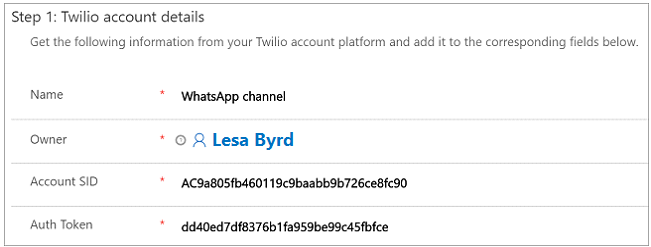
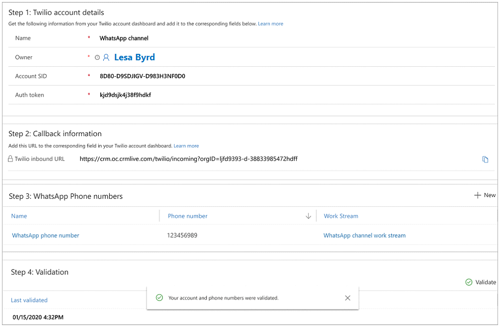

# Configure a WhatsApp channel through Twilio

[!INCLUDE[cc-use-with-omnichannel](../includes/cc-use-with-omnichannel.md)]

## Overview of WhatsApp channel through Twilio

Many customers use social messaging channels like WhatsApp for their personal communication needs and prefer to use the WhatsApp channel to engage with businesses also.

The success of social media customer service, like all other customer service, depends on the quality of care provided. Communications from agents should be timely, accurate, sensitive, brief, and friendly, which ultimately improves the customer satisfaction and brand loyalty.

The WhatsApp channel feature lets you integrate WhatsApp through Twilio with Omnichannel for Customer Service to engage with customers who prefer the WhatsApp channel.

## Prerequisites

- Make sure channels are provisioned in your environment. For information, see [Provision Omnichannel for Customer Service](omnichannel-provision-license.md).
  > [!NOTE]
  >
  > To enable the Twilio channel in an existing Omnichannel environment, you must upgrade to the latest version of Omnichannel for Customer Service. For information, [Upgrade Omnichannel for Customer Service](upgrade-omnichannel.md).

- Obtain a Twilio account with an appropriate subscription or a Twilio sandbox account. For information on configuring a Twilio sandbox account, see [Integrate a Twilio sandbox account with Omnichannel for Customer Service](#integrate-a-twilio-sandbox-account-with-omnichannel-for-customer-service)

- Connect Twilio Number to your WhatsApp Business Profile. To learn more, see [Connect your Twilio Number to your WhatsApp Business Profile](https://www.twilio.com/docs/sms/whatsapp/tutorial/connect-number-business-profile).

## WhatsApp message types and 24 hours session rule

- **Template messages:** These are the outbound messages that agents send through Twilio using one of the pre-approved templates. They are typically transactional messages, such as delivery alerts and appointment reminders, sent to users who have opted in to receive messages from your organization. For messages requiring localization, you must get the message approved by WhatsApp in each language. For more information about WhatsApp message templates, see [WhatsApp documentation](https://developers.facebook.com/docs/whatsapp/message-templates/).

- **Session messages:** According to WhatsApp, session messages are incoming messages from a customer or outgoing replies by an agent to the incoming messages, within 24 hours. A messaging session starts when agents receive a message from a customer. It lasts for 24 hours from the most recently received message. Session messages do not need to follow a template, and can include media attachments.

- **24 hours session rule:** A messaging session starts when an agent receives a message from a customer or replies to the incoming message from the customer. When the customer sends a message, the agent has 24 hours to reply from the time the agent received it. However, after 24 hours, the agent can send a message to customer only by using a predefined and approved template.

## End-to-end walk-through

1. Fetch Twilio account details
2. Create a WhatsApp channel
3. Create routing rules
4. Modify settings for a specific WhatsApp phone number

## Fetch Twilio account details

To integrate a WhatsApp channel through Twilio with Omnichannel for Customer Service, you need to go to your Twilio account and fetch the **ACCOUNT SID** and **AUTH TOKEN** values. Save those safely. These two values are required to create a WhatsApp channel configuration in the Omnichannel Administration app.

Go to your **Twilio Console Dashboard** > **Settings** > **General** to fetch the details.

## Create a WhatsApp channel in Omnichannel admin center

1. In the site map, select **Channels** under **General settings**, and on the **Accounts and channels** page, select **Add account**.
2. Enter the following details:
   1. On the **Channel details** page, enter a name and select **WhatsApp** in **Channels**.
   2. On the **Account details** page, enter the following details:
      - **Account SID:** Specify the value from your Twilio account.
      - **Authentication token:** Specify the value from your Twilio account.
   3. On the **WhatsApp numbers** page, select **Add**, and on the page that appears, enter the following information:
      - **Name:** Specify a name.
      - **Number:** Specify the WhatsApp phone number.
    4. On the **Callback information** page, copy the value in the **Twilio inbound URL** box. You'll use the copied information for Twilio account.
    5. Select **Done**. The account is added to the list.
3. To configure routing and work distribution, you can create a [workstream](create-workstreams.md) or select an existing one.
4. Select the workstream that you've created for the WhatsApp channel and on the workstream page, select **Set up WhatsApp** to configure the following options:
    1. On the **WhatsApp number** page, in the **Available WhatsApp numbers** list, select the number that you created.
    2. On the **Language** page, select the language.
    3. On the **Behaviors** page, configure the following options:
      - [Custom automated messages](configure-automated-message.md)
      - [WhatsApp message templates](#configure-whatsapp-message-templates)
      - [Post-conversation survey](configure-post-conversation-survey.md)
   4. On the **User features** page, set the toggle for **File attachments** to **On** and select the following checkboxes if you want to allow agents and customers to send and receive file attachments. More information: [Enable file attachments](enable-file-attachments.md).
      - Customers can send file attachments
      - Agents can send file attachments
   5. Verify the settings on the **Summary** page, and select **Finish**. The WhatsApp channel instance is configured.
5. Configure routing rules. More information: [Configure work classification](configure-work-classification.md).
6. Configure work distribution. More information: [Work distribution settings](create-workstreams.md#configure-work-distribution)
7. Add a bot. More information [Configure a bot](create-workstreams.md#add-a-bot).
8. In **Advanced settings**, configure the following options based on your business needs:
   - [Sessions](../app-profile-manager/session-templates.md)
   - [Agent notifications](../app-profile-manager/notification-templates.md#out-of-the-box-notification-templates)
   - [Context variables](create-workstreams.md#configure-context-variables)
   - [Smart assist bots](smart-assist-bot.md)
   - [Quick replies](create-quick-replies.md)

### Configure WhatsApp message templates

You can configure the option for agents to send WhatsApp-approved messages. If 24 hours pass after a customer's last message, agents will only be able to send messages from WhatsApp-approved templates until the customer responds. You must create your message templates in your Twilio account and have them approved by WhatsApp before you add them in Omnichannel for Customer Service.

Perform the following steps:

1. For the selected workstream for WhatsApp, edit the WhatsApp account.
2. On the **Behaviors** tab, in **WhatsApp message templates**, select **Add**.
3. On the **Add message template** dialog box, do the following:
   - **Name:** Specify a name for the template.
   - **Default language:** Select the language from the list.
   - **WhatsApp approved text:** Copy and paste the approved text from the template that you created in WhatsApp.
4. Select **Save**.
5. Create as many templates as required.

## Create a WhatsApp channel in Omnichannel Administration

After you create a work stream for the WhatsApp channel through Twilio, create a WhatsApp channel in the Omnichannel Administrator app.

To create a WhatsApp channel, follow these steps:

1. Sign in to the Omnichannel Administration app.

2. Select **WhatsApp** under **Channels**.

3. In the **New WhatsApp** page, do the following.

    | Section | Field | Description | Example  value |
    |-------------|-------------------|---------------------------|--------------------------------------|
    | Twilio account details |Name| Specify a name for the WhatsApp channel.| WhatsApp channel |
    | Twilio account details |Account SID | Fetch the value from your Twilio account and paste it here. | AC9a805fb460119c9baabb9b726ce8fc90 |
    | Twilio account details |Auth Token | Get the value from your Twilio account and paste it here. | dd40ed7df8376b1fa959be99c45fbfce |

    > [!div class=mx-imgBorder]
    > 

4. Select **Save**. In the **Callback information** section, the **Twilio inbound URL** field is generated with a link. Copy the link from the field.

   > [!div class=mx-imgBorder]
   > 

5. Go to your Twilio console, select **Senders** and then select the WhatsApp phone number. Under **Messaging**, paste the link that you copied in step 4 in the **Twilio inbound URL** field.

6. In the **WhatsApp phone numbers** section, select **New WhatsApp Number**. The **New WhatsApp Number** page is displayed.

7. Do the following.

    | Section | Field | Description | Example  value |
    |-------------|-------------------|---------------------------|--------------------------------------|  
    | Phone number details | Name | Specify a name for the WhatsApp channel. | WhatsApp phone number |
    | Phone number details | WhatsApp Account | The **WhatsApp Account** field is populated by default. However, you can change the value using the lookup. | WhatsApp channel |
    | Phone number details | WhatsApp Number | Specify the WhatsApp number. | 123456989 |
    | Work distribution | Work stream | Select the out-of-the-box work stream from the lookup.   To create a new work stream, see [Create work streams](work-streams-introduction.md). | WhatsApp channel work stream |

    > [!div class=mx-imgBorder]
    > 

8. Select **Save**. The WhatsApp phone number is saved.

9. Select the back button on the browser to go to the WhatsApp channel page. You can see that the WhatsApp phone number is added in the **WhatsApp phone numbers** section.

10. Select **Save**.

11. In the **Validation** section, select **Validate** to validate the Account SID, Auth token, and phone numbers.  After you validate, a toast notification displays with the success or error.

    > [!div class=mx-imgBorder]
    > 

### Integrate a Twilio sandbox account with Omnichannel for Customer Service

1. In Twilio, go to the **Programmable SMS** > **Programmable Messaging** > **WhatsApp sandbox**.
2. In the **WHEN A MESSAGE COMES IN** box, enter the Twilio inbound URL that you generated in Omnichannel for Customer Service, and save the changes.
3. To test the WhatsApp channel with the Twilio sandbox, you can send a WhatsApp message to the number provided by Twilio with a unique code that is also provided by Twilio. You can also use the sandbox message template provided by Twilio to test sending messages outside of the 24-hour window.

## Create routing rules

1.	Go to **Work Distribution Management** > **Work Streams**.
2.	Open the out-of-the-box work stream or the one you created.
3.	On the **Routing rules items** tab, you can create a routing rule to transfer the message to an appropriate agent. Select the entity as **WhatsApp Engagement Context**. For example, you can create a rule to transfer WhatsApp chat from a customer to the default queue.

When you create conditions for routing rules, the **WhatsApp Engagement Context (Conversation)** entity enables you to set the **Customer Phone Number** and **Customer First Message** attributes. The **Customer First Message** attribute lets you create a pre-filled message that will automatically appear in the text field of a customer chat, which can be used for routing.

## Modify settings for a specific WhatsApp phone number 

1. In the Omnichannel Administration app, go to your WhatsApp application and select the WhatsApp phone number you want to modify. 

2. On the **General settings** tab, provide the following information:
    
    - **Language**: Select the preferred language for your WhatsApp phone number.
    
    - **Work stream**: Select an existing work stream or create a new one.

    - **Enable file attachments for customers**: Set to **Yes** to allow customers to send file attachments to agents. Otherwise, set **No**. 

    - **Enable file attachments for agents**: Set to **Yes** to allow agents to send file attachments to customers. When the agent sends an attachment, the app sends the blob storage URL to the channel. Otherwise, set **No**. 
    
       To learn more about attachments, see [File attachments](enable-file-attachments.md). 
       
       To learn more about uploading media in WhatsApp, see [Twilio support documentation](https://support.twilio.com/hc/en-us/articles/360017961894-Sending-and-Receiving-Media-with-WhatsApp-Messaging-on-Twilio-Beta-).
    
3. On the **Automated messages** tab, [configure automated messages](configure-automated-message.md). 

4. On the **Message templates** tab, you can configure agents' ability to send WhatsApp-approved messages. If 24 hours pass after a customer's last message, agents will only be able to send messages from WhatsApp approved templates until the customer responds.

    > [!NOTE]
    >
    > Create your message templates in your Twilio account and have them approved by WhatsApp before you add them in Omnichannel for Customer Service.

    Click **New** to create a new template and complete the following fields:

    - **Name**: Label the group of messages that will go in this template.
    
    - **Message trigger**: Select the event that will trigger the message to be sent.
    
    - **Message description**: Give the message template a description.
    
    > [!div class=mx-imgBorder]
    > 
    
    Click **Save** and the **Localization Data (Message template)** panel appears. Select **New localization** and complete the following fields:
    
    - **Language code**: Select the language for the message.
    
    - **Localized text**: Write the message in the language specified. You must create a new localization for each translation of the message.
    
    > [!div class=mx-imgBorder]
    > 
    
5. On the **Surveys** tab, [configure a post-conversation survey](configure-post-conversation-survey.md).

### See also

[Understand and create work streams](work-streams-introduction.md) 
[Create and manage routing rules](routing-rules.md) 
[Configure automated messages](configure-automated-message.md)  
[Configure a post-conversation survey](configure-post-conversation-survey.md) 
[Skill-based routing](overview-skill-work-distribution.md) 
[Create message templates](create-message-templates.md) 
[Templates](templates-overview.md) 
[Delete a configured channel](delete-channel.md)

[!INCLUDE[footer-include](../includes/footer-banner.md)]
