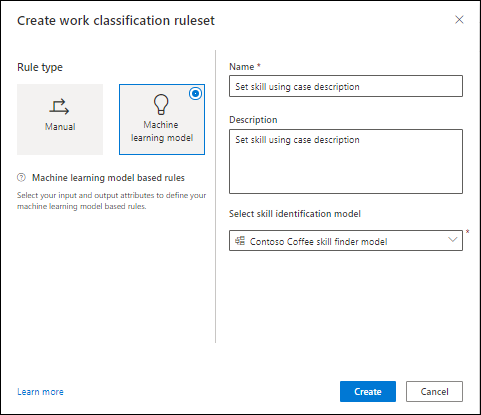
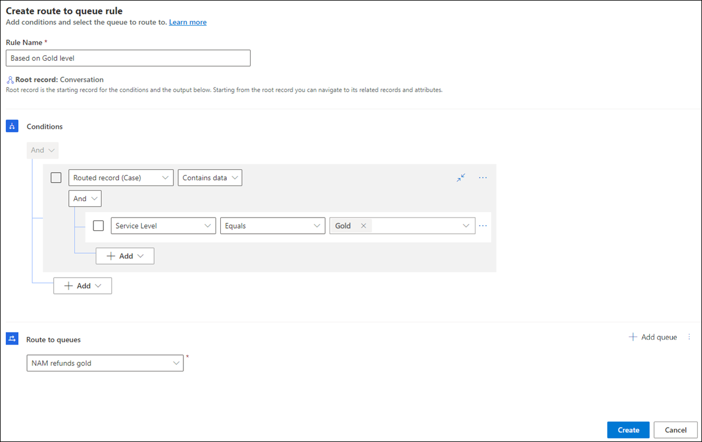

# Configure work classification rulesets for unified routing

You will perform the tasks listed in this topic in the Omnichannel admin center or Customer Service Hub app.

In unified routing, work classification lets you define classification rules to add detailed information to incoming work items that can be used to route and assign the work items optimally.

With the CSR Manager or Omnichannel administrator role, perform the tasks listed in this section to configure the work classification rules for the workstream that you created.

> [!IMPORTANT]
> You can create 10 rulesets per workstream, and for each ruleset, you can create up to 100 rule items.

## Create work classification rulesets

The rules in a ruleset will be evaluated when a work item enters the queue.

To create a manual work classification ruleset, do the following:

1. In Omnichannel admin center or Customer Service Hub, select a workstream, and in the **Routing rules** area, for the **Work classification (optional)** option, select **Create Ruleset**.
2. On the **Work classification** page, select **Create new**, and in the **Create work classification ruleset** dialog box, select **Rule Type** as **Manual**, and enter a name and description.
3. In the **Decision list** area, select **Create Rule**, and on the **Create demand rule** dialog box, enter a name.
4. In the **Conditions** area, define the conditions according to your business needs.
5. In the **Output** area, select the attribute for which value needs to be set if the conditions are met.

   

6. Repeat steps 3 through 5 to create the demand rules.
 
   

## Create manual skill classification rulesets

Follow these steps to create a manual skill classification ruleset:

1. In Omnichannel admin center or Customer Service Hub, select a workstream, and in the **Routing rules** area, for the **Work classification (optional)** option, select **Create Ruleset**.
2. On the **Work classification** page, select **Create new**.
3. In the **Create work classification ruleset** dialog box, select  **Rule Type** as **Manual**, and enter a name and description.
4. Select **Create Rule**, and on the **Create demand rule** dialog box, enter a name.
5. In the **Conditions** area, define the conditions according to your business needs.
6. In the **Output** area, select the attribute whose value will be set if the conditions are met.
7. If you want to manually set up the skill attribute, in the **Conditions** area, define the conditions, and select the required value in the **Output** area for the skill that needs to be set.

## Create machine learning-based skill classification rulesets

To configure a skill classification ruleset by using the machine learning option, you must have configured the intelligent skill finder models. More information: [Set up intelligent skill finder model](intelligent-skill-model.md)

Do the following to configure a machine learning-based ruleset:

1. In Omnichannel admin center or Customer Service Hub, select a workstream, and in the **Routing rules** area, for the **Work classification (optional)** option, select **Create Ruleset** or **See more**.
2. On the **Work classification** page, select **Create new**.
3. In the **Create work classification ruleset** dialog box, select **Rule Type** as **Machine learning model**, and enter a name and description.
4. Select a model in the **Select skill identification model** list, and select **Create**.

   

5. On the page that appears, in the **Input attributes** area, select **Add attribute**, and select the attributes from the **Attributes** or **Related Entities** category. For an incoming work item, these attribute values will be concatenated and sent to the machine learning model for skill prediction.

    > [!NOTE]
    > Skill is the default selection for output attributes and can't be edited or deleted.

    

## Configure route to queues rulesets and rules

1. In Omnichannel admin center or Customer Service Hub, select a workstream, and in the **Routing rules** section, select **Create ruleset** beside **Route to queues**, and then select **Create Rule** in **Decision list**.
2. In the **Create route to queue rule** dialog box, enter a name in **Rule Name**.
3. In **Conditions**, define the set of conditions.
4. In **Route to queues**, select the queue to which the work items will be routed if the conditions are met.

   

5. Repeat steps 2 through 4 to define the rules to cater to your business needs.

> [!NOTE] 
> You can reorder the rules in the ruleset by selecting the arrows in the **Order** column on the **Decision list** page.

### See also

[Create a workstream for unified routing](create-workstreams.md)  
[Set up record routing](set-up-record-routing.md)  

[!INCLUDE[footer-include](../includes/footer-banner.md)]
