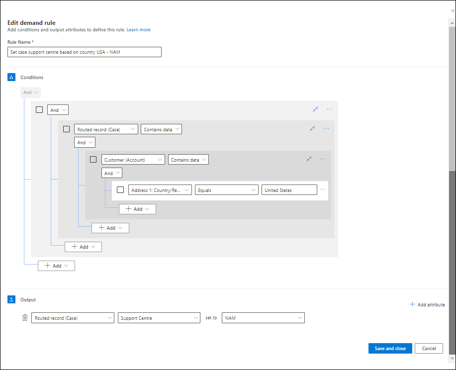
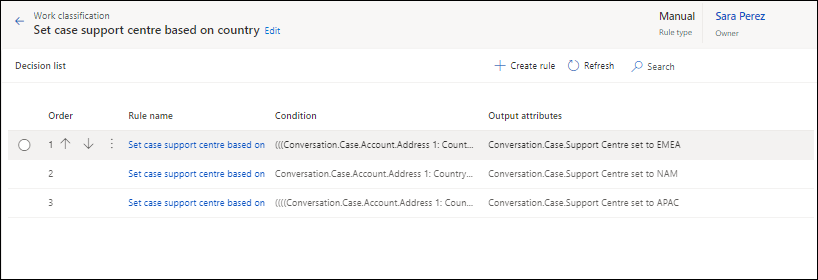

# Configure work classification rules

Perform the tasks listed in this section to configure the work classification rules for the work stream that you created. You will perform these tasks in the Omnichannel admin center or Customer Service Hub app.

## Manual work classification ruleset

You can create as many number of rulesets as your business workflow requires. For each ruleset, you will create rule items for a decision list that will be evaluated when a work item enters the queue.

To create a manual work classification ruleset, do the following:

1. Select a work stream, and in the **Routing rules** area, for the **Work classification (optional)** option, select **Create Ruleset**.
2. On the **Work classification ruleset** page, select **Create new**, and in the **Create work classification ruleset** dialog box, select  **Rule Type** as **Manual**, and enter a name and description.
3. In the **Decision list** area, select **Create Rule**, and on the **Create demand rule** dialog box, enter a name.
4. In the **Conditions** area, define the conditions according to your business needs.
5. In the **Output** area, select the attribute for which value needs to be set if the conditions are met.
   
   > 
6. Repeat steps 3 through 5 to create the demand rules.
    > 

## Manual skill identification ruleset

### Prerequisite

