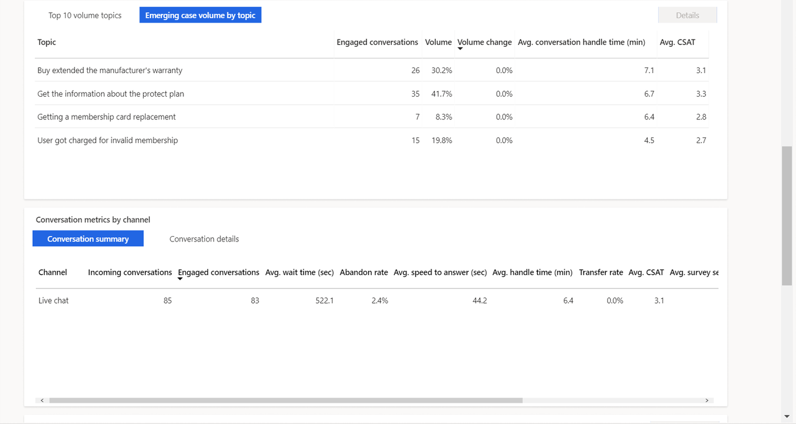
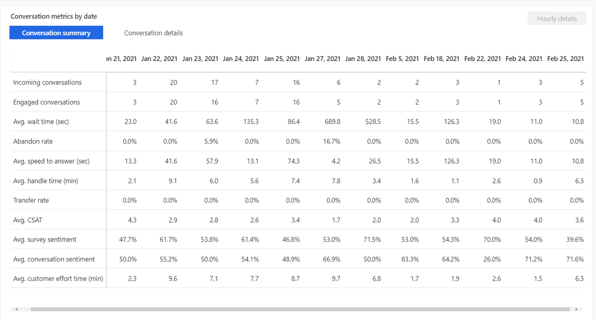
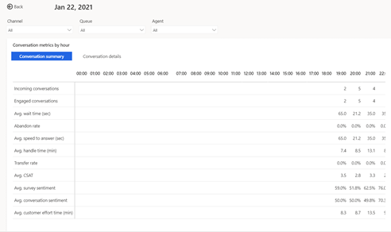

# Conversation dashboard

The Conversation dashboard gives you a broad overview of the customer service experience in your organization. It uses AI to surface insights into which topics are generating the highest volume and with topics are emerging with the highest rate of change in volume.

> [!div class="mx-imgBorder"]
> 

To view the Conversation dashboard, navigate to Omnichannel historical analytics and select **Conversation** in your workspace. The dashboard includes a variety of charts with graphical views of your system's key performance indicators.

The conversation volume drivers and emerging conversation volume by topic charts use natural language understanding to group support conversations as topics that are a collection of related conversations. These charts display the customer support topics that are generating the most volume and emerging topics with the highest rate of change in volume, helping you identify areas for improvement that can have the greatest impact on system performance.

By default, the dashboard shows you KPIs for the past month and for all channels, queues, and agents in your system. The data filtering options allow you to select data for specific time periods, channels, queues, agents, conversation status, and timezones.

> [!NOTE]
> If you switch to a different dashboard, the filter you specify persists, and is applied to the data on all dashboards.

## Report details

The following table displays the key performance indicators in the conversation dashboard.

| Metric | Description | Derivation |
| -------- | --------------------- | --------------------------- |
| Incoming conversations | The number of conversations initiated by the customer and can be presented to a human agent. | All conversations are considered, except bot conversations.
| Engaged conversations | Offered conversations that are engaged by an agent. Customer-to-agent communication can begin at this point. | All conversations are considered. |
| Abandon rate | The percentage of conversations that are not engaged by agents.| All conversations are considered. |
| Avg. speed to answer (seconds) | The average time customers waited in the queue before connecting to an agent. (time for acceptance) | Conversations engaged and conversations that are in the closed state are considered. |
| Avg. CSAT | Average of customer satisfaction rating provided by customers. Only available if Customer Voice has been configured as a post conversation survey tool. | 
| Avg. conversation sentiment | Average sentiment score based on the verbatims provided in customer voice survey. | 

> [!div class="mx-imgBorder"]
> 

Conversation charts are displayed as shown in the image.

> [!div class="mx-imgBorder"]
> 

## Conversation Hourly details drill down view

The Conversation hourly details drill down view provides more granular insight into the hour-by-hour breakdown of key conversation metrics within the contact center. The Conversation summary and Conversation details metrics are the same as the day-by-day view ensuring that supervisors can consistently analyze their contact center operation regardless of desired duration granularity.  

To view the drill down, select any single metric value on the desired day, then select **Hourly details**.  

> [!div class="mx-imgBorder"]
> 

