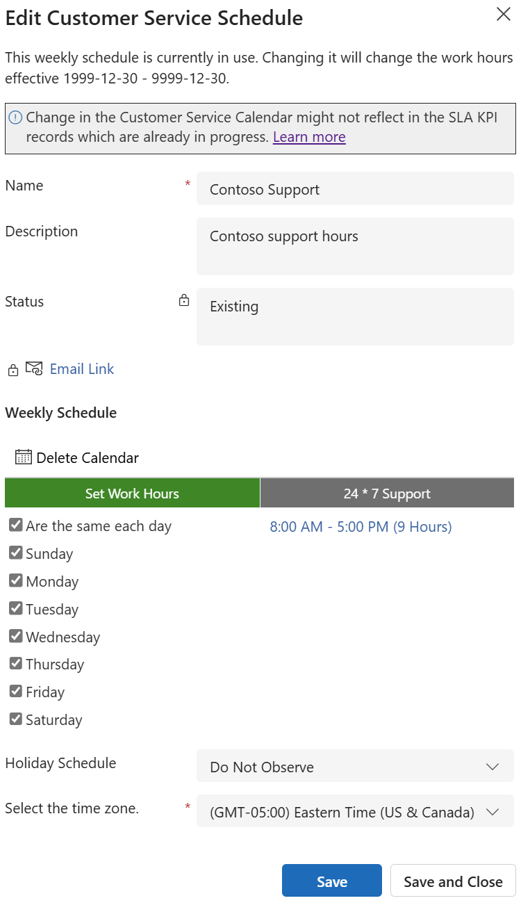

# Create customer service schedule and define the work hours

To define when your service or support team is available for providing support to customers, create a customer service schedule in Dynamics 365 Customer Service. A customer service schedule determines the business hours for each day in a week and also the weekly off. Customer Service uses these details for time tracking of service-level agreements (SLAs).  
  
For SLA time tracking, make sure you add a holiday schedule to the customer service schedule, and associate this customer service schedule to the SLA record.

You can create the service schedule and define work hours in Dynamics 365 Customer Engagement (on-premises) 9.1 also. More information: [New features in Dynamics 365 Customer Engagement (on-premises)](../customerengagement/on-premises/whats-new.md#new-work-hour-calendar-in-service-scheduling)

> [!NOTE]
> With the latest release of Dynamics 365 Customer Service app, customer service schedule in service management is available in the Customer Service Hub. We recommend that you create and manage customer service schedule using the new experience.
  
## Create a customer service schedule  
  
1. [!INCLUDE[proc_permissions_custsvcmgr_sysadmin_and_customizer](../includes/proc-permissions-custsvcmgr-sysadmin-and-customizer.md)]  
  
    #### Check your security role
  
   - [!INCLUDE[proc_follow_steps_in_link](../includes/proc-follow-steps-in-link.md)]  
  
   - [!INCLUDE[proc_dont_have_correct_permissions](../includes/proc-dont-have-correct-permissions.md)]  
  
2. In the Customer Service Hub site map, go to **Service Management** and select **Service Terms** > **Customer Service Schedule**.

    > [!NOTE]
    > In the Customer Service app, [!INCLUDE[proc_settings_service_management](../includes/proc-settings-service-management.md)] and select **Customer Service Schedule**.
  
3. To create a customer service schedule, select **New**.  
  
    -OR-  
  
    To edit a schedule that you already have, select the schedule in the list of records, and on the command bar, select **Edit**.  
  
4. In the **Create Customer Service Schedule** dialog box, in the **Name** box, type a meaningful name for the schedule, like “APAC Customer Schedule”, and select **Create**.  
  
5. In the **Weekly Schedule** dialog box, follow these steps:  
   
   1. For work hours, select one of these options:  
  
      - **Are the same each day**: The schedule is the same for every day of the week. After you select this option, to select the days of the week that the customer support is available, select **Set Work Hours**.  
  
           To set the work hours for the days, select **Set Work Hours**. For more information, see the **Define work hours for the customer service schedule section** in this topic.  
  
      - **Vary by day**: The new schedule is different for one or more days of the week. After you select this option, select the days of the week that the customer support is available, and also specify the work hours for each day.  
  
      - **24 x 7 support**: The customer support is available 24 hours a day, and all days a week.  
  
   2. For **Work Days**, select the check box for each day that the customer support resources will be available and working.  
  
   3. For **Holiday Schedule**, select **Observe** to specify when your service organization will be closed.  
  
       If you selected **Observe**, select a holiday schedule from the lookup box. [!INCLUDE[proc_more_information](../includes/proc-more-information.md)] [Set up a holiday schedule](../customer-service/set-up-holiday-schedule.md)  
  
6. Under **Select the time zone**, in the **Time Zone** drop-down box, select the time zone in which your customer support resources will work.  
  
7. Select **Save**.  

   
 
## Define the work hours for the schedule

 In the **Set Work Hours** dialog box, complete the following fields, and then select **OK**:  
  
- **Start**  
  
     Select the time the work day starts.  
  
- **End**  
  
     Select the time the work day ends.  
  
  To add a break in the work hours, like a lunch break, select **Add Break**, and then select the start and end time of the break.  
  
### See also

 [Set up a holiday schedule](../customer-service/set-up-holiday-schedule.md)  

[!INCLUDE[footer-include](../includes/footer-banner.md)]