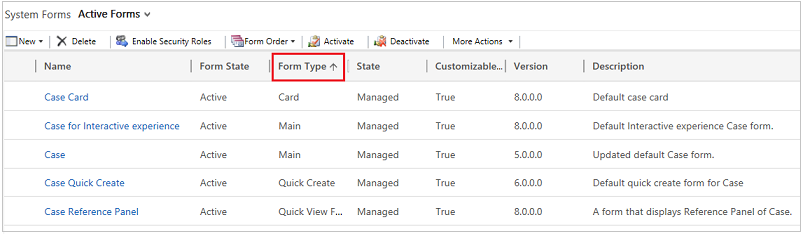
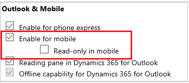

# Create and design forms for Customer Service Hub

[!INCLUDE[cc-data-platform-banner](../includes/cc-data-platform-banner.md)]

Improve user's productivity with the new forms in the Customer Service Hub. The form type of the new forms is **Main**. 

The **Main** forms come with an improved user experience optimized for agent productivity, helping to maintain context while working on related records. Main forms provide the primary interface where the agents can view and interact with their data in Microsoft Dynamics 365 Customer Service.

Upgrading to the Customer Service Hub? See the blog to know some key upgrade-specific changes as well as general customization and user experience changes :[Upgrade from Interactive Service Hub to the Customer Service Hub](upgrade-ish-csh.md)

For information about how to use **Main** form, and add or edit components, see [Use the Main form and its components](../customerengagement/on-premises/customize/use-main-form-and-components.md).

## Main form supported entities

The following Customer Service Hub entities have the **Main** forms created out-of-the box for them: 

- Accounts  

- Contacts  

- Cases  

- Activities (Phone, task, email, appointment, and social activity)  

- Social Profiles  

- Queues

- Knowledge Articles  

> [!NOTE]
>  Apart from these entities, you can also create or customize interactive dashboards. [!INCLUDE[proc_more_information](../includes/proc-more-information.md)] [Configure interactive dashboards](configure-interactive-dashboards-customer-service-hub.md)

You can see the forms for each entity in their list of forms given in the solution explorer in the **Customization** area. The default form type for the Unified interface based Customer Service Hub is **Case for Interactive experience - Main**. For more information on the types of forms available, see [Types of forms](#types-of-forms).

Both the **Main** type forms are available to use in the Customer Service Hub.

### Enable custom entities in the Customer Service Hub
You can enable any custom entity or custom activity in the Customer Service Hub, and then create forms for it. To enable a custom entity for Unified interface experience, ensure that the flag **Enable for mobile** is checked in the **Outlook & Mobile** section in the entity metadata:

Check the flag **Read-only in mobile** if you want the custom entity to be read-only on a mobile device.

As a customizer, you can customize these forms in a way that it is easier for the users in your organization to find or enter information efficiently. You can create more forms for these entities.  

> [!NOTE]
> All customization tasks for the Customer Service Hub must be done in Microsoft Dataverse.

## Types of forms  
 The following table describes the types of forms in that are used rendering data in Customer Service Hub:  

|    Form Type     |                                                                                                                                                                                                                                                                                                                                                                  Description                                                                                                                                                                                                                                                                                                                                                                   |
|------------------|------------------------------------------------------------------------------------------------------------------------------------------------------------------------------------------------------------------------------------------------------------------------------------------------------------------------------------------------------------------------------------------------------------------------------------------------------------------------------------------------------------------------------------------------------------------------------------------------------------------------------------------------------------------------------------------------------------------------------------------------|
|     **Main**     |                                                                                                                                                                                                                                                These forms provide the main user interface for interacting with entity data. [!INCLUDE[proc_more_information](../includes/proc-more-information.md)] [Design considerations for main forms](../customerengagement/on-premises/customize/design-considerations-main-forms.md).                                                                                                                                                                                                                                                 |
|  **Card Form**   |                                                                                                                   These forms are used in the interactive dashboards to show the entity data in the streams of interactive dashboards. [!INCLUDE[proc_more_information](../includes/proc-more-information.md)]  [Create a card form ](https://docs.microsoft.com/powerapps/maker/model-driven-apps/create-card-forms)    **Note:** These forms are only for use in the Customer Service Hub. You can’t use these in the Microsoft Dynamics 365 for Outlook and Microsoft Dynamics 365 for tablets.                                                                                                                    |
| **Quick Create** |                                                                                                                                          These forms provide a basic form optimized for creating new records. [!INCLUDE[proc_more_information](../includes/proc-more-information.md)] [Create and edit quick create forms](../customerengagement/on-premises/customize/create-edit-quick-view-forms.md)   The Customer Service Hub uses the same quick create form that’s used for the web application and uses the same customization experience. However, the forms are presented in the Customer Service Hub paradigm.                                                                                                                                           |
|  **Quick View**  | These forms appear within the main form to display additional data for a record that is referenced by a lookup field in the form.   There are also quick view forms created out-of-the-box for use in the reference panel to show records of related entity. When you open a record of the related entity at the runtime, it opens in a horizontal tab on top of the pane.   If the quick view form contains sub-grids, the sub-grids will appear in Dataverse at the runtime, but they won’t appear in the Customer Service Hub reference panel. |

## Assign form order  
 When you have multiple main, quick create, or mobile forms for an entity you can assign a form order. The form order determines which of the available forms will be shown by default. [!INCLUDE[proc_more_information](../includes/proc-more-information.md)] [Assign form order for forms](../customerengagement/on-premises/customize/assign-form-order.md)  

## See Also  
[Create and design forms](../customerengagement/on-premises/customize/create-design-forms.md)   

[!INCLUDE[footer-include](../includes/footer-banner.md)]