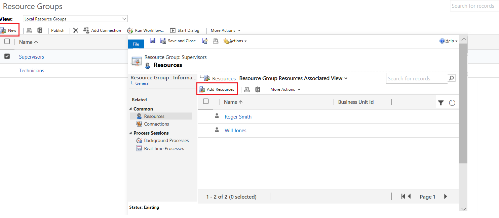

# Create or change a resource group (Customer Service app)

Use resource groups to group users, facilities, and equipment as part of the selection rules for a service.

> [!NOTE]
> With the latest release of Service Scheduling, Resource Groups are referred as Resource Categories. [!INCLUDE[proc_more_information](../includes/proc-more-information.md)] [Create and manage resource categories](resource-categories-service-scheduling.md)
  
1. [!INCLUDE[proc_settings_bus_management](../includes/proc-settings-bus-management.md)]  
  
2.  Select **Resource Groups**.  
  
3.  On the Actions toolbar, select **New**.  
  
4.  In the **Resource Groups** form, enter information in the following fields:  
  
    - **Name**  
  
         You must enter a name for the resource group. The application does not check that the name is unique.  
  
    - **Business Unit**  
  
         To locate and select a business unit, select the **Lookup** button .  
  
    - **Description**  
  
         You can add a detailed description of this resource group, including the criteria that you used to determine which resources to add to the resource group.  
  
5.  Select **Save**.  
  
     After you save the record, **Resources** appears under **Common**.  
  
6.  Select **Resources**, and then on the Actions toolbar, select **Add Resources**.  
  
7.  In the **Look Up** dialog box, select the users, facilities/equipment, teams, or other resource groups to add to this resource group.  
  
     Adding other resource groups to a resource group is a good way to manage large numbers of resources. For example, you could add the resource groups of "senior technicians" and "junior technicians" to a resource group of "technicians."  
  
8.  Select **OK** to add the selected resources to the resource group.  
  
9. Select **Save** or **Save and Close**.  

   
  
## Edit a resource group  
  
1.  [!INCLUDE[proc_settings_bus_management](../includes/proc-settings-bus-management.md)]
  
2.  Select **Resource Groups**.  
  
3.  Open the resource group you want to change.  
  
4.  In the **Resource Groups** form, change the information.  
  
5.  Select **Save** or **Save and Close**.  
  
> [!NOTE]
>  Resource groups are published automatically when you save and close the form. If the new resource group doesn’t appear in the list of available resource groups for a service, or if changes are not appearing, you can manually publish the change by selecting **Publish** on the **Resource Groups** page.  
>   
>  To remove a resource, select the resource you want to remove from the resource group. On the Actions toolbar, select **More Actions**, and then select **Remove Resources**.  
>   
> [!INCLUDE[cc_solution_recommendation](../includes/cc-solution-recommendation.md)]

[!INCLUDE[footer-include](../includes/footer-banner.md)]