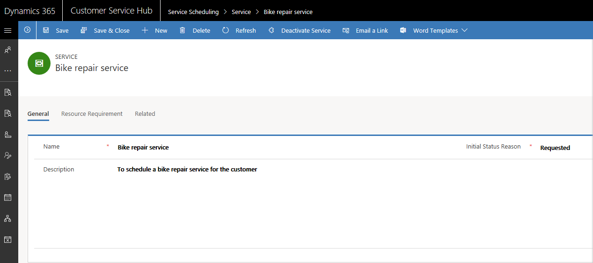
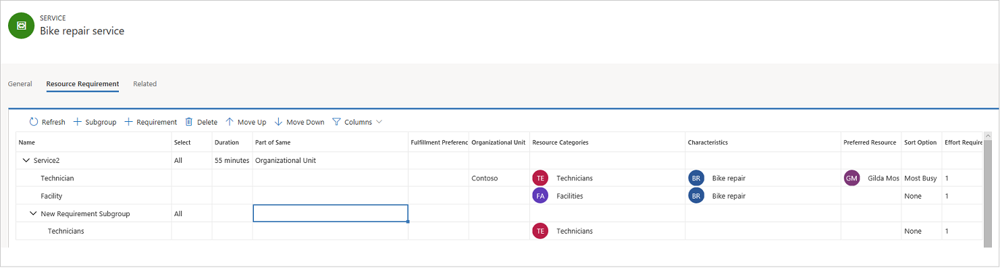

# Create or edit a service in Service Scheduling

To make scheduling services quick and easy, it’s helpful to predefine the specifics of the services you provide to customers. By using the service records in Dynamics 365 Customer Service, you can define:  
  
-   How long a service activity would last.
  
-   What resources are needed for the service activity, like resources, facilities, or equipment.
  
> [!NOTE]
> A service requires at least one selection criteria and one or more resources or resource groups before the service can be scheduled with a service activity.

## Create a service
  
Make sure that you have the required security role or equivalent permissions. 

[!INCLUDE[proc_more_information](../includes/proc-more-information.md)] [Manage security roles in service scheduling](manage-security-roles.md)

1. In the Customer Service Hub sitemap, go to **Scheduling**.
2. From the list of entity records, select **Scheduling > Service**.
   - The **Active Services** view is displayed. You can switch between various system views using the drop-down menu.
   - Select any existing service to see additional options in the command bar

3. On the command bar, select **New** to create a new service. To edit a service, open a service from the list.  
  
4. In the **General** section, enter a **Name** and **Description** to reflect the specifics of the service and describe what the service is.  

   Also, specify the initial status of the service activity when it is created. If your organization prefers to approve all service activities before committing them to the schedule, you can select **Requested** or **Tentative**.

   > [!NOTE]
   > The status reason also reflects in the schedule board when you create a booking for the service.

5. Select **Save** to save the service.

   

5. In the **Resource Requirements** section, define the selection criteria.

    - Here, the new service record forms the root node. In the root node, you can:

      

      - Select **All** or **Any**. All selects resources for all the underlying requirements and Any selects resources for any one of underlying requirement.

      - Select **Duration**, and enter the duration in minutes to define the duration for which resources are allocated for the service. 

        > [!NOTE]
        > The maximum duration of a service activity is 10 days.

      - Lookup or quick create a **Fulfillment Preference** to define the start time and end time of the service availability in a day and intervals in which it is provided. You can also choose from a list of fulfillment preferences displayed. 
        > [!NOTE]
        > When you select create, a **Quick Create** form is displayed where you can quickly create a new fulfillment preference.

    

     After configuring details in the root node:  
        
    - Add a new requirement subgroup by selecting **Subgroup**. You can add subgroups inside a subgroup.
    - Add a new resource requirement by selecting **Requirement**. 

   - Choose whether the service is **Part of Same** organizational unit, resource tree or location.
  
   - Choose the **Organizational Unit** to define the unit to which the selected resource should belong to.
   - Select **Resource Categories**  and choose **Resource Characteristics** to define the categories for the resource.
   - Choose **Preferred Resource** to display resource options. When only preferred resources are selected on a requirement, any one of the available resources from the list of preferred resources will be selected as per the time slot. When preferred resources are selected along with the resource category on a requirement, any one of the available resources from the list of preferred resource and which belongs to the resource category will be selected as per the time slot.
   - Choose **Sort Option** to sort according to most and least business impact.
   - Provide **Effort Required**. While booking, this option helps you view all the resources who satify the minimum effort requirement. For example, if the effort required is defined as 100, only the resources with the capacity value of 100 and more will be displayed in the list while booking the service in the schedule board.

   You can add complexity to a rule by adding a subrule to it.  
   > [!NOTE]
   >  You can save a service without defining a selection criteria, but you won’t be able to schedule that service.   

7.  When you’re ready to save your data, select **Save**.  
  
## Activate or deactivate a service  
 You can make a service available or unavailable for scheduling by activating or deactivating it. To do this, in the list of service records, select a service, and then select **Activate** or **Deactivate** in the command bar.  

> [!NOTE]
> If there are open or scheduled service activities associated with a service, then the service cannot be deactivated.
  
### See also  

[Create and manage resource categories](resource-categories-service-scheduling.md)
 
[Set work hours for the resources](resources-service-scheduling.md#set-work-hours-for-the-resources)

[!INCLUDE[footer-include](../includes/footer-banner.md)]