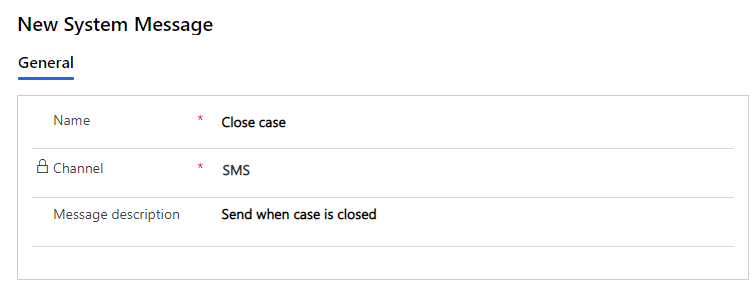
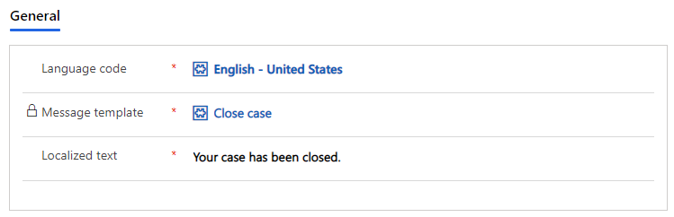

# Create message templates

[!INCLUDE[cc-use-with-omnichannel](../includes/cc-use-with-omnichannel.md)]

Message templates enable the one-time creation of reusable messages that can be sent to multiple customers. With message templates, you can maintain high-quality content and avoid spam in the ecosystem. You can save time and personalize the messages by using placeholder values that can be replaced with dynamic content when the message is sent.

To create a message template:

1. Log in to the Omnichannel Administration app. 

2. Under **Settings**, click **Message templates**.

3. Click **New**.

4. Enter a name.

5. Select a channel (SMS or Twitter).

6. Enter a description.

    > [!div class=mx-imgBorder]
    > 

7. Click **Save**. After saving the template, the **Message template** panel appears. 

    > [!div class=mx-imgBorder]
    > 

8. Click **New message** and create a message using localized text in each language you want to support.

    > [!div class=mx-imgBorder]
    > 
    
    Message templates support the following slugs.  

    | Slug | Description | 
    |-----------------|-----------------------------|
    | {FullName{Customer}}  | The full name of the customer who initiated the conversation. |
    | {LastName{Customer}}| The last name of the customer.|
    | {NickName{Customer}}| The nickname for the customer.|
    | {FullName{Agent}}| The full name of the agent who is assigned to the conversation.|
    | {FirstName{Agent}}| The first name of the agent.|
    | {LastName{Agent}}| The last name of the agent.|
    | {Nickname{Agent}}| The nickname for the agent.|

      For more information, see [Slugs](../app-profile-manager/automation-dictionary-keys.md#slugs).
    
9. Click **Save & Close** to see your localized message appear in the list of message templates.

## See also

[Configure outbound messaging](outbound-messaging.md)  
[Configure an SMS channel for TeleSign](configure-sms-channel.md)  
[Configure an SMS channel for Twilio](configure-sms-channel-twilio.md)  
[Configure a WhatsApp a channel through Twilio](configure-whatsapp-channel.md) 

[!INCLUDE[footer-include](../includes/footer-banner.md)]