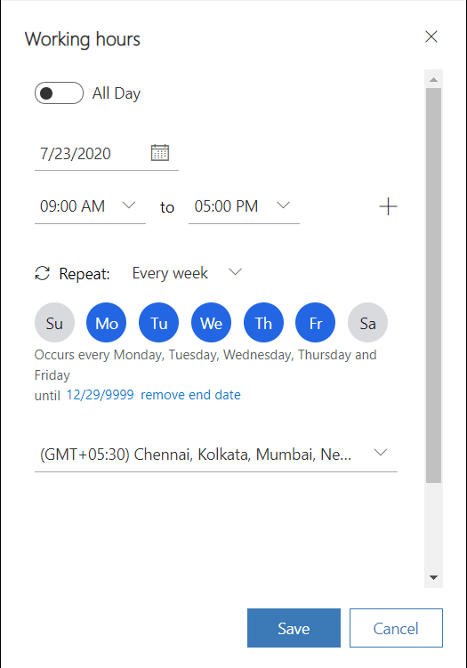

# Create and manage operating hours

[!INCLUDE[cc-use-with-omnichannel](../includes/cc-use-with-omnichannel.md)]

## Introduction

Operating hours define the hours when your organization's customer support team is active and available to serve customers. By setting up operating hours, you help your customers and your organization work together to resolve issues.

The operating hours schedules cater to the following scenarios:

- Display the non-availability of customer support on public holidays that are otherwise operating hours.
- Accommodate change of calendar timings for daylight saving time twice an year for timezones that have implemented the daylight saving time.
- Set up separate schedules for agents, bots, and queues to cater to different business scenarios and product lines seamlessly for any channel.
- Define schedules to transition customer queues from bots to agents.
- Customize the display and other settings of the chat widget during non-business hours.

After you define the business hours for your organization and set up [Automated messages](configure-automated-message.md) to be displayed to customers, when customers interact through a channel during non-business hours, they will see the messages that you have set. For example, customers can be shown an offline message on the chat widget as "Our agents are not available. Our business hours are between 8:00 am to 5:00 pm." Similarly, for social channels, you can configure the operating hours at the queue level. When customers contact your agents through any of the social channels outside the business hours, they will receive responses that you have set.

After you create an operating hour record, in Omnichannel admin center, you can do the following steps depending on your requirement:

- **Queues:** Configure the operating hour on the main page of the queue.
- **Chat widget:** Add the operating hour record on the **Chat widget** tab.
- **SMS channels:** Add the operating hour record on the **Behaviors** tab of the channel instance that can be accessed through the corresponding workstream.

In Omnichannel Administration, you can add the operating hour record on the **Design** tab of the appropriate chat widget to control the display of the widget. For SMS channels and queues, the operating hour will be available for selection on the **General** and **Summary** tabs respectively.

## Create a record to define operating hours

1. In Omnichannel admin center, in the site map, under **Advanced settings**, select **User attributes**.
2. On the page that appears, select **Manage** for **Operation Hours**.

    > [!Note]
    > If you are using Omnichannel Administration, under **Settings**, select **Operating Hours**.

3. Select **New**. The **New Operating Hour** page is displayed.

4. On the **General** tab, provide the following information:

    - **Name**: Enter a name for the operating hour record.
    - **Owner:** Accept the default value or search to specify a different owner.
    - **Description:** Enter an optional description of the operating hour record.

5. Select **Save**. The **Working Hours** tab is displayed. By default, the calendar displays the work hours defined as 8:00 am to 5:00 pm.

6. On the **Working Hours** tab, select **New** > **Working hours** in the calendar.

7. In the **Working hours** panel, set the following options to define the working hours schedule.
   - **All Day:** Specify Yes, if the chat widget should be available 24/7.
   - **Calendar:** Specify the period for the schedule. The option to choose dates is available only when **All Day** is Yes.
   - **Time:** Select the start and end time for the schedule.
   - **Repeat:** Select a recurrence option.
   - **choose an end date:** Optionally, specify an end date.
   -  **Time zone:** Select an applicable time zone. The daylight saving timings are taken into account, if applicable for the selected time zone.

    > 

8. Select **Save**. You are returned to the **Working Hours** tab.

## Define a holiday on the calendar

1. To set unavailability of customer support for a public holiday, on the calendar view, select **New** > **Holiday**.
2. Select the date or date range, and specify a reason.
3. Save the settings.
4. Select **Save** on the navigation bar.

 > [!NOTE]
 > If you set up a recurring schedule, and then try to set up another schedule that overlaps the recurring schedule, the recurring schedule will be overwritten with the new one.

## Edit or delete the work hour settings

You can edit or delete the operating hours schedule in an existing record.

1. Go to the record in which you want to modify the schedule.
2. Select an event on the calendar.
3. On the menu that appears, select **Edit**, and select one of the options:
   - This event
   - This and all following events
   - All events in the series 
4. If you want to delete an event, select **Delete**.
    
    > 

## Add operating hours to a chat widget

Do the following to specify operating hours for a chat widget:

1. Open the chat widget, and select the **Design** tab.
2. In the **Operating hours** box, browse, and select the operating hour record. The chat widget is displayed during the hours specified in the selected operating hour record.
3. Specify the offline settings in the **Offline** area.
4. Save the changes.

    > [!div class=mx-imgBorder]
    > 

## Add operating hours to a queue

You can add operating hours to a queue that can subsequently be configured for a social channel.

Do the following to specify operating hours for a queue:

1. Open the queue for which you want to specify the operating hours.
2. On the **Summary** tab, in the **Operating Hours** box, search and select the operating hour record that you want to specify.
3. Save the changes.

### See also

[Automated messages](configure-automated-message.md)  
[Add a chat widget](add-chat-widget.md)  
[Configure a pre-chat survey](configure-pre-chat-survey.md)  
[Create quick replies](create-quick-replies.md)  
[Create chat authentication settings](create-chat-auth-settings.md)  
[Embed chat widget in Power Apps portals](embed-chat-widget-portal.md) 

[!INCLUDE[footer-include](../includes/footer-banner.md)]