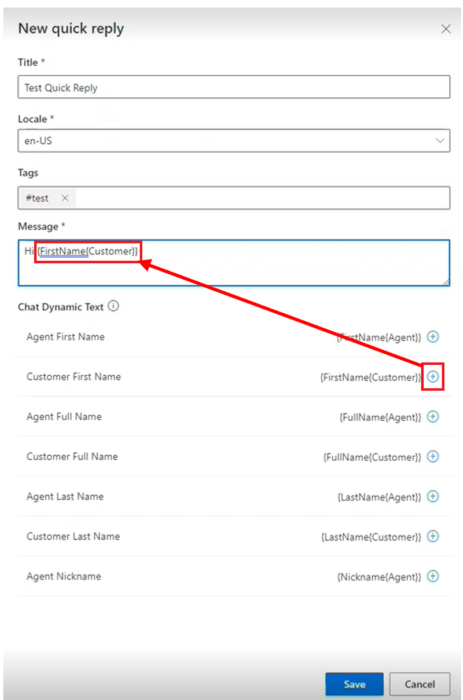
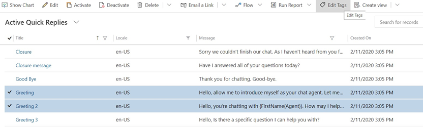
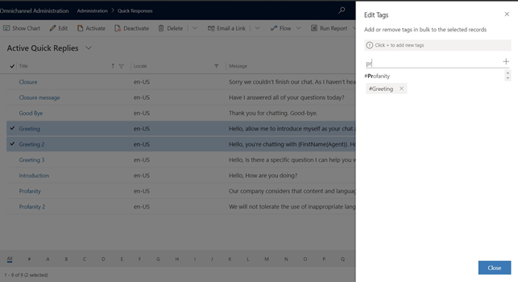

# Create quick replies

[!INCLUDE[cc-use-with-omnichannel](../includes/cc-use-with-omnichannel.md)]

Quick replies are predefined messages that can be created for agents to quickly respond to common questions from customers. For information about the agent's quick reply experience, see [Send predefined messages in chats](oc-conversation-control.md#send-predefined-messages-in-chats).  

1. In the site map of Omnichannel admin center, select **Agent experience** under **Advanced settings**, and then select **Manage** for **Quick replies**. If you're using the Omnichannel Administration app, go to **Quick replies** under **Agent Experience**.
2. To create a quick reply, select **New**, or to edit an existing quick reply, select the name of the quick reply.
3. Provide or change the following information:

    - **Title:** Enter the title of the message.
    - **Locale:** Specify the language of the message.
    
        > [!NOTE]
        > Omnichannel for Customer Service does not localize quick replies. To provide quick replies in multiple languages, create a separate quick reply for each language and select its corresponding locale.

    - **Message:** Enter the text of the message.

      > [!div class=mx-imgBorder]
      > 

     The **Message** field supports the following slugs.  

    | Slug | Description |
    |-----------------|-----------------------------|
    | {FullName{Customer}}  | The full name of the customer who initiated the conversation. |
    | {LastName{Customer}}| The last name of the customer.|
    | {FullName{Agent}}| The full name of the agent who is assigned to the conversation.|
    | {FirstName{Agent}}| The first name of the agent.|
    | {LastName{Agent}}| The last name of the agent.|
    | {Nickname{Agent}}| The nickname for the agent.|

      For more information, see [Slugs](../app-profile-manager/automation-dictionary-keys.md#slugs).

5. Select **Save**.

## Create or edit tags for common categories of quick replies

Quick replies can be classified and tagged into categories. The categorization capability can also be leveraged to group quick replies into logical chunks that represent key conversational states for agents. These logical chunks help agents select appropriate messages that correspond to customer issues.

1. In the site map of Omnichannel admin center, select **Agent experience** under **Advanced settings**, and then select **Manage** for **Quick replies**. In the Omnichannel Administration app, go to **Agent Experience** > **Quick replies**.

2. Select two or more quick replies for which you want to create a tag, and then select **Edit Tags**.

> [!div class=mx-imgBorder]
> 

  The **Edit Tags** dialog box appears.

3. In the **Add new tag** field, start typing the tag you want to create. If it already exists, it will appear in a list below the field. If it doesn’t appear, select the plus **+** sign to add it.

> [!div class=mx-imgBorder]
> 

4. After you're done, select **Close**.

## Associate quick replies with a workstream

For organizations with diverse lines of businesses, agents will send a variety of messages, depending on their area of expertise. Administrators can determine which quick replies are necessary for different groups of agents to use. Administrators can associate quick replies with workstreams to show agents only those quick replies that apply to them. If no workstream is associated, the quick reply is available for all agents.

1. In the site map of Omnichannel admin center, select **Agent experience** under **Advanced settings**, and then select **Manage** for **Quick replies**. In the Omnichannel Administration app, go to **Agent Experience** > **Quick replies**.

2. Select a quick reply from the list.

3. In the **Workstreams** section, select **Add Existing Work Stream**.

4. Select the workstream from the list of records, and then click **Add**.

   The workstream appears in the list.

5. Select **Save**.

   If you select the workstream in the list, you can view the workstream record, and see the quick replies associated with the workstream.

## Availability of quick replies and language settings

The quick replies that the agents will see is determined by the following parameters:

- The language mapped to the channel instance
- The language configured in the agent's personal settings
- The workstream the quick reply is mapped to

For example, when you set up a live chat widget or Facebook page, the quick replies will be available in the language that is configured for the chat widget or Facebook page. Then, when you associate the chat widget with a queue containing agents, the agent-specific language setting, if configured, will determine the language in which the quick replies will be available to the agents. The agents will see the quick replies mapped to the workstream that is associated with the channel with other quick replies.

### See also

[Add a chat widget](add-chat-widget.md)  
[Configure a pre-chat survey](configure-pre-chat-survey.md)  
[Create and manage operating hours](create-operating-hours.md)  
[Create chat authentication settings](create-chat-auth-settings.md)  
[Embed chat widget in Power Apps portals](embed-chat-widget-portal.md)  
[Language settings for agents](https://docs.microsoft.com/powerapps/user/set-personal-options)

[!INCLUDE[footer-include](../includes/footer-banner.md)]