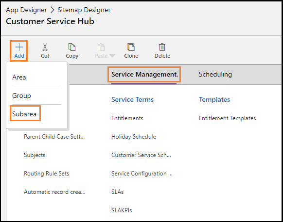
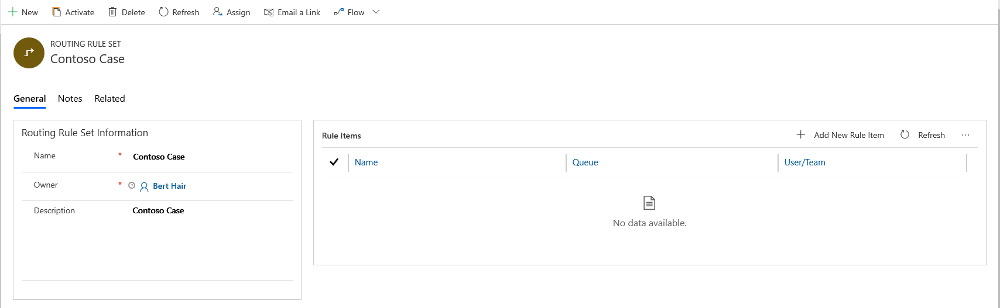
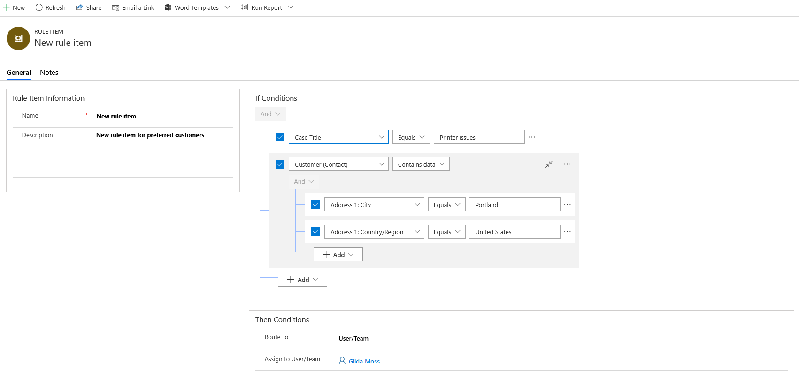
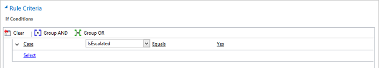
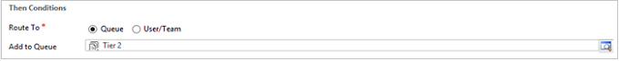
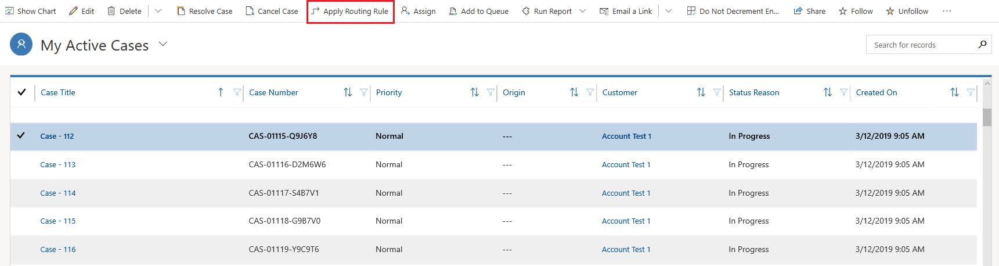

# Automatically route cases using basic routing rule sets

Use routing rules in Dynamics 365 Customer Service to automatically route cases to the right people at the right time without any manual intervention. You can also use routing rules to route cases that are escalated to specific queues.

## Add routing rule sets site map for custom apps

While creating custom apps, you might not have routing rules sets available in your site map. You must add the routing rule sets site map for your custom app to access. To add routing rule sets to site map, follow these steps:

1. Sign in to https://"<"org">*.dynamics.com/apps, and go to App designer.

2. Select the **More Options** ellipsis (...) on your custom app, and then select **OPEN IN APP DESIGNER**. The **App Designer** page appears.

3. Select the pencil icon beside **Site Map**. The **Customer Service Hub** page appears.

4. Select the area in which you want to add the routing rule set entity, such as **Service Management**, select **Add**, and then select **Subarea**.

    > [!div class="mx-imgBorder"]
    > 

  The **SUB AREA** section appears in the right pane.

5. On the **Properties** tab, in **General** section, do the following:

    - **Type:** Select **Entity**.

    - **Entity:** Select **Routing Rule Sets**.

6. Save and publish the site map.

    The site map is created with the Routing Rule Set. Go to your custom app to locate Routing Rule Sets in the site map.

To Learn more, see [Create a site map for an app using the site map designer](../customerengagement/on-premises/customize/create-site-map-app.md)

## Create a routing rule set (Customer Service Hub)

### Prerequisites

Review the following prerequisites before creating a routing rule set:

- Verify that you have the Customer Service Manager, System Administrator, System Customizer security role, or equivalent permissions.

   **Check your security role**  

    - [!INCLUDE[proc_follow_steps_in_link](../includes/proc-follow-steps-in-link.md)]  

    - [!INCLUDE[proc_dont_have_correct_permissions](../includes/proc-dont-have-correct-permissions.md)]  

### Create routing rule sets to automatically route cases

When creating routing rule sets, you can add multiple rule items and arrange them in the required order. The rule items are evaluated in the order of definition. Rule items are evaluated from top to bottom. If a rule item is evaluated as true, the case gets routed to the destination agent and skips further evaluation. If a rule item is evaluated as false, further rule items are evaluated.

1. In the Customer Service Hub site map, go to **Service Management**, and select **Case Settings** > **Routing Rule Sets**.

2. To create a routing rule set, select **New** on the command bar.

3. On the **General** tab, in **Routing Rule Set Information**, Enter **Name** and **Description** for the routing rule set.

4. Select **Save**. The routing rule set is saved, and the **Rule Items** section is displayed.

    > [!div class="mx-imgBorder"]
    > 

5. In the **Rule Items** section, select **New Rule Item**. The **New Rule Item** dialog box appears in which you can specify conditions that will be evaluated for routing cases to a queue, an agent, or a team.

    a. On the **General** tab, in **Rule Item Information**, enter a **Name** and **Description**.

    b. In **Rule Criteria**, you can specify the conditions in one or a combination of the following to be evaluated for routing cases:

      - **Add Row:** Select **…** to group multiple rows of conditions into one group.

      - **Add Group:** Select **…** to ungroup a group of conditions.

      - **Add related entity:** Select to add a condition for a specific entity.

      > [!NOTE]
      > The following limitations are applicable when defining a rule criteria in Customer Service Hub:
      > - You can’t select a time value for the Date and Time data type. If you try to edit an existing rule item that was created in the web client, the time will be set to 00:00.
      > - Only one level of the related entity hierarchy is supported though the application lets you select nested related entities.
      > - The related entity inside a group of the and/or clause is not supported.
      > - By design, the attribute with "Multi Select Option Set" data type is not supported.
      > - The "in" and "not in" operators for the Single Line of Text and Multiple Lines of Text data types and the "not-on" operator for the Date data type are not supported.
      > - For the lookups data type, only the "equal", "not equal", "null", and "not null" operators are supported.
      > - In the Add related entity list, the "One to Many" and "Many to Many" options are not supported even though the application lets you select them.

    c. In **Action** > **Route to**, select queue or user/team.

      For example, all cases about printer issues from customers should be routed to an agent named Bert Heir, who is the subject matter expert in the team. The rule item for the condition can be configured as shown in the screenshot.

      > [!div class="mx-imgBorder"]
      > 

    d. Select **Save & Close** to save and close the rule item.

7. In the **Routing Rule Set** record, select **Activate**. The rule set is applied to cases that match the conditions in the rule.

    > [!NOTE]
    > - Only one routing rule set can be active at any point of time. If you try to activate a rule when another rule is active, it will deactivate the currently active rule. You can activate or deactivate only the rules that you own.
    > - If you want to edit an active routing rule set, you must deactivate it. To successfully import a solution that includes an active routing rule set into an organization where a rule exists with the same ID, deactivate the rule in the organization.

## Create a routing rule set (Customer Service app)

1. [!INCLUDE[proc_permissions_custsvcmgr_sysadmin_and_customizer](../includes/proc-permissions-custsvcmgr-sysadmin-and-customizer.md)]  

     When you create and activate a routing rule set, internally a corresponding workflow is also created. Whatever action you do on the routing rule set, such as creating or assigning the rule, you must have privileges to perform the same action on workflows. For the rule to work, you must have sufficient privileges to run a workflow. The routine rule set is applied in context of the privileges that the owner of the routing rule set has.  

    #### Check your security role

   - [!INCLUDE[proc_follow_steps_in_link](../includes/proc-follow-steps-in-link.md)]  

   - [!INCLUDE[proc_dont_have_correct_permissions](../includes/proc-dont-have-correct-permissions.md)]  

2. [!INCLUDE[proc_settings_service_management](../includes/proc-settings-service-management.md)]  

3. Select **Routing Rule Sets**.  

4. To create a new routing rule set, select **New**.  

    -OR-  

    To edit a routing rule set that you already have, in the list of records, select the rule that’s in the Draft state, and then on the command bar, select **Edit**.  

5. [!INCLUDE[proc_handy_infotips](../includes/proc-handy-infotips.md)]  

6. After you enter information in all the required fields, select **Save**.  

7. In the **Rule Items** section, select the **Add Rule Item** button **+** to specify conditions for routing cases to a queue.  

    You can add multiple conditions here and arrange them in the desired order. The rule items are run in the same order. As soon as an applicable rule item (based on the If Conditions) is applied on the case, the other rule items are not run on the case.  

   1. In the Rule Item form, type a descriptive name for the rule item.

   2. Under **Rule Criteria** in the **If Conditions** section, specify the conditions for which the case will be routed.

      For example, to route all cases that have the **IsEscalated** field set to **Yes** to the **Tier 2 support** queue, specify the conditions as shown here:  

      

   3. Under **Then Conditions**, specify the queue to which the cases will be routed or the user or team to which the cases will be assigned if the conditions in the **If Conditions** section are met.

        

> [!TIP]
> To group conditions in the criteria, use the **Group And** or **Group Or** options.  

8. [!INCLUDE[proc_click_or_tap_save_and_close](../includes/proc-click-or-tap-save-and-close.md)]  

9. In the Routing Rule Set record, select **Activate** so that the rule set is applied to the cases matching the conditions in the rule.  

> [!NOTE]
>
> - Only one routing rule set can be active at any point of time. If you try to activate another rule when one rule is already active, it will deactivate the currently active rule. You can activate or deactivate only the rules that you own.  
> - You can’t edit an active routing rule set. Therefore, if you’re importing a solution that includes an active routing rule set into an organization where the rule already exists with the same ID, the solution import will fail.  

## Apply a routing rule set  

You can apply the routing rule when creating a case using the **Save & Route** button. For more information, see [Create a case](customer-service-hub-user-guide-create-a-case.md).

Perform the following steps to manually apply the rule to any existing or manually created cases:

1. In the Customer Service Hub, go to the list of cases in the **My Active Cases** view.
2. Select the cases that you want to route using this rule, and on the command bar, select **Apply Routing Rule**.

    > [!div class="mx-imgBorder"]
    >  

> [!NOTE]
>
> - If you’re importing bulk records, and you don’t want the routing rules to apply to the cases that you’re importing, add a column **Route Case** to your spreadsheet, and add the value **No** for all the cases that you don’t want to route.
> - Programmatically created cases are automatically routed. If you want to override this behavior, set the value for the RouteCase attribute to "No".

## Recommendation to upgrade solution

Perform the following steps before you upgrade a solution:

1. Deactivate the Routing Rule Sets which are brought through the previous version of the solution. The state of Routing Rule Sets changes to draft.

2. Upgrade your solution as required. 

3. After the successful upgrade of the solution, activate the Routing Rule Sets as required.

### See also

[Create and manage queues](set-up-queues-manage-activities-cases.md)

[!INCLUDE[footer-include](../includes/footer-banner.md)]