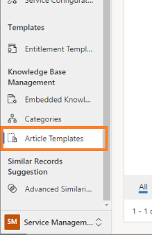
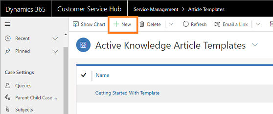

# Create knowledge article template

Knowledge article templates help knowledge authors by simplifying the process of creating knowledge articles. Templates also help knowledge managers and authors in maintaining consistency in branding, language, and structure. 

When an author chooses a template to create an article, the fields that are defined in the template are prepopulated, allowing the author to focus on the main content of the article.

> [!NOTE]
> To learn how to use knowledge article templates to create knowledge articles, see [Create knowledge articles using templates](customer-service-hub-user-guide-knowledge-article.md#create-knowledge-articles-using-templates)

As a Knowledge Manager, you can create knowledge article templates by defining the necessary fields such as Language, Title, Keywords, and Subject. These fields will be pre-populated while creating the article using the template and reduce the efforts of authors to fill in these fields. 

> [!NOTE]
> Make sure you have the required privileges to create, edit, or delete knowledge article templates. Contact your administrator if you do not have these privileges.

1.	Open **Customer Service Hub** app and select **Change area > Service Management**.

    > [!div class=mx-imgBorder]
    > 

2.	Under **Knowledge Base Management** section, select **Article Templates**.

    > [!div class=mx-imgBorder]
    > 

3.	To create a template, select **+ New**.

    > [!div class=mx-imgBorder]
    > 
 
4.	On the **Choose Language** dialog box, select the language for the template, and select **OK**. In this example, we are selecting the language as **English – United States**.

    > [!div class=mx-imgBorder]
    > 
 
5.	On the **New Knowledge Article Template** page, enter the values for the required fields that you want to prepopulate when the template is selected.

    |Section|Field|Description|
    |-------|-----|-----------|
    | **TEMPLATE DATA** | Name | Enter a name for the template. |
    || Owner | Enter the name of the owner who owns the template. By default, your name will be displayed in this field. | 
    | **ARTICLE DATA** | `--` | Define article fields such as Title, Keywords, and Subject which are used in any knowledge article that’s created based on the template. |
    | **CONTENT** | `--` | Define a structure that will be used in any knowledge article that’s created based on this template. To learn more, see [Use the rich text editor to create knowledge articles and emails.](customer-service-hub-user-guide-knowledge-article.md#use-the-rich-text-editor-to-create-knowledge-articles-and-emails) |

    > [!div class=mx-imgBorder]
    > 

6.	After you have entered the required information, select **Save**.

    A template is created and is available for knowledge authors to use to create articles.

> [!NOTE]
> Similarly, you can edit or delete knowledge article templates from the **Service Management** area. 

### See also

[Create knowledge articles using templates](customer-service-hub-user-guide-knowledge-article.md#create-knowledge-articles-using-templates)
