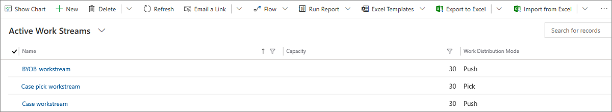

# Create workstreams

## Overview

A workstream is a collection of routing and work distribution settings. Routing settings define how conversations should be routed to queues. Work distribution settings define how conversations should be allocated to agents within a queue. You can create the workstreams in the Omnichannel admin center, Customer Service Hub, and Omnichannel Administration apps.

A work stream can belong to multiple channels of the same type, like multiple chat channels. In this case, all the conversations from these channels inherit the routing and work distribution settings of the work stream they belong to.

The workstream can be of one of the following types:

**Messaging:** To route conversations from live chat, SMS, social, and Teams channels
**Record:** To route entity records

> [!IMPORTANT]
>
> - Entity routing must be enabled in the service configuration settings in Customer Service Hub for records to be routed using unified routing.
> - Workstreams that you created in Omnichannel Administration app can't be modified

## Create a workstream in Omnichannel admin center

Perform the following steps:

1. In Omnichannel admin center, in the site map, select **Workstreams** under **General settings**, and then select **New**.
2. In the **Create a workstream** dialog box, enter the following details:
    - **Name:** Enter an intuitive name, such as **Contoso chat workstream**.
    - **Work distribution mode:** Select **Push** or **Pick**.
    - **Type:** Select one of the following types:
      - **Messaging:** To configure the workstream for chat and other conversation channels.
      - **Record:** To configure the workstream for entity record, such as case and email activity.
    - **Channel:** This box appears if you have selected the type as Messaging. Select a channel from the list.
    - **Record:** This box appears if you have selected the type as Record. Select the entity record from the list.

3. Select **Create**. The workstream that you created is displayed with the option to configure the selected channel instance.
    > [!div class=mx-imgBorder]
    >  
4. Perform the steps outlined in one of the following sections depending on the channel that you've selected.
   - [Configure a chat widget](add-chat-widget.md#configure-a-chat-widget-in-omnichannel-admin-center)
   - [Configure a Facebook channel](configure-facebook-channel.md)
   - [Configure a WeChat instance](configure-wechat-channel.md)
   - [Configure a LINE channel](configure-line-channel.md)
   - [Configure a Twitter channel](configure-twitter-channel.md)
   - [Configure a WhatsApp channel](configure-whatsapp-channel.md)
   - [Configure a Microsoft Teams channel](configure-microsoft-teams.md)
   - [Configure an SMS channel for TeleSign](configure-sms-channel.md)
   - [Configure an SMS channel for Twilio](configure-sms-channel-twilio.md)
   - [Configure a custom messaging channel](configure-custom-channel.md)
5. Configure routing rules for the workstream. More information: [Configure work classification rules](configure-work-classification.md)
6. If you want to configure route to queues, see [Configure route to queues](configure-work-classification.md#configure-route-to-queues-ruleset-and-rules)

### Configure work distribution

In the **Work distribution** area of a workstream, you can either accept the default settings or select **See more** and update the following options.

- **Auto-close after inactivity:** Select a time period after which inactive conversations will be moved to the closed state automatically.
- **Work distribution mode:** The option that you selected in step 3 is displayed and can't be edited.
- **Capacity:** Select one of the following options:
  - **Unit based:** Enter value if your organization has configured unit-based capacity.
  - **Profile based:** Specify a profile in the list if your organization has configured profile-based capacity.
- **Allowed presences:** Select the presences in which agents will be assigned.
- **Default skill matching algorithm**: Select Exact Match or Closest Match.
- **Keep same agent for entire conversation:** Set the toggle to yes if you want the conversation to be remained assigned to the originally-assigned agent. More information: [Agent affinity](#agent-affinity).

### Configure Advanced settings

For a selected workstream, expand **Advanced settings** to configure the following options:

- [Sessions](../app-profile-manager/session-templates.md)
- [Agent notifications](../app-profile-manager/notification-templates.md#out-of-the-box-notification-templates)
- [Context variables](#configure-context-variables)
- [Smart assist bots](smart-assist-bot.md)
- [Quick replies](create-quick-replies.md)

### Add a bot

To add a bot, the bot must be configured and available for selection. After a bot is added to the workstream, the selected bot will be the first to pick up the incoming work item at runtime. When a work item needs to be assigned the classification rules are run and the work distribution system checks and routes the work item to the bot if the selected workstream has a bot.

For information about how to configure bots in Power Virtual Agents, see [Integrate a Power Virtual Agents bot](configure-bot-virtual-agent.md). For information about how to configure Azure bots, see [Integrate an Azure bot](configure-bot.md).

1. For the selected workstream and channel, in the **Bot** area, select **Add bot**.
2. In **Add a bot**, select the required bot in the **Name** list, and select **Save and close**.

### Configure context variables

Context variables enrich conversations with pre-chat data, channel data, and custom context data. These attributes can then be used to define routing rules to route conversations to different queues.

> [!Note]
> Context variable names must be unique. We recommend that you do not update or delete the context variables after creating them. If you need to, make sure that the variables are not used in any routing or assignment rules.

1. Select **Add context variable** in the **Advanced settings** section of a workstream.
2. In the **Edit** pane, select **Add**, and enter **Name**.
3. Select the **Type** of variable from the drop-down list. You can choose from **Text** or **Number**.
4. Repeat the steps 2 and 3 to create the required variables.

## Create a work stream in Omnichannel Administration

Perform the following steps:

1. In the Omnichannel Administration site map, go to **Work Distribution Management** > **Work Streams**.

    The **Active Work Streams** view is displayed.

    > [!div class=mx-imgBorder] 
    > 

2. On the command bar, select **New** to create a work stream.

3. In the **Work Distribution** tab of the new work stream, follow these steps:

   1. In the **General information** section, specify the following information:  
      - **Name**: Enter a name for the work stream.
      - **Channel**: Channel is defined as a medium through which a customer reaches out for support. For example, a customer can contact an agent through chat.

        Select a channel from the drop-down list:
        - Live Chat
        - SMS
        - Facebook
        - Entity Records
        - WeChat
        - Microsoft Teams
        - LINE
        - WhatsApp
        - Custom
        - Twitter

      - **Capacity**: Specify the units of capacity that are required to process a single conversation for the work stream in the text box. For information on how to determine capacity units, see [Capacity](users-user-profiles.md#capacity).

      - **Auto-close after inactivity**: Enter the unit of time after which a conversation is moved from the **Waiting** state to the **Closed** state because of inactivity.

   2. Select **Save**. The work stream is saved.

   3. In the **Work distribution** section, perform the following steps:

      1. Select whether the **Work distribution mode** should be **Push** or **Pick** for agents to take up a conversation.

         - In **Push** mode, a conversation is dispatched to agents automatically using a message alert. You can configure a push conversation to be explicitly picked up.

         - In **Pick** mode, a conversation is dispatched to agents when they explicitly pick a conversation from the **Open work items** in the agent dashboard.

      2. In **Allowed Presences**, select a base presence, such as "Available" and "Busy" from the list. You can select all options also. Agents will be allocated work items if the agent presence is set to one of the statuses specified here. If you have enabled [missed notifications](manage-missed-notifications.md), do not select "Away" as an allowed presence. For information, see [Configure and manage custom presence](presence-custom-presence.md).

          > [!div class=mx-imgBorder] 
          > 

      3. If you have selected **Push** in **Work distribution mode**, set the toggle to **Yes** for **Enable selecting from push-based work streams**. The agents can assign work items to themselves irrespective of constraints, such as capacity and presence.
      4. If you want an ongoing conversation to be assigned to the same agent when the conversation status changes from waiting to active, make sure the **Enable Agent Affinity** is set to yes. By default, the toggle is enabled for SMS and social channels.
    
    > [!NOTE]
    > The **Enable Agent Affinity** option is available only when the work distribution mode is push. More information: [Agent affinity](#agent-affinity).

4. View and create context variables in the **Context variables** tab. Context variables enrich conversations with pre-chat data, channel data, and custom context data. These attributes can then be used to define routing rules to route conversations to different queues.

   1. Select **New** to create a context variable in the **Quick Create** window.
   2. Enter **Display Name** for the new variable. The **Name** field is populated accordingly.
   3. Select the **Type** of variable from the drop-down list. You can choose from **Text** or **Number**.

      > [!div class=mx-imgBorder] 
      > 

5. Define routing rule items in the **Routing rule items** tab. Routing rule items are configured for each work stream, so that conversations can be routed to the correct queues. To learn how to configure a routing rule, see [Create and manage routing rules in Omnichannel](routing-rules.md).

6. Select **Save**. The work stream is saved.

## Associate work streams with channel artifacts

You can associate work streams with channel artifacts so that the conversations can be assigned to agents seamlessly. For example, for a live chat widget, a default work stream is already associated in the **Work stream** field. You can select the search icon to associate another work stream. Select **New** to create a new work stream from within the live chat widget.

To learn more about how to set up channels and associate work streams, see the following topics:

- [Configure a chat channel](set-up-chat-widget.md)
- [Configure an SMS channel](configure-sms-channel.md)

### Agent affinity

When a conversation becomes active from the waiting status, it might not be assigned to the same agent who had previously handled it. You can use the agent affinity option to reassign the conversation to the agent who had worked on it earlier. This helps save the effort to reorient the agent or set the context about the problem again. The agent affinity works as follows:

- Is enabled by default for SMS and social channels.
- Is available only for push type of work distribution.
- Reassigns conversations to the same agent, irrespective of the agent's capacity and presence.

Because the conversation assignment takes place using the notification alert, the agent has the option to reject the assignment.

### See also

[Manage users in Omnichannel for Customer Service](users-user-profiles.md)  
[Create workstream for entity record routing](set-up-entity-workstream.md)  
[Work with queues](queues-omnichannel.md)  
[Automatically identify customers using pre-chat responses](record-identification-rule.md)  

[!INCLUDE[footer-include](../includes/footer-banner.md)]