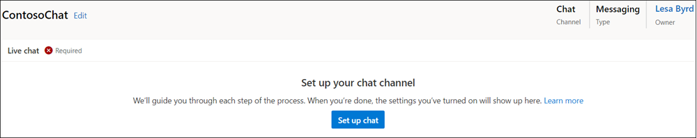

# Create workstreams for unified routing

## Overview

A workstream is a container to enrich, route, and assign work items. The workstream can be associated with a channel, such as live chat and case.

The workstream can belong to multiple channels of the same type, like multiple chat channels. In this case, all the conversations from these channels inherit the routing and work assignment settings of the workstream they belong to.

The workstream can be one of the following types:

- **Messaging**: To route conversations from live chat, SMS, social, and Teams channels.
- **Record**: To route entity records.

> [!IMPORTANT]
>
> - Unified routing must be enabled in the service configuration settings in Customer Service Hub for records to be routed using unified routing. More information: [Provision unified routing](set-up-record-routing.md#provision-unified-routing).
> - Workstreams that you created in the Omnichannel Administration app can't be modified in the Omnichannel admin center app. You'll need to migrate the existing workstreams and then manage them in the Omnichannel admin center app. More information: [Migrate workstreams created in Omnichannel Administration](migrate-workstreams.md).

## Create a workstream in Omnichannel admin center

While you can create the workstreams for unified routing in the Omnichannel admin center and Customer Service Hub apps, this topic covers the steps for Omnichannel admin center.

Perform the following steps:

1. In Omnichannel admin center, in the site map, select **Workstreams** under **General settings**, and then select **New**.

2. In the **Create a workstream** dialog box, enter the following details:

    - **Name**: Enter an intuitive name, such as **Contoso chat workstream**.
    - **Work distribution mode**: Select **Push** or **Pick**.
    - **Type**: Select one of the following types:
      - **Messaging**: To configure the workstream for chat and other conversation channels.
      - **Record**: To configure the workstream for entity record, such as case and email activity.
    - **Channel**: This box appears if you have selected the type as Messaging. Select a channel from the list.
    - **Record**: This box appears if you have selected the type as Record. Select the entity record from the list. More information: [Set up record routing](set-up-record-routing.md).

3. Select **Create**. The workstream that you created is displayed with the option to configure the selected channel instance.
    > [!div class=mx-imgBorder]
    > 
4. Perform the steps outlined in one of the following sections depending on the channel that you've selected.
   - [Configure a chat widget](add-chat-widget.md#configure-a-chat-widget-in-omnichannel-admin-center)
   - [Configure a Facebook channel](configure-facebook-channel.md)
   - [Configure a WeChat instance](configure-wechat-channel.md)
   - [Configure a LINE channel](configure-line-channel.md)
   - [Configure a Twitter channel](configure-twitter-channel.md)
   - [Configure a WhatsApp channel](configure-whatsapp-channel.md)
   - [Configure a Microsoft Teams channel](configure-microsoft-teams.md)
   - [Configure an SMS channel for TeleSign](configure-sms-channel.md)
   - [Configure an SMS channel for Twilio](configure-sms-channel-twilio.md)
   - [Configure a custom messaging channel](configure-custom-channel.md)

### Configure routing rules

Routing rules for a workstream consists of work classification rules and route-to-queue rules. For the steps to configure routing rules, see the following:

- [Configure work classification rules](configure-work-classification.md)
- [Configure route to queues](configure-work-classification.md#configure-route-to-queues-rulesets-and-rules).

### Configure work distribution

In the **Work distribution** area of a workstream, you can either accept the default settings or select **See more** and update the following options:

- **Auto-close after inactivity**: Select a time period after which inactive conversations will be moved to the closed state automatically.
- **Work distribution mode**: The option that you selected in step 3 is displayed and can't be edited.
- **Capacity**: Select one of the following options. More information: [Create and manage capacity profiles](capacity-profiles.md)
  - **Unit based**: Enter a value if your organization has configured unit-based capacity.
  - **Profile based**: Specify a profile in the list if your organization has configured profile-based capacity.
- **Allowed presences**: Select the presences in which agents will be assigned.
- **Default skill matching algorithm**: Select **Exact Match**, **Closest Match**, or **None**.
- **Keep same agent for entire conversation**: Set the toggle to yes if you want the conversation to remain assigned to the originally assigned agent. More information: [Agent affinity](#agent-affinity)

### Configure advanced settings

For a selected workstream, expand **Advanced settings** to configure the following options:

- [Sessions](../app-profile-manager/session-templates.md)
- [Agent notifications](../app-profile-manager/notification-templates.md#out-of-the-box-notification-templates)
- [Context variables](#configure-context-variables)
- [Smart assist bots](smart-assist-bot.md)
- [Quick replies](create-quick-replies.md)

### Add a bot

To add a bot, the bot must be configured and available for selection. After a bot is added to the workstream, the selected bot will be the first to pick up the incoming work item at runtime. When a work item needs to be assigned, the classification rules are run and the work distribution system checks and routes the work item to the bot if the selected workstream has a bot.

For information about how to configure bots in Power Virtual Agents, see [Integrate a Power Virtual Agents bot](configure-bot-virtual-agent.md). For information about how to configure Azure bots, see [Integrate an Azure bot](configure-bot.md).

1. For the selected workstream and channel, in the **Bot** area, select **Add bot**.
2. In **Add a bot**, select the required bot in the **Name** list, and select **Save and close**.

### Configure context variables

Context variables enrich conversations with pre-chat data, channel data, and custom context data. These attributes can then be used to define routing rules to route conversations to different queues.

> [!Note]
> Context variable names must be unique. We recommend that you do not update or delete the context variables after creating them. If you need to, make sure that the variables are not used in any routing or assignment rules.

1. Select **Add context variable** in the **Advanced settings** section of a workstream.
2. In the **Edit** pane, select **Add**, and enter **Name**.
3. Select the **Type** of variable from the drop-down list. You can choose from **Text** or **Number**.
4. Repeat steps 2 and 3 to create the required variables.

### Manage workstreams in Omnichannel admin center

You can manage the workstreams on the workstreams page in the Omnichannel admin center app.

Select a workstream to perform any of the following actions:
- **Edit**: Lets you edit the workstream, such as add a new channel or update the existing settings.
- **Copy**: Lets you create a copy of the workstream with all the properties, such as the rules, so that you can reuse the configured workstream in another organization. The copied workstream name is prefixed with "Copy of"*<workstream>*.
- **Delete**: Lets you delete the workstream if you no longer need it1 in your organization.

### Agent affinity

When a conversation becomes active from the waiting status, it might not be assigned to the same agent who had previously handled it. You can use the agent affinity option to reassign the conversation to the agent who had worked on it earlier. This helps save the effort to reorient the agent or set the context about the problem again. The agent affinity works as follows:

- Is enabled by default for SMS and social channels.
- Is available only for push type of work distribution.
- Reassigns conversations to the same agent, irrespective of the agent's capacity and presence.

Because the conversation assignment takes place using the notification alert, the agent has the option to reject the assignment.

### Associate templates

You can keep the default templates for sessions and notifications or update to use custom templates. More information: [Associate templates in Omnichannel admin center](../app-profile-manager/associate-templates.md#associate-templates-with-workstreams-in-omnichannel-admin-center)

### See also

[Set up record routing](set-up-record-routing.md)  
[Manage users in Omnichannel for Customer Service](users-user-profiles.md)  
[Create workstream for entity record routing in Omnichannel Administration](set-up-entity-workstream.md)  
[Work with queues](queues-omnichannel.md)  
[Automatically identify customers using pre-chat responses](record-identification-rule.md)  

[!INCLUDE[footer-include](../includes/footer-banner.md)]
