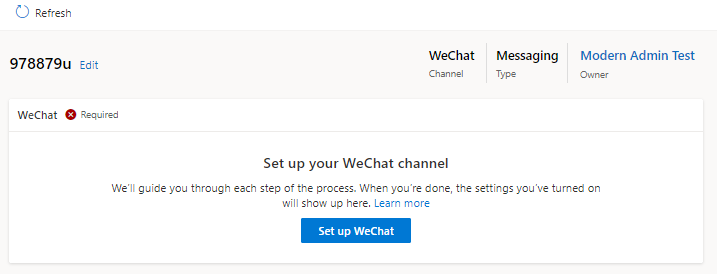

# Create workstreams in Omnichannel admin center

A workstream is a collection of routing and work distribution settings. Routing settings define how conversations should be routed to queues. Work distribution settings define how conversations should be allocated to agents within a queue. You can create the workstreams in Omnichanne admin center and Customer Service Hub.

> [!IMPORTANT]
> To configure workstream for record routing, entity routing must be enabled in the service configuration settings in Customer Service Hub.

Perform the following steps to configure the workstream in Omnichannel admin center:

1. In Omnichannel admin center, go to the home page.
2. On the site map, select **Workstreams**, select **New**, and then select **Create a workstream**.
3. Enter the following details for the workstream:
    - **Name:** Enter an intuitive name, such as **Contoso chat workstream**.
    - **Work distribution mode:** Select **Push** or **Pick**.
    - **Type:** Select one of the following types:
      - **Messaging:** To configure the workstream for chat and other conversation channels.
      - **Record:** To configure the workstream for entity record, such as case and email activity.
    - **Channel:** Is applicable if you have selected the type as Messaging. Select a channel from the list.
    - **Record:** Is applicable if you have selected the type as Record. Select the entity record from the list.

4. Select **Create**. The workstream that you created is displayed with the option to configure the selected channel instance.
    > [!div class=mx-imgBorder]
    > 
5. Perform the steps outlined in one of the following sections depending on the channel that you've selected.
   - [Configure a chat widget](add-chat-widget.md#configure-a-chat-widget-in-omnichannel-admin-center)
   - [Configure a Facebook channel](configure-facebook-channel.md)
   - [Configure a WeChat instance](configure-wechat-channel.md)
   - [Configure a LINE channel](configure-line-channel.md)
   - [Configure a Twitter channel](configure-twitter-channel.md)
   - [Configure a WhatsApp channel](configure-whatsapp-channel.md)
   - [Configure a Microsoft Teams channel](configure-microsoft-teams.md)
   - [Configure a custom messaging channel](configure-custom-channel.md)
6. Configure routing rules for the worksteam. More information: [Configure work classification rules](configure-work-classification.md
7. If you want to configure route to queues, see [Configure route to queues](configure-work-classification.md#configure-route-to-queues-ruleset-and-rules)
8. In the **Work distribution** area, you can either accept the default settings or select **See more**, and update the following options:
   - **Auto-close after inactivity:** Select a time period after which inactive conversations will be moved to the closed state automatically.
   - **Work distribution mode:** The option that you selected is displayed and can't be edited.
   - **Capacity:** Select one of the following options:
     - **Unit based:**
     - **Profile based: **
   - **Allowed presences:** Select the presences in which agents will be assigned.
   - **Default skill matching algorithm**:
   - **Keep same agent for entire conversation:** Set the toggle to yes if you want the conversation to be remained assigned to the originally-assigned agent. More information: [Agent affinity](work-streams-introduction.md#agent-affinity)
9. Expand **Advanced settings** to configure the following options:
   - [Sessions](../app-profile-manager/session-templates.md)
   - [Agent notifications](../app-profile-manager/notification-templates.md#out-of-the-box-notification-templates)
   - Context variables
   - Smart assist bots
   - Quick replies