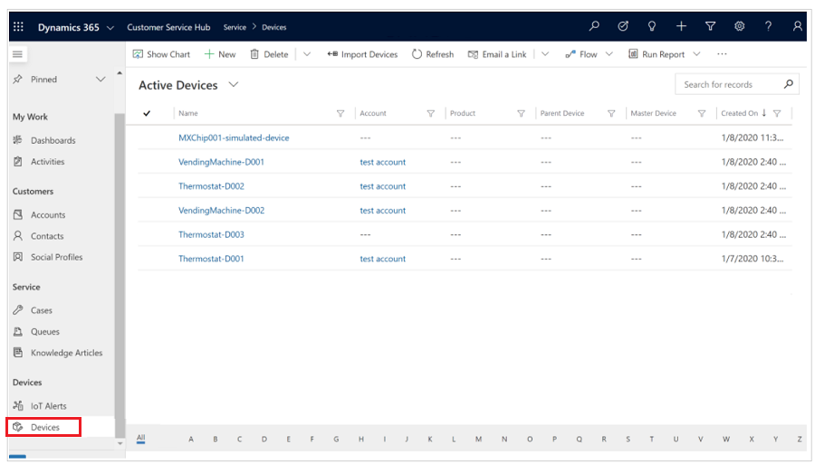
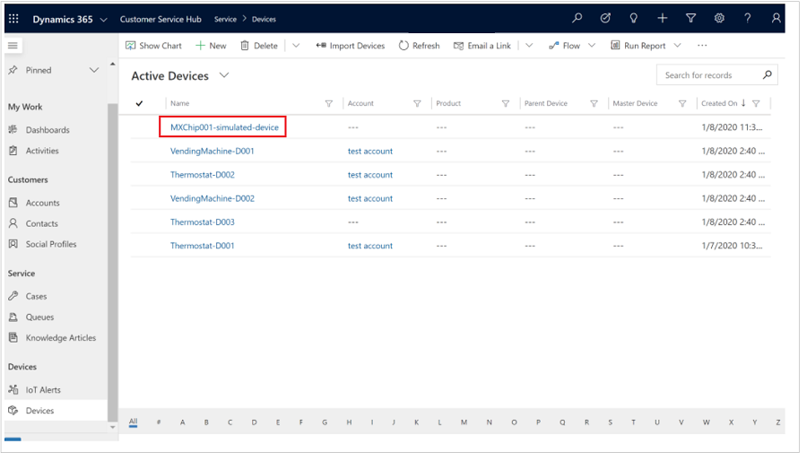
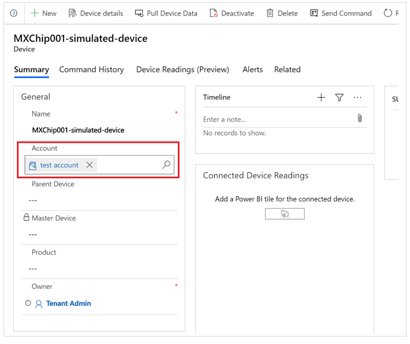

# 2 - Associate devices with customer accounts 

If an IoT device isn't associated with a customer account in Connected Customer Service, the system will not be able to generate work orders or cases against incoming alerts. In this tutorial, you'll learn how to associate a device with a customer account. While customer accounts are an optional association in Azure IoT Central, they are required in Connected Customer Service.

## Goals

Associate a device in Connected Customer Service with a customer account so that work orders or cases can be generated against incoming IoT alerts.

## Steps

1. In your Connected Customer Service application, navigate to the device page you wish to associate with a customer account. You can find this under "Devices" in the left-side menu.

    > [!div class="mx-imgBorder"]
    > 

2. On the Active Device page, select one of the devices without an account associated.

    > [!div class="mx-imgBorder"]
    > 

3. On the device detail page, start typing the name of the customer account in the "Account" field.

    > [!div class="mx-imgBorder"]
    > 

4. Save the changes you've made (the Save button is in the bottom corner of your window).

## See the results

This device will now be associated with a customer account, and can receive IoT alerts from Azure IoT Central.

[!INCLUDE[footer-include](../includes/footer-banner.md)]