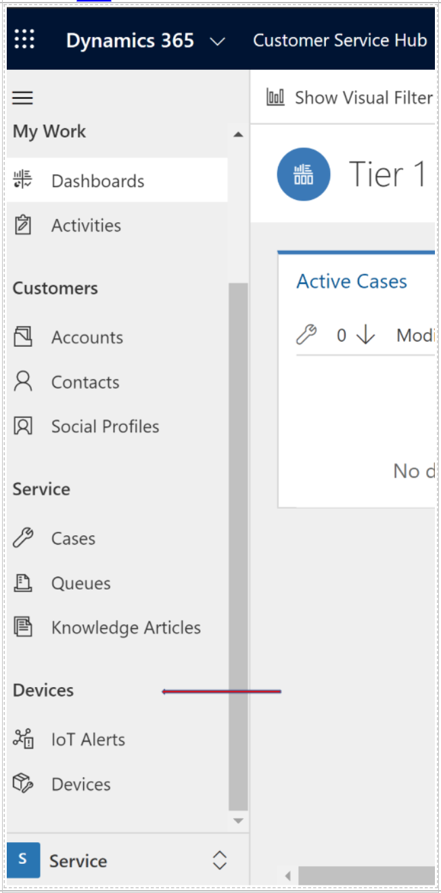
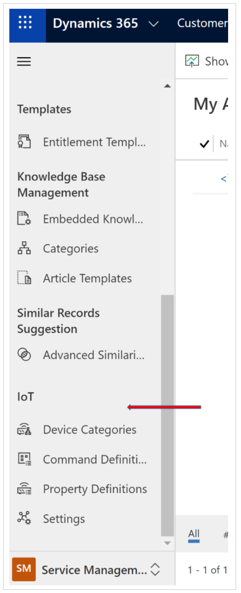

# Security roles for Connected Customer Service

Security roles for Connected Customer Service allow administrators to give appropriate access to Internet of Things (IoT) entities, including alerts, assets, devices, and commands, which are all included with Customer Service 9.0.20034.20XX +. These security roles should be added to existing Customer Service security roles. 

1. Customer Service Representative who needs to work with device registration and device data pulls (IoT Hub operations). 
- CSR should be given the IoT Administrator and IoT Endpoint User security roles. General knowledge of Customer Service security roles. For more information, see the topic on setting up customer service users and security roles. 

> [!div class="mx-imgBorder"]
> 

In general, access to IoT entities should mimic access to the customer asset entity for field service administrators, dispatchers, and resources.

2. A Customer Service administrator who needs to can set up IoT Configuration. 
- The CSR admin should be granted Dynamics 365 system administrator access. 

> [!div class="mx-imgBorder"]
> 

[!INCLUDE[footer-include](../includes/footer-banner.md)]