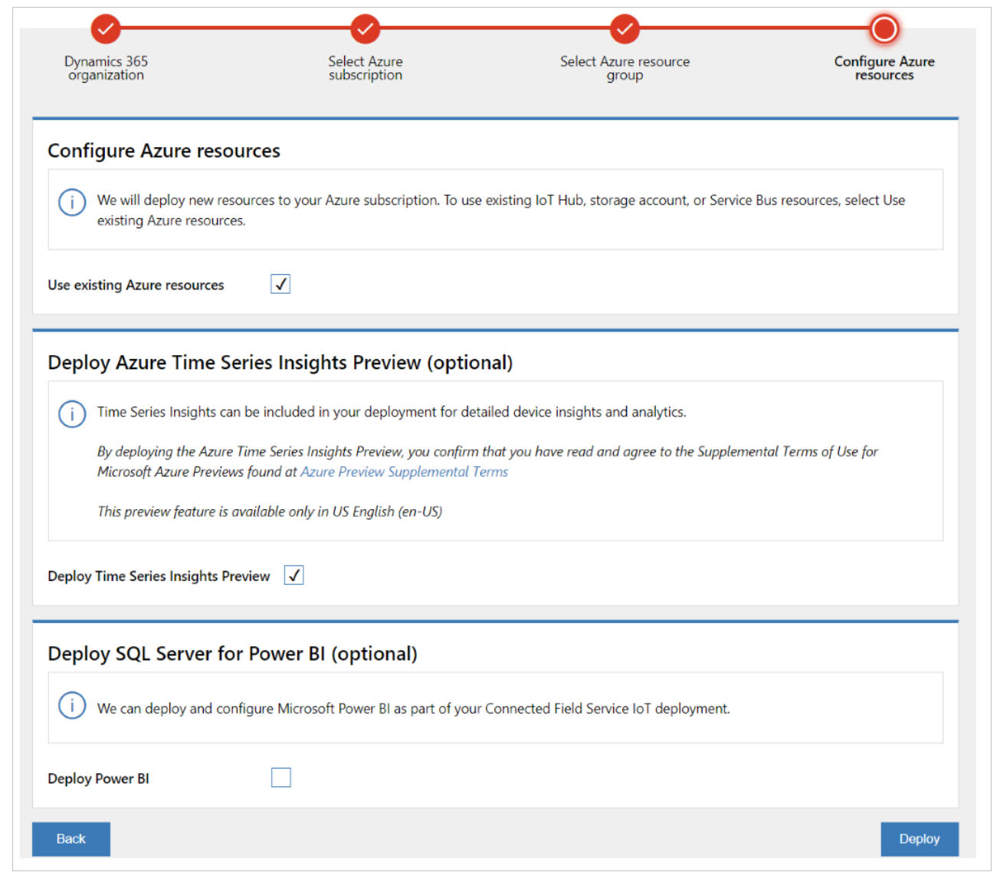
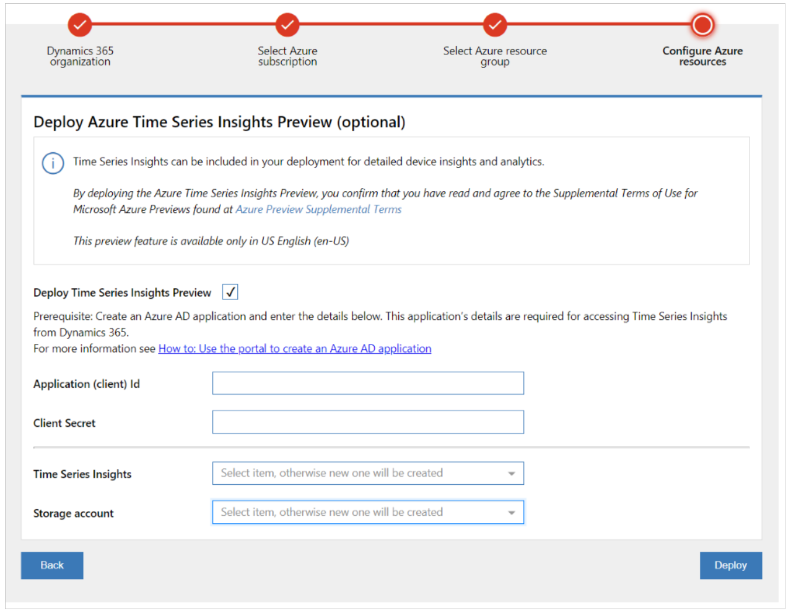
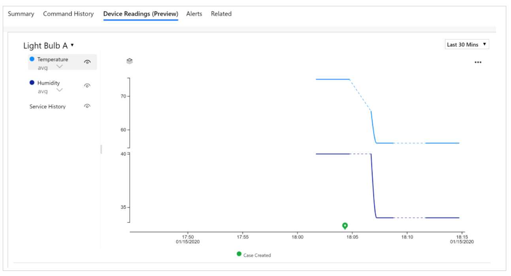
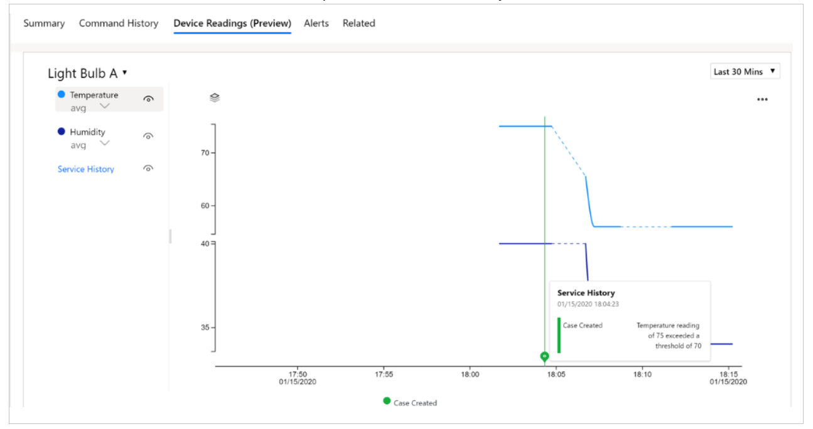
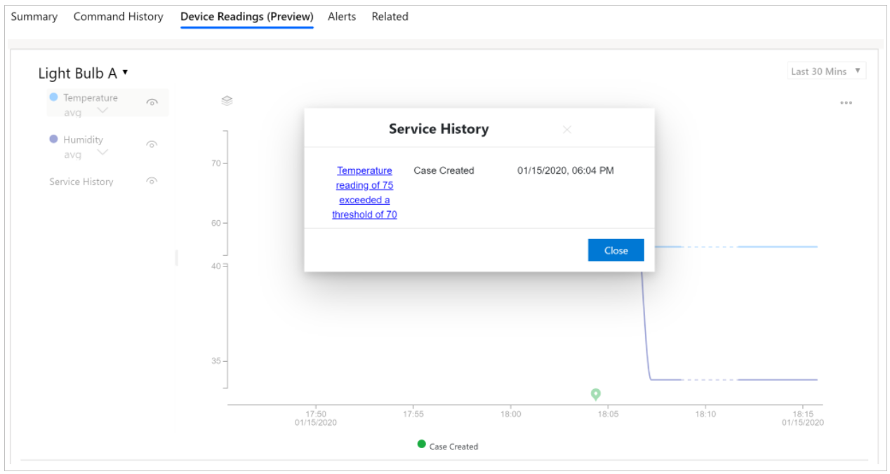

# Visualize device readings

To help you understand the current state of a device, its repair history, and the effect of performed work orders, the Connected Customer Service add-in displays near realtime device readings and historical sensor measurements in a chart alongside work order details.

The device readings chart is available on the IoT alert, work order, case, device, and asset forms.

To enable the device readings chart, administrators need to deploy Azure Time Series (Preview) into the Azure subscription when deploying or upgrading Connected Customer Service with Azure IoT Hub for their organization. Administrators do the deployment through the IoT Deployment app.  

## Prerequisites

- Customer Service version 9.0.20034.20XX or higher
- Currently available in United States English only. This feature is in **preview** and it is not available in all languages and geographies.

## Enable the device readings chart

1. Open the Connected Customer Service [IoT Deployment app](https://iotdeployment.dynamics.com/). 
2. Select the Dynamics 365 organization where the IoT solution will be deployed. 
3. Select the Azure subscription and the Azure Resource Group. (Note: Select **Upgrade deployment** if  you're updating an existing Connected Customer Service for IoT Hub deployment.)
4. Select the **Deploy Time Series Insight Preview** checkbox.
5. Select **Deploy**.

> [!div class="mx-imgBorder"]
> 

6. Follow the remaining steps in the IoT Deployment app to complete the Time Series Insights Preview deployment.
- Create the application (client) ID: Follow the steps in [Create an Azure Active Directory application](https://docs.microsoft.com/azure/active-directory/develop/howto-create-service-principal-portal#create-an-azure-active-directory-application
).
- Create the client secret: Follow the steps in [Create a new application secret](https://docs.microsoft.com/azure/active-directory/develop/howto-create-service-principal-portal#create-a-new-application-secret
). 

> [!div class="mx-imgBorder"]
> 

> [!Note]
> - Storage account selection is only available when you're upgrading an existing deployment.
> - The IoT Deployment app adds timeseriesinsightsconsumergroup into the IoT Hub Consumer Group.

6. After deployment, the **Device Readings (Preview)** tab is displayed on the IoT alert, work order, case, device, and asset forms.  

## Use the device readings chart

To view device readings, the following data must be in place:

|Form |Required data
--|--|
|Device  |Device ID is not empty.  
 Work order|The work order has a related IoT alert and the IoT alert has a related IoT device. The device ID in the IoT device is not empty.
| Case| The case has a related IoT alert and the IoT alert has a related IoT device. The Device ID in the IoT device is not empty. |
| Asset|The device ID is not empty. The device readings chart is for the device ID set in Connected Device Attributes section of the asset form. |
|IoT alert|The alert has a related IoT device. The device ID in the IoT device is not empty. |

 1. Open the **Device Readings (Preview)** tab on IoT alert, work order, case, device, or asset form.

 > [!div class="mx-imgBorder"]
> 

2. Choose the time period from the drop-down list. If the device sends device measurements to TSI, and the device measurement data exists for the selected time period, a chart is loaded.  

3. Select the eye icon next to the measurement to show or hide the measurement on the chart.

4. Hover over the chart to see tooltip with measurement details. 

> [!div class="mx-imgBorder"]
> 

5. Select the icon to view service history details. 

> [!div class="mx-imgBorder"]
> 

6. Select the eye icon next to **Service history** to show or hide any case created and closed during the selected time period.

> [!Note]
> If there are no work orders in the selected time period, work order selection will not be displayed.

## Error codes

Use the following table to troubleshoot error codes related to device readings. 

| Error code	| Possible root cause	| Suggested corrective action |
| --- | --- | --- |
| 5000101	 |	Local Config Store is not available |	Contact Microsoft Support to investigate |
| 4001002	 |	Value for the Search Span parameter passed to the custom action msdyn_IoTHubQueryDeviceReadings is Null	 |	Please verify that valid values for all the required arguments are passed to the custom action msdyn_IoTHubQueryDeviceReadings |
| 4000103	 |	Value for the From or To date argument passed to the custom action msdyn_IoTHubQueryDeviceReadings is not a valid DateTime |		Verify that valid values for all the required arguments are passed to the custom action msdyn_IoTHubQueryDeviceReadings | 
| 4000104	 |	Value for the Interval argument passed to the custom action msdyn_IoTHubQueryDeviceReadings is not a valid Duration	 |	Verify that valid values for all the required arguments are passed to the custom action msdyn_IoTHubQueryDeviceReadings. For interval, the format should be in the [ISO 8601 Duration Format](https://en.wikipedia.org/wiki/ISO_8601#Durations). For example: PT1H |
| 4000201	 |	Value for the IotDeviceId argument passed to the custom action msdyn_IoTHubQueryDeviceReadings is not a valid Guid	 |	Verify that valid values for all the required arguments are passed to the custom action msdyn_IoTHubQueryDeviceReadings. For IotDeviceId, the value should be the msdyn_iotdeviceid, which is a global unique identifier (GUID). |
| 4010202 |		The user doesn't have permission to query Device Entity (msdyn_iotdevice)	 |	Ensure the user can query Device entity (msdyn_iotdevice) |
| 5000203 |		Unable to get msdyn_DeviceId for the given msdyn_iotdeviceid in the Device Entity (msdyn_iotdevice) |		Make sure the attribute msdyn_DeviceId is populated for the device |
| 5000204	 |	Unable to get Time Series Insights Url for the for the given msdyn_iotdeviceid |		Make sure that CFS Deployment App has deployed Time Series Insights for this CRM Org and the device is linked to the correct IoT Provider |
| 5000205 |		Client Id used to get Azure AD token for TSI Authorization is invalid or an empty GUID (global unique identifier) |		Make sure that valid Client ID is provided in the CFS Deployment App when it was executed |
| 5000206 |		Client Secret used to get Azure AD token for TSI Authorization has expired |		Please update the Client Secret in Azure AD and re-run CFS Deployment App to update the new Client ID and Client Secret |
| 5000207 |		Unable to get the access token to query Time Series Insights |		Retry your request, and if the problem persists, try updating new Client ID and Client Secret by re-running the CFS Deployment App |
| 5000603	 |	Request to Time Series Insights API returned with a failure	 |	Retry your request. If the problem persists, contact Microsoft Support to investigate |
| 5000604	 |	Response from Time Series Insights API is not in an expected format	 |	Retry your request. If the problem persists, please contact Microsoft Support to investigate |

## Additional notes
- Available only in United States English (en-US)
- **Known issues:** 
  - In custom time settings, the time zone is always set as UTC even when another time zone is selected. The time period displayed after applying the setting is always local time. 
  - When deploying immediately after creating a new application (client) ID with the IoT Deployment app, you may see an **unable to deploy TSI with credential** error. Try again after one minute.
- Azure Time Series Insights (Preview) uses a pay-as-you-go (PAYG) pricing model. The pricing and cost estimate calculator is available at https://azure.microsoft.com/pricing/details/time-series-insights. Select the region where you are planning to deploy TSI to understand the storage and query cost. (Note that TSI uses Azure blob to store the data.) 

[!INCLUDE[footer-include](../includes/footer-banner.md)]