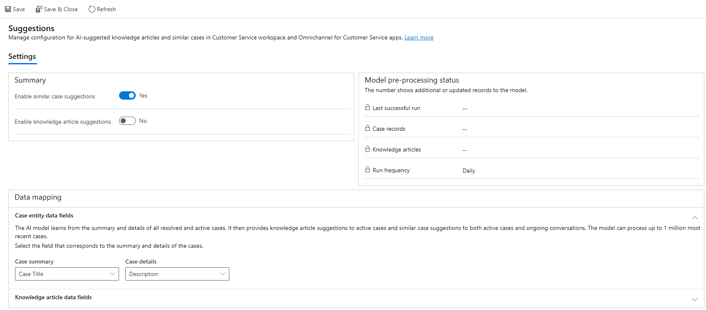

# Enable AI suggestions for similar cases and knowledge articles

## Introduction

With the use of AI, suggestions about similar cases that were previously resolved successfully help agents find the right solutions quickly, increase agent productivity, and provide better and faster service to customers.

The key highlights of the feature are as follows:

- AI-driven case and knowledge articles suggestions based on case context and historical success rate.
- Secondary actions that agents can take, such as collaborate with an expert, after a similar case has been found.
- Capability of the AI model to process up to one million most recent cases for listing them at run time.
- Continuous improvement of the recommendation model through comprehensive feedback mechanism.

> [!NOTE]
>
> - The AI suggestions feature is currently available only in the following geographical locations:
>   - North America
>   - South America
>   - Canada
>   - United Kingdom
>   - Europe
>   - Japan
>   - Asia Pacific
>   - Australia

## Multilingual support for AI similar cases and knowledge articles

AI similar cases and knowledge articles are now supported in seven different languages. Customers who have cases, conversations or knowledge articles in languages other than English can now benefit from the AI multi language availability. The supported languages are listed as follows.

- Dutch
- English
- French
- German
- Italian
- Japanese
- Spanish

When an agent accepts an incoming case or conversation, the knowledge article suggestions first checks if the agent has set up a specific language, and if no language setting is found, the user's personal UI language settings is used to display similar cases and knowledge article suggestions. 

After an agents accepts a case or conversation, AI smart assist checks if the language is supported and matched. If the language is supported, case suggestions are displayed in the same language, if the language is not supported, then no suggestions are displayed. If no suggestions are displayed, the agent can update the settings to supported languages.

## How AI suggestions for similar cases and knowledge articles works

The AI suggestions are displayed in smart assist, which is an intelligent assistant that provides real-time recommendations to agents, helping agents take actions during their interactions with customers. After the productivity pane is enabled in Customer Service workspace or the Omnichannel for Customer Service app, the smart assist cards with suggestions appear on the productivity pane.

The AI suggestions are powered by a set of pre-trained natural language understanding models that help agents find relevant knowledge articles or similar cases quickly, based on the context of active cases or ongoing conversations. The AI models work as follows:

- Knowledge articles and similar cases can be suggested based on the semantic meaning in case context and knowledge article content.
- The model pre-processes published knowledge articles and resolved cases every day to prepare suggestion candidates. For the first time pre-processing, up to 1,500 published articles and 10,000 recently resolved cases will be processes. Subsequently, newly published articles and resolved cases will be processed. Up to 1 million of latest resolved cases will be processed to serve suggestions.
- After a case is created or updated, or during an ongoing conversation, the model finds out matching knowledge articles and similar cases from suggestion candidates.
- A brief summary is auto-generated for each pre-processed knowledge article based on its content. When a knowledge article is suggested, both article title and the auto-generated summary are surfaced to agents, which helps them to get a better idea about the article before agent clicks through it.
- In addition to the suggestions, agents can also tell why an article or similar case is suggested through a list of key phrases that are auto-extracted from knowledge articles and cases. These key phrases highlights the relevance between a suggestion and an active case or an ongoing conversation, in addition to the confidence score (which is a percentage number that indicates the degree to which an article or similar case matches with the active case).
- The feedback provided by agents on the relevance of the similar cases and knowledge articles suggestions is used by the AI model to retrain and improve the suggestions over time.

> [!NOTE]
>
> - After you enable the settings, it might take up to 24 hours for the models to process data and complete the first time setup.
> - After you enable or disable the settings, they will be in place only after agents refresh or reopen their browser and not in the currently active sessions nor on session switch.

## Prerequisites

Make sure that the following requirements are met:

- Customer Service workspace is installed and accessible. More information: [Customer Service workspace](csw-overview.md)
- The	productivity pane is enabled. By default, the productivity pane is enabled out of the box. More information: [Enable productivity pane](../app-profile-manager/app-profile-manager.md#enable-prod-pane).
- The System Administrator role is granted.
- The workflow processes used by the AI model and AI configuration entities are in the activated status. More information: [Workflow processes](#workflow-processes).
- The feature works only when the administration mode is disabled. For how to update the administration mode, see 
[Edit properties of an environment](https://go.microsoft.com/fwlink/p/?linkid=2151237)

## Enable AI suggestions for similar cases

Perform the following steps to enable the AI suggestions for similar cases:

1. Sign in to Omnichannel Admin Centre application

or

Sign in to Customer Service Hub.

2. In the **Change area**, select **Service Management**, and then under **Analytics and Insights**, select **Settings**.
3. In the **Premium AI capabilities** section, select** **Manage** under **Suggestions**. The **Suggestions** page appears.
4. In the **Settings** > **Summary** area, set the toggle to **Yes** for **Enable similar case suggestions**.
5. In the **Data mapping** > **Case entity data fields** area, select values for the **Case summary** and **Case details** boxes respectively if you do not want to use **Case Title** and **Description** that are set by default. The AI model uses the data corresponding to the selected boxes to understand the case context to provide similar case suggestions. By default, Case Title and Description fields are selected.

   > [!NOTE]
   > We recommend that you use text fields with plain text because suggestions might not be generated for text fields that are enabled for rich text format.

6. Select **Save**.

   > 

## Enable AI suggestions for knowledge articles

Perform the following steps to enable the AI suggestions for related knowledge articles:

1. Sign in to Omnichannel Admin Centre application

 or

 Sign in to Customer Service Hub.

2. In the **Change area**, select **Service Management**, and then under **Analytics and Insights**, select **Settings**.
3. Select **Manage** under **Suggestions**. The **Suggestions** page appears.
4. In the **Settings** > **Summary** area, set the toggle to **Yes** for **Enable knowledge article suggestions**.
5. In the **Data mapping** > **Knowledge article data fields** area, make sure that **Title** and **Content** are selected in **Article title** and **Article content** boxes, respectively. The selected options are used by the AI model to understand and find a good match for a case or conversation. Article content is used by the AI model to generate a brief article summary that is displayed to the agent at runtime.

6. Select **Save**.

## Model pre-processing status

The **Model pre-processing status** area displays the following metadata pertaining to the AI processing. The run frequency is set out of the box. Every day, the model pre-processes newly published or updated knowledge articles and resolved or updated cases to prepare the candidates data for suggestions.

- **Last successful run:** Displays the date and time the model was last run.
- **Case records:** Displays the number of new or updated resolved case records that were processed.
- **Knowledge articles:** Displays the number of new or updated published knowledge articles that were processed.
- **Run frequency:** Display the frequency that is set for the model to run.

### Workflow processes

The AI model and AI configuration entities use the following workflow processes. Make sure these processes are in the activated status. By default, these processes are activated:

- IsPaiEnabled
- Predict
- PredictionSchema
- Train
- QuickTest
- BatchPrediction
- ScheduleTraining
- SchedulePrediction
- ScheduleRetrain
- UnschedulePrediction
- UnscheduleTraining
- CancelTraining
- PublishAIConfiguration
- UnpublishAIConfiguration

## Service protection limits for AI suggestions

AI suggestions for Case and Knowledge became available as of Oct, 2020. We're introducing service protection limits on these capabilities to maintain a consistent quality of service for all our customers, but there is no penalty if customers exceed pre-defined limits. Over time, Microsoft may adjust these limits in keeping with customer usage patterns and provide options for customers with high usage scenarios/patterns to purchase additional capacity in a manner minimally disruptive to those customers. 

The service protection limits for AI suggestions are defined in the following table. The total limits are pooled at the tenant level based on the number of Customer Service Enterprise user licenses that are available in the tenant.

| Area    | Limits     | Notes     |
|----------|------------|-----------|
| AI suggestions for active cases | 30 cases/month per user license | Each user license adds 30 active cases, where agents can get AI-suggested knowledge articles and similar cases in real-time. |
| AI suggestions for conversations | 150 conversations/month per user license | Each user license adds 150 Omnichannel conversations where agents can get AI suggested knowledge articles and similar cases in real-time.  |

### See also

[View AI-suggested similar cases and knowledge articles for active cases](csw-view-ai-suggested-cases-knowledge-articles.md)  
[View smart assist suggestions for knowledge articles and similar cases using AI for ongoing conversations](../omnichannel/agent/agent-oc/oc-view-ai-suggested-cases-articles.md)  
[FAQs on AI-suggested cases and knowledge articles](csw-faqs-ai-suggestions.md)  
[Create a new similarity rule to view similar cases](suggest-similar-cases-for-a-case.md#create-a-new-similarity-rule-to-view-similar-cases)  

[!INCLUDE[footer-include](../includes/footer-banner.md)]