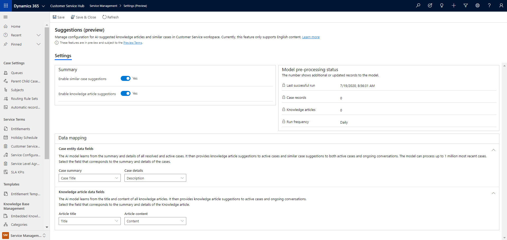

# Preview: Enable AI suggestions for similar cases and knowledge articles

[!include[cc-beta-prerelease-disclaimer](../includes/cc-beta-prerelease-disclaimer.md)]

With the use of AI, suggestions about similar cases that were previously resolved successfully help agents find the right solutions quickly, increase agent productivity, and provide better and faster service to customers.

The key highlights of the feature are as follows:

- AI-driven case and knowledge articles suggestions based on case context and historical success rate.
- Secondary actions that agents can take, such as collaborate with an expert, after a similar case has been found.
- Capability of the AI model to process up to one million most recent cases for listing them at run time.
- Continuous improvement of the recommendation model through comprehensive feedback mechanism.

> [!NOTE]
> The AI suggestions feature supports only English content and is available only in organizations that have the base language set as English.

## How AI suggestions for similar cases and knowledge articles works

AI suggestions are powered by a set of pre-trained natural language understanding models that help agents find relevant knowledge articles or similar cases quickly, based on the active case context. After you enable the settings, it might take up to 24 hours for the models to process data and complete the first time setup. The AI models enable the following capabilities:

- Knowledge articles and similar cases can be suggested based on the semantic meaning in case context and knowledge article content. The model pre-processes published knowledge articles and resolved cases every day to prepare suggestion candidates. After a case is created or updated, the model quickly finds out matching knowledge articles and similar cases from suggestion candidates.
- A brief summary is auto-generated for each pre-processed knowledge article based on its content. When a knowledge article is suggested, both article title and the auto-generated summary are surfaced to agents, which helps them to get a better idea about the article before agent clicks through it.
- In addition to the suggestions, agents can also tell why an article or similar case is suggested through a list of key phrases that are auto-extracted from knowledge articles and cases. These key phrases highlights the relevance between a suggestion and an active case, in addition to the confidence score (which is a percentage number that indicates the degree to which an article or similar case matches with the active case).

> [!NOTE]
> After you enable or disable the settings, they will be in place only after agents refresh or reopen their browser and not in the currently active sessions nor on session switch.

## Prerequisites

Make sure that the following requirements are met:

- Customer Service workspace is installed and accessible. More information: [Customer Service workspace](csw-workspace.md)
- Administrator permissions

## Enable AI suggestions for similar cases

Perform the following steps to enable the AI suggestions for similar cases:

1. Sign in to the Customer Service Hub app.
2. In the **Change area**, select **Service Management** > **Settings (Preview)**. The **Analytics and insights settings** page appears.
3. Select **Manage** under **Suggestions**. The **Suggestions (preview)** page appears.
4. In the **Settings** > **Summary** area, set the toggle to **Yes** for **Enable similar case suggestions**.
5. In the **Data mapping** > **Case entity data fields** area, select values for the **Case summary** and **Case details** boxes respectively if you do not want to use **Case Title** and **Description** that are set by default. The AI model uses the data corresponding to the selected boxes to understand the case context to provide similar case suggestions. By default,  are selected.
6. Select **Save**.

   > 

## Enable AI suggestions for knowledge articles

Perform the following steps to enable the AI suggestions for related knowledge articles:

1. Sign in to the Customer Service Hub app.
2. In the **Change area**, select **Service Management** > **Settings (Preview)**. The **Analytics and insights settings** page appears.
3. Select **Manage** under **Suggestions**. The **Suggestions (preview)** page appears.
4. In the **Settings** > **Summary** area, set the toggle to **Yes** for **Enable knowledge article suggestions**.
5. In the **Data mapping** > **Knowledge article data fields** area, make sure that **Title** and **Content** are selected in **Article title** and **Article content** boxes, respectively. The selected options are used by the AI model to understand and find a good match for a case. Article content is used by the AI model to generate a brief article summary that is displayed to the agent at runtime.

6. Select **Save**.

    

## Model pre-processing status

The **Model pre-processing status** area displays the following metadata pertaining to the AI processing. The run frequency is set out of the box. Every 24 hours, the model pre-processes newly published or updated knowledge articles and resolved or updated cases to prepare the candidates data for suggestions.

- **Last successful run:** Displays the date and time the model was last run.
- **Case records:** Displays the number of new or updated resolved case records that were processed.
- **Knowledge articles:** Displays the number of new or updated published knowledge articles that were processed.
- **Run frequency:** Display the frequency that is set for the model to run.

### See also

[Create a new similarity rule to view similar cases](suggest-similar-cases-for-a-case.md#create-a-new-similarity-rule-to-view-similar-cases)  
