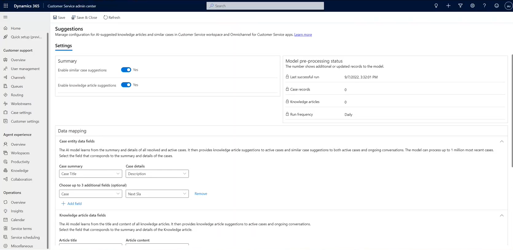

# Enable AI suggestions for similar cases and knowledge articles

With the use of AI, suggestions about similar cases that were previously resolved successfully help agents find the right solutions quickly, increase their productivity, and provide better and faster service to customers.

The key highlights of the feature are as follows:

- AI-driven case and knowledge article suggestions that are based on case context and historical success rate.
- Secondary actions that agents can take, such as collaborating with an expert, after a similar case has been found.
- Capability of the AI model to process up to 1 million of the most recent cases for listing them at runtime.

> [!NOTE]
> The AI suggestions feature is currently available in a few geographical locations. More information: [Regional availability and Service limits for Customer Service](cs-region-availability-service-limits.md).

## How AI suggestions for similar cases and knowledge articles work

The AI suggestions are displayed in smart assist, an intelligent assistant that provides real-time recommendations to agents to help them take action during their interactions with customers. After the productivity pane is enabled in Customer Service workspace or Omnichannel for Customer Service, the smart assist cards with suggestions appear on the productivity pane.

The AI suggestions use a set of pre-trained natural language understanding models. These models are designed to help agents find relevant knowledge articles or similar cases quickly, based on the context of active cases or ongoing conversations. 

The AI models work as follows:

- Knowledge articles and similar cases can be suggested based on the semantic meaning in case context and knowledge article content.
- The model pre-processes published knowledge articles and resolved cases every day to prepare suggestion candidates. For the first time pre-processing, up to 1,500 published articles and 15,000 recently resolved cases will be processed. After, newly published articles and resolved cases will be processed up to the daily limit. Over time, accumulatively, up to 1 million of the latest resolved cases will be processed to serve suggestions.
- After a case is created or updated, or during an ongoing conversation, the model finds out matching knowledge articles and similar cases from suggestion candidates.
- A brief summary is auto-generated for each pre-processed knowledge article, based on its content. When the system suggests a knowledge article, both the article title and auto-generated summary are surfaced to agents. This data can help agents get a better idea about an article before they click through it.
- In addition to the suggestions, agents can also tell why an article or similar case is suggested through a list of key phrases that are auto-extracted from knowledge articles and cases. These key phrases highlight the relevance between a suggestion and an active case or an ongoing conversation in addition to the confidence score (a percentage number that indicates the degree to which an article or similar case matches with the active case).
- During an ongoing conversation, for the first three messages sent by the customer, the AI suggestions are triggered for each message. After these first three customer messages, AI suggestions are triggered for every third customer message. The AI suggestions are based on the context described in the last 18 messages.

> [!NOTE]
>
> - After you enable the settings, it might take up to 24 hours for the models to process data and complete the first time setup.
> - After you enable or disable the settings, they'll be in place only after agents refresh or reopen their browser; they won't appear in the currently active sessions or on session switch.

## Language support for AI suggestions

AI suggestions for similar cases and knowledge articles are now supported in the following languages:

- Dutch
- English
- French
- German
- Italian
- Japanese
- Spanish

After an agent opens a case or accepts a conversation, smart assist checks the language from the following sources:

- Whether the language selected in the language settings is supported.

- Whether the language that the AI has detected in the case or conversation that the agent accepts matches the language settings.

If the language verification passes, the suggestions are displayed in the language used in the case or the conversation. Suggestions aren't displayed if the language doesn't match or isn't supported. In such cases, the agent should update the settings to use supported languages. The language settings used in AI suggestions are listed as follows:

- For similar case suggestions, the language selected in the user's **User Interface Language** settings is used to display similar cases and knowledge article suggestions.

- For knowledge article suggestions, smart assist first checks for the language that's set in the **Knowledge Personalization** settings. If no language setting is found, the user's **User Interface Language** setting is used to display knowledge article suggestions. More information: [Personalize your knowledge search article filters](filter-articles.md#personalize-your-knowledge-search-article-filters).

## Prerequisites

Make sure that the following requirements are met:

- Customer Service workspace is installed and accessible. More information: [Customer Service workspace](csw-overview.md)
- The	productivity pane is enabled. By default, the productivity pane is enabled out of the box. More information: [Enable productivity pane](../app-profile-manager/app-profile-manager.md#enable-prod-pane).
- The System Administrator role is granted.
- The workflow processes used by the AI model and AI configuration entities are in the activated status. More information: [Workflow processes](#workflow-processes).
- If administration mode is enabled, make sure that background operations are also enabled. More information: [Administration Mode](/power-platform/admin/admin-mode).
- For the AI suggestions to work, customer-managed keys should be disabled.

## Enable AI suggestions for similar cases

> [!NOTE]
> AI suggestions for similar cases is enabled out of the box.

You can enable AI suggestions for similar cases in the Customer Service admin center, Omnichannel admin center, or Customer Service Hub app.

1. Go to one of the apps, and then perform the following steps.
   
   ### [Customer Service admin center](#tab/customerserviceadmincenter)
     
     1. In the site map, select **Insights** in **Operations**. The **Insights** page appears.
     1. In the **Suggestions for agents** section, select **Manage**.

     The **Suggestions** page is displayed.       

   ### [Omnichannel admin center](#tab/omnichanneladmincenter)
    
     1. In the site map, select **Settings** in **Insights**. The **Insights** page appears.
     1. In the **Suggestions for agents** section, select **Manage**.

      The **Suggestions** page is displayed.    
    
   ### [Customer Service Hub](#tab/customerservicehub)

      1. In the site map, go to **Service Management**
      1. Select **Settings** in **Insights**. The **Insights** page appears.
      1. In the **Suggestions for agents** section, select **Manage**.

      The **Suggestions** page is displayed.  

2. In the **Settings** > **Summary** area, set the **Enable similar case suggestions** toggle to **Yes**.

3. In the **Data mapping** > **Case entity data fields** area, select values for the **Case summary** and **Case details** boxes respectively, if you don't want to use **Case Title** and **Description** that are set by default. You can choose up to three more fields for the case suggestion model to use to find similar cases. For example, you can look at cases with a similar age, cases owned by a particular team, and so forth. The AI model uses the data that corresponds to the selected boxes to understand the case context to provide similar case suggestions.

   > [!NOTE]
   > We recommend that you use text fields with plain text because suggestions might not be generated for text fields that are enabled for rich text format.

   > 

4. Select **Save**.

## Enable AI suggestions for knowledge articles

> [!NOTE]
> AI suggestions for knowledge articles is enabled out of the box.

You can enable AI suggestions for knowledge articles in the Customer Service admin center, Omnichannel admin center, or Customer Service Hub app.

1. Go to one of the apps, and perform the following steps.
   
   ### [Customer Service admin center](#tab/customerserviceadmincenter)

     1. In the site map, select **Insights** in **Operations**. The **Insights** page appears.
     1. In the **Suggestions for agents** section, select **Manage**.

     The **Suggestions** page is displayed.       

   ### [Omnichannel admin center](#tab/omnichanneladmincenter)
    
     1. In the site map, select **Settings** in **Insights**. The **Insights** page appears.
     2. In the **Suggestions for agents** section, select **Manage**.

      The **Suggestions** page is displayed.    
    
   ### [Customer Service Hub](#tab/customerservicehub)

      1. In the site map, go to **Service Management**
      1. Select **Settings** in **Insights**. The **Insights** page appears.
      1. In the **Suggestions for agents** section, select **Manage**.

      The **Suggestions** page is displayed.  

2. In the **Summary** area, set the **Enable knowledge article suggestions** toggle to **Yes**.

3. In the **Data mapping** > **Knowledge article data fields** area, ensure that **KB articles** is selected for **Article entity**, and **Title** and **Content** are selected in the **Article title** and **Article content** boxes, respectively. You can choose three more fields for the model to find similar knowledge articles, such as article keywords, description, and so forth. The selected options are used by the AI model to understand and find a good match for a case or conversation. Article content is used by the AI model to generate a brief article summary that's displayed to the agent at runtime.

4. Select **Save**.

## Model pre-processing rules

You can use model pre-processing rules to limit the pre-processed cases that the AI model will suggest to your agents. You can choose from a variety of conditions, such as sentiment value, associated with the resolved case, and so forth.

You can also apply model pre-processing rules to knowledge articles to limit the suggestions to knowledge articles based on things such as keywords, language, the number of views on the knowledge article, and so forth.

## Model pre-processing status

The **Model pre-processing status** area displays the following metadata pertaining to the AI processing. The run frequency is set out of the box. Every day, the model pre-processes newly published or updated knowledge articles and resolved or updated cases to prepare the candidates for suggestions.

- **Last successful run**: Displays the date and time the model was last run.
- **Case records**: Displays the number of new or updated resolved case records that were processed.
- **Knowledge articles**: Displays the number of new or updated published knowledge articles that were processed.
- **Run frequency**: Displays the frequency that has been set for the model to run.

### Workflow processes

The AI model and AI configuration entities use the following workflow processes. Make sure these processes are in the activated status. By default, these processes are activated:

- IsPaiEnabled
- Predict
- PredictionSchema
- Train
- QuickTest
- BatchPrediction
- ScheduleTraining
- SchedulePrediction
- ScheduleRetrain
- UnschedulePrediction
- UnscheduleTraining
- CancelTraining
- PublishAIConfiguration
- UnpublishAIConfiguration

## Service protection limits for AI suggestions

AI suggestions for Case and Knowledge became available as of October 2020. We're introducing service protection limits on these capabilities to maintain a consistent quality of service for all our customers, but there's no penalty if customers exceed predefined limits. Over time, Microsoft might adjust these limits in keeping with customer usage patterns and provide options for customers with high usage scenarios and patterns to purchase more capacity in a manner minimally disruptive to those customers.

The service protection limits for AI suggestions are defined in the following table. The total limits are pooled at the tenant level based on the number of Customer Service Enterprise user licenses that are available in the tenant.

| Area    | Limits     | Notes     |
|----------|------------|-----------|
| AI suggestions for active cases | 30 cases/month per user license | Each user license adds 30 active cases, where agents can get AI-suggested knowledge articles and similar cases in real time. |
| AI suggestions for conversations | 150 conversations/month per user license | Each user license adds 150 omnichannel conversations, where agents can get AI-suggested knowledge articles and similar cases in real time.|
||||

### See also

[View AI-suggested similar cases and knowledge articles for active cases](csw-view-ai-suggested-cases-knowledge-articles.md)  
[View smart assist suggestions for knowledge articles and similar cases using AI for ongoing conversations](./oc-view-ai-suggested-cases-articles.md)  
[FAQ on AI-suggested cases and knowledge articles](csw-faqs-ai-suggestions.md)  
[Create a new similarity rule to view similar cases](suggest-similar-cases-for-a-case.md#create-a-new-similarity-rule-to-view-similar-cases)  

[!INCLUDE[footer-include](../includes/footer-banner.md)]
