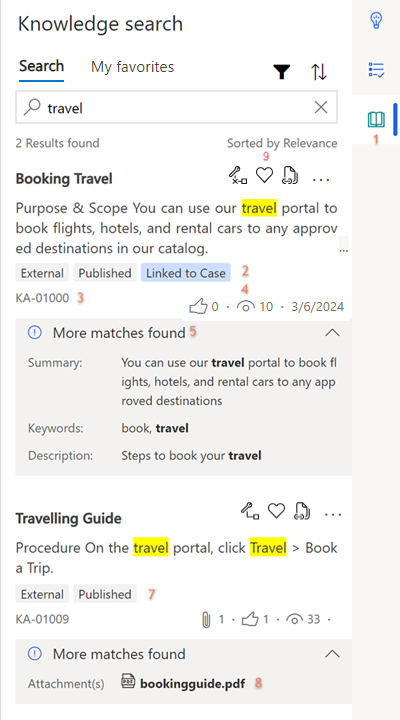
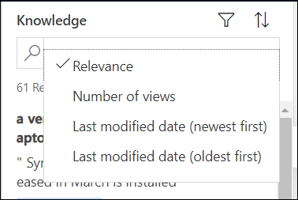
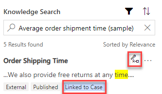

# Search for knowledge articles

In Customer Service workspace, knowledge base search lets you search for relevant knowledge articles to resolve a case. The knowledge area is available on the productivity pane.

## Prerequisites

- The productivity pane and knowledge search must be enabled in app profile manager.
- The anchor tab should be a case or conversation for the knowledge pane to be displayed.

## Use the knowledge pane to search articles

In Customer Service workspace, for a case, when you select the knowledge tab, knowledge articles that match the case title are displayed on the **Knowledge** pane. These articles are displayed based on relevance and full-text search mechanisms.

The knowledge articles are applicable for all knowledge-enabled entities.

By default, the full text search displays 10 results and relevance search displays 50 results.

  > [!div class=mx-imgBorder]
  > 

  |Label|Description|
  |-----|-----------|
  |1.| Knowledge tab|
  |2.| Lets you link or unlink the article to the entity, such as the case.|
  |3.| Text appears when the article is linked to the entity.|
  |4.| Number of times the article has been viewed.|
  |||

On the Knowledge pane, you can perform the following actions:
- Select the article title to open it in an application tab.
- Use the search box to enter keywords and search for articles if those displayed by default are not relevant.
- Select the filter icon to display the options based on which the articles can be filtered.
- Select sort icon to display the options based on which results can be displayed.
- Select the ellipses to display the following actions that can be performed:
  - Copy URL
  - Email URL
  - Email Content

    These actions can be performed for only published or expired articles.

### View the knowledge article in the application tab

Select an article title to view it in an application tab.  You can view up to 10 articles in the application tab.

You can perform the following actions for the knowledge article:

- Copy URL to copy the external URL of the article so you can share it with your customers over channels like chat or email.
- Provide feedback by selecting the thumbs up or thumbs down icon.
  - Make sure that the knowledge article entity is enabled for feedback. To learn more, see [Enable an entity for feedback/ratings](/dynamics365/customer-engagement/customize/enable-entity-feedback).
  - Customer service agents and customer service managers can create, or view feedback based on their role and privileges on feedback entity. Out of the box, customer service agents can create, view, or edit their own feedback only. Customer service managers or knowledge managers can view feedback submitted by all agents.
- When you select thumbs down, the **Comments** box to provide feedback appears. Optionally, provide additional information and reasons for the feedback.

### Filter knowledge articles

With the help of text and visual filters, you can filter the knowledge articles. To see knowledge articles in specific states, use the **Status** filter. You can filter search results to see all draft, published, or approved articles. See articles that are categorized as internal and external. You can also filter the articles based on date and language.

When you select the filter icon, you can see the **Filter by** menu where you can filter the items based on the following categories.

  | Category | Sub-category |
  |-----------------------|-----------------------|
  | Status | <ul> <li> Draft </li> <li> Approved </li> <li> Published </li> </ul> |
  | Visibility | <ul> <li> Internal </li> <li> External </li> <li> All </li> </ul> |
  | Modified Date | <ul> <li> Last 7 days </li> <li> Last 30 days </li> <li> Last 6 months </li> <li> Last year </li> <li> All </li> </ul> |
  | Language | <ul> <li> List of languages </li> </ul> **Note:** The language list is based on the articles that are present in the those languages. For example, there are a total of 50 articles in five different languages such as French, English, Japanese, Spanish, and Danish. The language filter will show only these five languages. |
  |||

### Sort knowledge articles

The knowledge base search control provides sort the knowledge articles interactions. Select the up-arrow icon to view the sorting options and select one of the options from the following: 

- Relevance
- Number of views
- Last modified date (newest first) 
- Last modified date (oldest first)

  > [!div class=mx-imgBorder]
  > 

### Link and unlink the knowledge article to a record

When configured, you can link an article to case. You can associate and dissociate the knowledge article with a record.

  > [!div class=mx-imgBorder]
  > 
  
- By default the articles are not linked to the case.
- When you select to link the article to the case, the link icon changes, and **Linked to Case** is displayed for the article.

### Email options

Use the following options to share the knowledge article link or knowledge article content through mail:

- **Email URL:** The new email form opens with the link to the article in the mail box.
- **Email Content:** The article content is populated in the mail body. The fields are automatically populated based on the case and customer details.

Add other information as needed, and then on the command bar, select **Send**.

## How knowledge base search powered by relevance search works

The knowledge base search is enabled to use the relevance search mechanism in the knowledge base search control area.

[!INCLUDE[proc_more_information](../includes/proc-more-information.md)] [How relevance search works](https://docs.microsoft.com/power-platform/admin/configure-relevance-search-organization)

The relevance search mechanism uses Azure search service to index and search records. Relevance search provides improved search functionality, such as better relevance, highlighted search keyword text, and search within attachments and notes. With relevance search, you can also configure search fields in the knowledge article entity.

[!INCLUDE[proc_more_information](../includes/proc-more-information.md)] [Configure searchable fields for Relevance Search](https://docs.microsoft.com/power-platform/admin/configure-relevance-search-organization)

> [!NOTE]
> To enable relevance search for knowledge article entity, see [Enable relevance search](https://docs.microsoft.com/power-platform/admin/configure-relevance-search-organization) and [Select entities for Relevance Search](https://docs.microsoft.com/power-platform/admin/configure-relevance-search-organization). 
If relevance search is not enabled for the entity, standard full-text search is used.

For more information, see [Understand knowledge base search mechanisms](knowledge-base-search-methods.md).

### Before you begin using relevance search

Relevance search uses the scoring concepts as defined by Azure search. To be able to search the knowledge base using relevance search, certain view columns should be mandatorily configured in the Quick Find view columns list. If any of these columns are deleted or missing, the search query will display an error.

> [!NOTE]
> An admin can configure the knowledge article quick find view columns list by navigating to **Settings > Customizations > Entities > Knowledge Article > Views > Quick Find View > View Columns**.

The required view columns are as follows:

- Article Public Number
- Title
- Created On
- Keywords
- Knowledge Article Views
- Language
- Major Version Number
- Minor Version Number
- Rating
- Status
- Modified On

### See also

[Add the Knowledge Base Search control to forms](add-knowledge-base-search-control-forms.md)  
[Create and manage knowledge articles](customer-service-hub-user-guide-knowledge-article.md)  
[Understand knowledge base search mechanisms](knowledge-base-search-methods.md)  

[!INCLUDE[footer-include](../includes/footer-banner.md)]